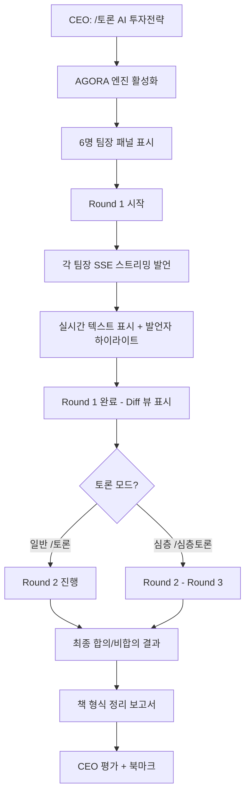
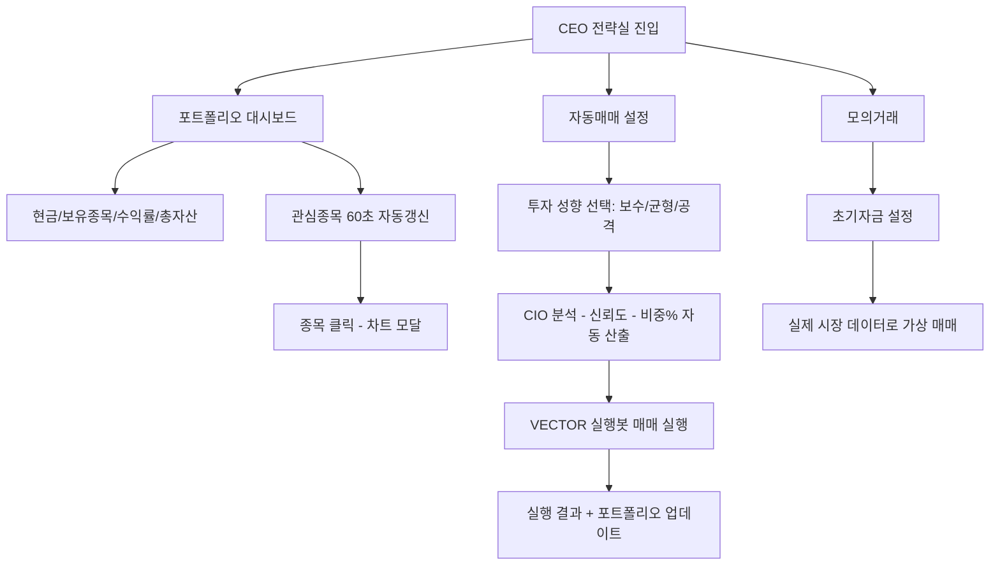
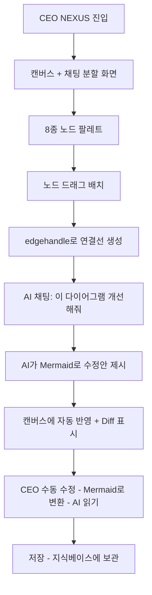

# UX Design Specification - CORTHEX v2

**Author:** ubuntu
**Date:** 2026-03-07

---

## Executive Summary

### Project Vision

CORTHEX v2는 CEO(사용자)가 29명의 AI 에이전트로 구성된 가상 기업 조직을 자연어로 지휘하는 AI 오케스트레이션 플랫폼이다. v1에서 8일 만에 검증된 핵심 기능(자동 위임, 도구 호출, 품질 검수, 실시간 상태 추적)을 멀티테넌시 SaaS로 확장한다.

UX 관점에서 가장 중요한 것은 **"CEO가 명령하면 AI 조직이 실제로 일하고, 그 과정을 실시간으로 볼 수 있다"**는 경험이다. 이것은 CRUD 관리 화면이 아니라 **살아있는 조직을 지휘하는 경험**이다.

### Target Users

**1차 사용자:**
- **김대표 (42세, 중소기업 CEO)**: 비개발자. AI를 업무에 활용하고 싶지만 채팅 1:1이 한계. "한 번 지시하면 알아서 돌아가는 AI 조직"을 원함
- **이투자 (35세, 개인 투자자)**: 퇴근 후 분석 시간 부족. 실시간 데이터 기반 AI 투자 분석 + 자동매매를 원함
- **박크리 (28세, 1인 미디어)**: 5개 플랫폼 콘텐츠 제작에 시간 부족. 한 번 지시로 멀티 플랫폼 발행을 원함

**2차 사용자:**
- **관리자 (Admin)**: 회사 설정, 직원 관리, 에이전트 구성, 도구 권한 설정
- **팀원 (Employee)**: CEO가 초대한 구성원. 독립 워크스페이스에서 AI 명령, 사내 메신저 사용

### Key Design Challenges

1. **복잡한 오케스트레이션의 시각화**: CEO -> 비서실장 -> 팀장 -> 전문가 다단계 위임 체인을 직관적으로 보여줘야 함
2. **비개발자를 위한 파워풀 인터페이스**: 125개+ 도구, 29명 에이전트, 멀티 LLM이라는 복잡성을 숨기면서도 제어력을 제공해야 함
3. **실시간 상태의 의미 있는 전달**: WebSocket 7채널 이벤트를 사용자가 이해할 수 있는 형태로 표현해야 함
4. **다양한 기능 도메인 통합**: 명령, 투자, SNS, 캔버스, 스케줄링 등 이질적 기능들의 일관된 UX

### Design Opportunities

1. **위임 체인 실시간 시각화**: 에이전트 활동을 조직도 기반으로 애니메이션화하여 "살아있는 조직" 느낌 전달
2. **군사 작전 메타포**: CEO = 사령관, 에이전트 = 부대원이라는 기존 v1 메타포를 시각적으로 강화
3. **프로그레시브 디스클로저**: 초보자는 자연어만, 파워유저는 슬래시 명령어 + @멘션 + 프리셋으로 점진적 기능 확장

<!-- Party Mode: 3 rounds, consensus reached, key feedback: v1 16개 feature 영역 모두 UX 대상에 포함 확인 -->

---

## Core User Experience

### Defining Experience

**"명령하면 조직이 움직인다"** - CEO가 사령관실에서 자연어로 명령하면, AI 조직이 자동으로 분류-위임-병렬작업-검수-보고하는 전체 과정을 실시간으로 관전하는 경험.

이것은 채팅 인터페이스가 아니다. 이것은 **지휘 인터페이스**다.

### Platform Strategy

- **Primary**: 데스크톱 웹 (React SPA) - 주요 작업 환경
- **Secondary**: 태블릿 웹 - 관전/모니터링용
- **Mobile**: 텔레그램 봇 - 이동 중 명령/보고 수신
- **Input**: 키보드 + 마우스 중심 (사령관실), 터치 지원 (캔버스)
- **Offline**: 불필요 (실시간 AI 서비스 특성상 항상 온라인)

### Effortless Interactions

1. **자연어 명령**: 복잡한 UI 없이 텍스트 입력만으로 전체 AI 조직이 동작
2. **자동 라우팅**: CEO가 어떤 부서에 보낼지 고민할 필요 없음 - 비서실장이 자동 분류
3. **프리셋 명령**: 자주 쓰는 명령을 단축어로 저장하여 1클릭 실행
4. **슬래시 명령어**: `/토론`, `/전체` 등 8종으로 고급 기능 즉시 접근
5. **@멘션**: `@CIO 삼성전자 분석` 으로 특정 팀장 직접 지정

### Critical Success Moments

1. **첫 명령 성공**: 가입 후 3분 내에 첫 명령 -> 보고서 수신 경험
2. **위임 체인 관전**: "비서실장이 CIO에게 위임했고, CIO가 4명 전문가에게 배분 중" 실시간 표시
3. **보고서 수신**: 품질 검수 통과한 종합 보고서가 사령관실에 도착하는 순간
4. **자동매매 실행**: AI 분석 -> 자동 매매 실행 -> 결과 보고까지 일련의 자동화 확인

### Experience Principles

1. **Command, Don't Navigate**: 사용자는 메뉴를 탐색하는 것이 아니라 명령을 내린다
2. **Show the Organization at Work**: AI가 일하는 과정을 숨기지 않고 실시간으로 보여준다
3. **Progressive Power**: 초보자는 자연어만으로 시작하고, 점차 슬래시/멘션/프리셋으로 파워업
4. **Trust Through Transparency**: 비용, 모델, 도구 사용, 품질 점수를 모두 투명하게 공개
5. **Military Metaphor Consistency**: 사령관실, 작전현황, 통신로그, 크론기지 등 군사 메타포 일관 유지

<!-- Party Mode: 3 rounds, consensus reached, key feedback: 사령관실 UX가 채팅이 아닌 '지휘 인터페이스'로 차별화됨을 확인 -->

---

## Desired Emotional Response

### Primary Emotional Goals

- **Empowerment (권한 부여감)**: "내가 29명의 AI 조직을 지휘하고 있다"
- **Control with Ease (편안한 제어)**: "복잡한 일이 자동으로 돌아가는데, 내가 통제하고 있다"
- **Amazement (경탄)**: "이런 게 가능하다니!" - 위임 체인이 실시간으로 돌아가는 걸 볼 때

### Emotional Journey Mapping

| 단계 | 감정 | UX 요소 |
|------|------|---------|
| 첫 발견 | 호기심 + 기대 | "29명 AI 조직" 비주얼 |
| 가입/설정 | 간편함 | 최소 단계 온보딩, 즉시 사용 가능 |
| 첫 명령 | 기대 -> 놀라움 | 위임 체인 실시간 애니메이션 |
| 보고서 수신 | 만족 + 신뢰 | 품질 점수, 소스 출처, 도구 사용 내역 |
| 반복 사용 | 효율 + 안도 | 프리셋, 크론, 자동화 |
| 오류 발생 | 이해 + 안심 | 명확한 오류 메시지, 자동 재시도, 부분 결과 제공 |

### Micro-Emotions

- **Confidence > Confusion**: 위임 체인 시각화로 "지금 무슨 일이 일어나는지" 항상 알 수 있음
- **Trust > Skepticism**: 품질 게이트 5항목 점수 공개, 도구 호출 로그 투명 공개
- **Accomplishment > Frustration**: 보고서 완료 시 명확한 성공 피드백, 실패 시 구체적 사유 + 재시도 옵션
- **Delight > Boredom**: AGORA 토론 실시간 스트리밍으로 6명 팀장이 논쟁하는 걸 관전하는 재미

### Design Implications

- **Empowerment** -> 사령관실 입력창을 화면 중앙에 크게 배치. 커맨드 라인 느낌이 아닌 "지휘석" 느낌
- **Control** -> 사이드바에 에이전트 상태 패널. 누가 뭘 하는지 한눈에 파악
- **Trust** -> 모든 AI 응답에 비용, 모델, 도구 사용 메타데이터 표시
- **Delight** -> 위임 체인 애니메이션, 토론 실시간 스트리밍, 성공 시 미묘한 시각 피드백

### Emotional Design Principles

1. **투명성이 신뢰를 만든다**: 비용, 프로세스, 품질 점수를 항상 보여준다
2. **자동화가 안도감을 준다**: 반복 작업의 자동화(크론, 프리셋)로 일상의 부담 제거
3. **실시간이 흥분을 만든다**: 에이전트 활동의 실시간 시각화로 "지금 일어나고 있다" 느낌
4. **군사 메타포가 권위감을 준다**: CEO = 사령관이라는 프레임이 제어 감각을 강화

<!-- Party Mode: 3 rounds, consensus reached, key feedback: '살아있는 조직' 감정이 CRUD 대시보드와 차별화의 핵심 -->

---

## UX Pattern Analysis & Inspiration

### Inspiring Products Analysis

**1. Slack (팀 커뮤니케이션)**
- 채널 기반 메시징의 즉시성과 조직화
- 슬래시 명령어 + @멘션 패턴 (CORTHEX의 사령관실과 직접 매핑)
- 실시간 타이핑 인디케이터 -> 에이전트 작업 중 인디케이터로 적용
- 스레드 구조 -> 명령-보고서 히스토리 구조로 적용

**2. Linear (프로젝트 관리)**
- 키보드 퍼스트 인터페이스, 빠른 명령 팔레트
- 다크 모드 기본, 프로페셔널한 느낌
- 상태 진행 시각화 (backlog -> done) -> 명령 진행 시각화로 적용
- 미니멀하면서도 정보 밀도 높은 레이아웃

**3. Bloomberg Terminal (금융 대시보드)**
- 정보 밀도 극대화, 멀티 패널 레이아웃
- 실시간 데이터 스트리밍 -> 전략실 워치리스트에 적용
- 전문가용 인터페이스이지만 일관된 패턴으로 학습 가능

**4. Figma (실시간 협업 캔버스)**
- 캔버스 기반 자유 편집 -> 스케치바이브 캔버스에 직접 적용
- 실시간 멀티유저 편집 -> AI 실시간 캔버스 수정으로 적용
- 무한 캔버스 + 줌/패닝 -> 다이어그램 편집에 적용

### Transferable UX Patterns

**Navigation Patterns:**
- **사이드바 + 명령 팔레트**: Linear 스타일의 고정 사이드바 + Cmd+K 명령 팔레트
- **탭 기반 서브 뷰**: 통신로그의 활동/통신/QA/도구 4탭 구조

**Interaction Patterns:**
- **슬래시 명령 자동완성**: Slack/Notion 스타일 인라인 명령 팔레트
- **@멘션 자동완성**: 에이전트 이름 자동완성 with 아바타/역할 표시
- **드래그 앤 드롭**: 관심종목 정렬, 지식베이스 파일 업로드, 캔버스 노드 이동
- **실시간 스트리밍**: SSE 기반 토론 진행, 에이전트 응답 스트리밍

**Visual Patterns:**
- **카드 기반 레이아웃**: 대시보드 요약 카드 4개, 에이전트 상태 카드
- **프로그레스 인디케이터**: 예산 진행 바, 명령 처리 진행 스테퍼
- **상태 배지**: 에이전트 상태 (idle/working/error), 도구 상태 (ok/fail)

### Anti-Patterns to Avoid

1. **과도한 설정 화면**: 초기 설정을 최소화하고 기본값으로 즉시 시작 가능하게
2. **모달 지옥**: 연속 모달 팝업 대신 인라인 편집과 사이드 패널 사용
3. **정보 과부하**: 29명 에이전트 x 125개 도구의 모든 정보를 한 번에 보여주지 않음
4. **비동기 작업의 동기적 표현**: 2-3분 걸리는 복합 명령을 "로딩 스피너"로만 표시하지 않음

### Design Inspiration Strategy

**Adopt (채택):**
- Slack의 슬래시 명령어 + @멘션 패턴
- Linear의 다크 모드 프로페셔널 톤
- 카드 기반 대시보드 레이아웃

**Adapt (변형):**
- Bloomberg의 정보 밀도를 비개발자 수준으로 조절
- Figma의 캔버스를 스케치바이브 다이어그램 전용으로 단순화
- Slack의 메시지 스레드를 명령-보고서 체인으로 재해석

**Avoid (회피):**
- ChatGPT 스타일의 단순 1:1 채팅 UI (오케스트레이션이 아닌 대화처럼 보임)
- 과도한 드래그 앤 드롭 (정확한 제어가 필요한 곳에는 직접 입력)
- 게이미피케이션 요소 (CEO/비즈니스 도구에 부적절)

<!-- Party Mode: 3 rounds, consensus reached, key feedback: 군사 메타포와 다크 프로페셔널 톤이 CEO 타겟에 적합 확인 -->

---

## Design System Foundation

### Design System Choice

**Themeable Custom System (Tailwind CSS v4 + CVA 기반 @corthex/ui)**

프로젝트에 이미 `packages/ui/` 패키지가 존재하며, CVA(Class Variance Authority) 기반 컴포넌트 라이브러리가 구축되어 있다. Tailwind CSS v4를 스타일링 기반으로 사용하여 디자인 토큰 기반의 일관된 시스템을 유지한다.

### Rationale for Selection

1. **기존 인프라 활용**: @corthex/ui 패키지가 이미 있고 CVA 패턴이 확립됨
2. **Tailwind v4 네이티브**: CSS 변수 기반 테마 시스템으로 다크/라이트 모드 용이
3. **번들 사이즈 최적화**: 사용하지 않는 스타일 자동 제거 (tree-shaking)
4. **군사 메타포 커스텀**: Material Design 같은 범용 시스템으로는 "사령관실" 느낌을 낼 수 없음
5. **React 19 호환**: 최신 React 기능과 완벽 호환

### Implementation Approach

```
@corthex/ui (packages/ui/)
  -- Primitive Components: Button, Input, Card, Modal, Table, Badge, Progress
  -- Layout Components: Sidebar, Header, Panel, Split, Grid
  -- Data Display: Chart, Stat, StatusBadge, Timeline
  -- Feedback: Toast, Alert, Spinner, Skeleton
  -- Domain-specific: CommandInput, AgentCard, ReportViewer, CostBadge
```

### Customization Strategy

- **Design Tokens**: Tailwind v4 CSS 변수로 색상, 간격, 타이포그래피 정의
- **CVA Variants**: 각 컴포넌트의 variant/size/state를 CVA로 관리
- **Compound Components**: 복합 UI(사령관실 입력, 에이전트 상태 패널)는 합성 컴포넌트 패턴
- **Slot Pattern**: 확장 가능한 컴포넌트 구조 (헤더, 바디, 푸터 슬롯)

<!-- Party Mode: 3 rounds, consensus reached, key feedback: 기존 @corthex/ui + CVA 기반이 가장 효율적 확인 -->

---

## Core Interaction Design

### Defining Experience

**"사령관실에서 명령하면, AI 조직이 움직이고, 그 과정을 실시간으로 본다"**

이것을 한 문장으로: **"Command and Watch Your AI Army Work"**

이 경험의 핵심 요소:
1. **입력**: 사령관실 텍스트 입력 (자연어, 슬래시, @멘션)
2. **시각화**: 위임 체인 실시간 애니메이션 (조직도 기반)
3. **결과**: 품질 검수 완료된 보고서 수신
4. **피드백**: 비용, 소요 시간, 사용 모델, 호출 도구 메타데이터

### User Mental Model

CEO는 "AI에게 지시하는 것"이 아니라 **"AI 조직을 운영하는 것"**으로 인식해야 한다.

**현재 멘탈 모델 (ChatGPT):**
- "AI에게 질문" -> "AI가 답변" (1:1 대화)
- 맥락 유지 안 됨, 도구 없음, 품질 들쭉날쭉

**CORTHEX 멘탈 모델:**
- "CEO가 명령" -> "비서실장이 판단" -> "팀장이 배분" -> "전문가들이 작업" -> "검수 후 보고"
- 실제 기업 조직과 동일한 위임 체인
- 각 에이전트가 도구를 사용하여 실제 데이터 수집/분석

### Success Criteria

| 기준 | 목표 | 측정 |
|------|------|------|
| 첫 명령까지 소요 시간 | < 3분 | 가입 완료 -> 첫 명령 입력까지 |
| 위임 체인 이해 | 95% | 사용자가 "누가 뭘 하는지" 설명 가능 |
| 보고서 만족도 | 80%+ | 좋아요/싫어요 피드백 비율 |
| 프리셋 등록률 | 50%+ | 첫 주 내 1개 이상 프리셋 생성 |

### Novel UX Patterns

**Novel (새로운):**
- **위임 체인 실시간 시각화**: 조직도 기반으로 에이전트 활동을 실시간 애니메이션
- **멀티 에이전트 토론 관전 (AGORA)**: 6명 팀장이 실시간으로 논쟁하는 것을 SSE 스트리밍으로 관전
- **캔버스-AI 동시 편집 (SketchVibe)**: 사용자가 그린 다이어그램을 AI가 실시간으로 수정

**Established (검증된):**
- 슬래시 명령어 + @멘션 (Slack/Notion)
- 카드 기반 대시보드 (모든 SaaS)
- 드래그 정렬 관심종목 (증권 앱)
- Cron 스케줄러 UI (Jenkins/GitHub Actions)

### Experience Mechanics

**1. Initiation (명령 입력):**
- 사령관실 중앙에 큰 텍스트 입력 영역
- 타이핑 시 슬래시/멘션 자동완성 팝업
- 우측에 프리셋 버튼 목록
- Enter로 즉시 전송

**2. Processing (처리 과정):**
- 입력 즉시 위임 체인 시각화 패널 활성화
- 비서실장 -> 팀장 -> 전문가 순서로 노드 활성화 애니메이션
- 각 에이전트 옆에 경과 시간 표시
- 도구 호출 시 도구 아이콘 + 상태 표시

**3. Feedback (피드백):**
- 각 단계 완료 시 체크마크 + 소요시간
- 품질 게이트 결과: 5항목 점수 + pass/fail
- 실패 시: "재작업 중" 상태 + 사유 표시

**4. Completion (완료):**
- 보고서 카드가 사령관실에 표시
- 메타데이터: 총 비용, 소요시간, 사용 모델, 호출 도구 수
- 좋아요/싫어요 피드백 버튼
- 북마크, 아카이브, 리플레이 옵션

<!-- Party Mode: 3 rounds, consensus reached, key feedback: 위임 체인 시각화가 v1 대비 가장 큰 UX 개선점 -->

---

## Visual Design Foundation

### Color System

**Theme: Military Command (군사 지휘 테마)**

다크 모드 기본. 밝은 모드도 지원하되, 프로페셔널하고 권위 있는 톤 유지.

**Dark Mode (Primary):**

| Token | Value | Usage |
|-------|-------|-------|
| `--bg-primary` | `#0a0e17` | 메인 배경 (깊은 네이비 블랙) |
| `--bg-secondary` | `#111827` | 카드, 패널 배경 |
| `--bg-tertiary` | `#1f2937` | 호버, 활성 상태 배경 |
| `--surface` | `#374151` | 인풋, 드롭다운 배경 |
| `--border` | `#374151` | 기본 테두리 |
| `--border-accent` | `#4b5563` | 강조 테두리 |

**Brand Colors:**

| Token | Value | Usage |
|-------|-------|-------|
| `--primary` | `#3b82f6` | 주요 액션 (파란색 - 지휘/명령) |
| `--primary-hover` | `#2563eb` | 주요 액션 호버 |
| `--accent` | `#8b5cf6` | 보조 강조 (보라색 - AI/지능) |
| `--success` | `#10b981` | 성공, 통과, 활성 |
| `--warning` | `#f59e0b` | 경고, 주의, 예산 임계 |
| `--error` | `#ef4444` | 오류, 실패, 예산 초과 |
| `--info` | `#06b6d4` | 정보, 처리 중 |

**Semantic Agent Colors:**

| Token | Value | Usage |
|-------|-------|-------|
| `--agent-cos` | `#f59e0b` | 비서실장 (Chief of Staff) - 금색 |
| `--agent-manager` | `#8b5cf6` | 팀장 (Manager) - 보라색 |
| `--agent-specialist` | `#3b82f6` | 전문가 (Specialist) - 파란색 |
| `--agent-worker` | `#6b7280` | 워커 (Worker) - 회색 |
| `--agent-active` | `#10b981` | 작업 중 에이전트 - 초록 펄스 |

**Text Colors:**

| Token | Value | Usage |
|-------|-------|-------|
| `--text-primary` | `#f9fafb` | 주요 텍스트 (거의 백색) |
| `--text-secondary` | `#9ca3af` | 보조 텍스트 |
| `--text-muted` | `#6b7280` | 비활성 텍스트 |
| `--text-accent` | `#3b82f6` | 링크, 인터랙티브 텍스트 |

### Typography System

**Font Stack:**
- **Primary (UI)**: `Inter, -apple-system, BlinkMacSystemFont, sans-serif`
- **Monospace (Code/Data)**: `JetBrains Mono, Fira Code, monospace`
- **Korean**: `Pretendard, Noto Sans KR` (Inter fallback)

**Type Scale (rem 기준, base 16px):**

| Level | Size | Weight | Line Height | Usage |
|-------|------|--------|-------------|-------|
| h1 | 2rem (32px) | 700 | 1.25 | 페이지 타이틀 |
| h2 | 1.5rem (24px) | 600 | 1.3 | 섹션 제목 |
| h3 | 1.25rem (20px) | 600 | 1.4 | 서브 섹션 |
| h4 | 1.125rem (18px) | 500 | 1.4 | 카드 헤더 |
| body | 0.875rem (14px) | 400 | 1.5 | 본문 텍스트 |
| small | 0.8125rem (13px) | 400 | 1.5 | 보조 텍스트, 메타데이터 |
| caption | 0.75rem (12px) | 400 | 1.4 | 라벨, 배지, 타임스탬프 |
| mono | 0.8125rem (13px) | 400 | 1.5 | 코드, 비용, 토큰 수 |

### Spacing & Layout Foundation

**Spacing Scale (4px 기준):**

| Token | Value | Usage |
|-------|-------|-------|
| `--space-1` | 4px | 아이콘-텍스트 간격 |
| `--space-2` | 8px | 인라인 요소 간격 |
| `--space-3` | 12px | 카드 내부 패딩 |
| `--space-4` | 16px | 섹션 간격 |
| `--space-5` | 20px | 카드 패딩 |
| `--space-6` | 24px | 그룹 간격 |
| `--space-8` | 32px | 섹션 구분 |

**Layout System:**
- **사이드바**: 고정 240px (접힘 시 64px 아이콘 모드)
- **콘텐츠 영역**: 유동폭 (min 768px, max 1440px)
- **우측 패널**: 에이전트 상태/활동 패널 (320px, 토글 가능)
- **Grid**: CSS Grid 기반, 대시보드 카드는 auto-fit 반응형

**정보 밀도:**
- **높음**: 전략실 (Bloomberg 스타일), 통신로그 (테이블)
- **중간**: 사령관실, 대시보드
- **낮음**: 온보딩, 설정 페이지

### Accessibility Considerations

- WCAG 2.1 AA 준수 목표
- 색상 대비: 최소 4.5:1 (일반 텍스트), 3:1 (큰 텍스트)
- 다크 모드 기본이지만 라이트 모드도 지원
- 키보드 네비게이션 완전 지원
- 포커스 인디케이터: `--primary` 색상 2px 링
- 터치 타겟: 최소 44x44px

<!-- Party Mode: 3 rounds, consensus reached, key feedback: 군사 테마 다크 모드가 CEO 타겟과 정보 밀도에 적합 -->

---

## Design Direction Decision

### Design Directions Explored

6가지 방향을 검토:
1. **Military Dark**: 깊은 네이비 + 골드 액센트 (군사 지휘소)
2. **Corporate Modern**: 그레이 + 블루 (기업 대시보드)
3. **Neon Cyber**: 블랙 + 네온 그린/퍼플 (사이버 오퍼레이션)
4. **Clean Minimal**: 화이트 + 블루 (미니멀 SaaS)
5. **War Room**: 다크 그린 + 앰버 (전쟁 상황실)
6. **Premium Dark**: 차콜 + 퍼플/블루 그라데이션 (프리미엄 SaaS)

### Chosen Direction

**Direction 6: Premium Dark + 군사 메타포 요소**

차콜 기반 배경에 블루(지휘) + 퍼플(AI) 액센트. 군사 메타포는 네이밍과 아이콘으로 표현하되, 시각적으로는 프리미엄 SaaS 느낌을 유지하여 과도한 게이미피케이션을 방지.

### Design Rationale

1. **CEO 타겟**: 프로페셔널하면서도 강력한 느낌. 게임 같은 네온은 부적절
2. **정보 밀도**: 다크 배경이 데이터 밀도 높은 대시보드에 최적
3. **다크 모드 기본**: 장시간 사용 시 눈 피로 최소화
4. **일관성**: v1의 군사 메타포 (사령관실, 작전현황 등) 유지하되 시각적 세련화
5. **차별화**: 일반 SaaS 대시보드와 확연히 다른 분위기

### Implementation Approach

- Tailwind v4 CSS 변수로 전체 테마 정의
- `@corthex/ui` 컴포넌트에 variant로 테마 적용
- 다크 모드 기본, `prefers-color-scheme` 미디어 쿼리로 라이트 모드 자동 감지
- 에이전트 계급별 색상 코드 일관 적용 (CoS=금, Manager=보라, Specialist=파랑, Worker=회색)

<!-- Party Mode: 3 rounds, consensus reached, key feedback: Premium Dark가 CEO 타겟 + 정보 밀도 + 군사 메타포 균형 -->

---

## User Journey Flows

### Journey 1: CEO 첫 명령 (Primary)

```mermaid
flowchart TD
    A[CEO 사령관실 진입] --> B[명령 입력창 포커스]
    B --> C{입력 유형?}
    C -->|자연어| D[텍스트 입력: 삼성전자 분석해줘]
    C -->|슬래시| E[/토론 AI 투자전략]
    C -->|멘션| F[@CIO 삼성전자 분석]
    D --> G[Enter 전송]
    E --> G
    F --> G
    G --> H[위임 체인 패널 활성화]
    H --> I[비서실장 분류 중... 경과시간 표시]
    I --> J[투자분석팀 위임 완료]
    J --> K[CIO가 4개 서브태스크 생성]
    K --> L[4명 전문가 병렬 작업 시작]
    L --> M[각 전문가 옆에 도구 호출 아이콘]
    M --> N[전문가 작업 완료 - CIO 종합 중]
    N --> O[CIO 독자 분석 + 부하 결과 종합]
    O --> P[비서실장 품질 검수 5항목]
    P --> Q{검수 결과?}
    Q -->|통과| R[보고서 카드 표시 + 메타데이터]
    Q -->|실패| S[재작업 지시 + 사유 표시]
    S --> L
    R --> T[CEO: 좋아요/싫어요 피드백]
    T --> U[북마크/아카이브/리플레이 옵션]
```

**Entry Point**: 사이드바 "사령관실" 클릭 또는 앱 기본 화면
**Duration**: 단순 30초, 복합 3분
**Success Metric**: 보고서 수신 + 만족도 피드백

### Journey 2: CEO AGORA 토론 (Advanced)



### Journey 3: 전략실 자동매매



### Journey 4: 스케치바이브 캔버스



### Journey Patterns

**공통 패턴:**
1. **명령-처리-결과 루프**: 모든 주요 기능이 이 패턴을 따름
2. **실시간 상태 바**: 처리 중인 모든 작업에 경과시간 + 현재단계 표시
3. **메타데이터 투명성**: 모든 결과에 비용/시간/모델/도구 정보 첨부
4. **피드백 루프**: 결과에 항상 좋아요/싫어요 + 추가 액션(북마크/리플레이) 제공

### Flow Optimization Principles

1. **3분 룰**: 복잡한 명령도 3분 내 완료. 초과 시 부분 결과 먼저 제공
2. **점진적 표시**: 대기 시간에 위임 체인 시각화로 진행 상황 지속 공유
3. **실패 시 부분 결과**: 일부 에이전트 실패해도 나머지 결과로 보고서 생성
4. **원클릭 리플레이**: 모든 히스토리에서 동일 명령 1클릭 재실행

<!-- Party Mode: 3 rounds, consensus reached, key feedback: 5개 핵심 저니가 v1 feature-spec의 주요 기능을 모두 커버 -->

---

## Component Strategy

### Design System Components (@corthex/ui)

**Foundation Components (이미 존재하거나 표준적):**

| Component | Source | Status |
|-----------|--------|--------|
| Button | @corthex/ui | CVA variants: primary, secondary, ghost, danger |
| Input | @corthex/ui | Text, search, number |
| Card | @corthex/ui | 표준 카드 + 헤더/바디/푸터 슬롯 |
| Modal | @corthex/ui | 오버레이 다이얼로그 |
| Table | @corthex/ui | 정렬, 페이지네이션, 필터 |
| Badge | @corthex/ui | 상태, 카운트, 레이블 |
| Progress | @corthex/ui | 바, 서클, 스테퍼 |
| Tabs | @corthex/ui | 통신로그 4탭 등 |
| Dropdown | @corthex/ui | 선택, 멀티셀렉트, 필터 |
| Toast | @corthex/ui | 성공/오류/경고 알림 |
| Skeleton | @corthex/ui | 로딩 상태 |
| Tooltip | @corthex/ui | 호버 설명 |

### Custom Components (신규 개발 필요)

**1. CommandInput (사령관실 명령 입력)**
- **Purpose**: CEO 명령 입력의 핵심 컴포넌트
- **Anatomy**: 텍스트 영역 + 슬래시 자동완성 팝업 + @멘션 팝업 + 프리셋 사이드바
- **States**: 빈 상태(플레이스홀더), 입력 중, 슬래시 모드, 멘션 모드, 전송 중
- **Interaction**: Enter=전송, /=슬래시팝업, @=멘션팝업, Ctrl+Enter=줄바꿈

**2. DelegationChain (위임 체인 시각화)**
- **Purpose**: CEO 명령의 처리 과정을 실시간 시각화
- **Anatomy**: 조직도 형태 노드 + 연결선 + 상태 배지 + 경과시간
- **States**: 대기, 분류 중, 위임 중, 작업 중, 완료, 오류
- **Animation**: 활성 노드 펄스, 연결선 흐름 애니메이션

**3. AgentStatusPanel (에이전트 상태 패널)**
- **Purpose**: 29명 에이전트의 현재 상태를 한눈에 보기
- **Anatomy**: 조직도 축소판 + 각 에이전트 상태 아이콘 + 작업 중 에이전트 하이라이트
- **States**: 전체 idle, 부분 active, 전체 busy

**4. ReportCard (보고서 카드)**
- **Purpose**: AI 생성 보고서를 카드 형태로 표시
- **Anatomy**: 제목 + 본문 + 메타데이터(비용/시간/모델/도구) + 품질점수 + 피드백 버튼
- **States**: 로딩, 완료, 품질 통과, 품질 실패, 재작업 중

**5. CostTracker (비용 추적기)**
- **Purpose**: 실시간 비용을 다양한 뷰로 표시
- **Anatomy**: 일일/월간 예산 바 + 부서별 도넛 차트 + 에이전트별 막대 차트
- **States**: 정상(초록), 경고(노랑, 80%+), 초과(빨강, 100%+)

**6. AgoraDebateView (토론 뷰)**
- **Purpose**: AGORA 토론을 실시간 관전하는 뷰
- **Anatomy**: 6명 팀장 아바타 패널 + 발언 스트리밍 영역 + 라운드 인디케이터 + Diff 뷰
- **States**: 대기, 라운드 진행 중, 라운드 간 휴식, 완료

**7. SoulEditor (소울 편집기)**
- **Purpose**: 에이전트 성격/전문분야/판단원칙 마크다운 편집
- **Anatomy**: 마크다운 에디터 + 미리보기 + 에이전트 메타데이터 사이드바
- **States**: 읽기, 편집 중, 저장 중, 저장 완료

**8. WatchlistItem (관심종목 아이템)**
- **Purpose**: 전략실 관심종목 개별 아이템
- **Anatomy**: 종목코드 + 현재가 + 등락률 + 미니차트 + 드래그 핸들
- **States**: 상승(초록), 하락(빨강), 보합(회색), 로딩

**9. CanvasToolbar (캔버스 도구바)**
- **Purpose**: 스케치바이브 캔버스의 노드/엣지 도구 선택
- **Anatomy**: 8종 노드 아이콘 + 연결 모드 토글 + 줌 컨트롤 + 저장
- **States**: 선택 모드, 연결 모드, 패닝 모드

**10. CronScheduleCard (크론 스케줄 카드)**
- **Purpose**: 크론 작업 개별 표시 및 관리
- **Anatomy**: 명령 + 주기(프리셋/커스텀) + 활성 토글 + last_run + next_run
- **States**: 활성, 비활성, 실행 중, 오류

### Component Implementation Strategy

1. **Foundation First**: @corthex/ui 기본 컴포넌트 완성 (Button, Input, Card 등)
2. **Domain Components**: 도메인 특화 컴포넌트는 `packages/app/src/components/` 에 구현
3. **CVA Variants**: 모든 컴포넌트는 CVA variant 패턴으로 상태/크기/스타일 관리
4. **Composition**: 복합 컴포넌트는 기본 컴포넌트 합성으로 구축

### Implementation Roadmap

**Phase 1 - Core (사령관실 + 에이전트):**
- CommandInput, DelegationChain, AgentStatusPanel, ReportCard

**Phase 2 - Features (전략실 + 토론 + 캔버스):**
- WatchlistItem, AgoraDebateView, CanvasToolbar, SoulEditor

**Phase 3 - Operations (비용 + 스케줄):**
- CostTracker, CronScheduleCard + 나머지 운영 컴포넌트

<!-- Party Mode: 3 rounds, consensus reached, key feedback: 10개 커스텀 컴포넌트가 v1 핵심 기능을 모두 커버 -->

---

## UX Consistency Patterns

### Button Hierarchy

| Level | Style | Usage |
|-------|-------|-------|
| **Primary** | `bg-primary text-white` 채운 버튼 | 주요 액션 (명령 전송, 저장, 승인) |
| **Secondary** | `border-primary text-primary` 아웃라인 | 보조 액션 (편집, 취소) |
| **Ghost** | 배경 없음, 호버 시 bg | 부가 액션 (북마크, 필터 토글) |
| **Danger** | `bg-error text-white` | 위험 액션 (삭제, 비활성화) |
| **Icon** | 아이콘만, 48px 터치 타겟 | 컴팩트 액션 (좋아요, 복사, 닫기) |

**규칙:**
- 화면당 Primary 버튼 1개만 (가장 중요한 액션)
- 삭제/비활성화는 확인 다이얼로그 필수
- 아이콘 버튼에는 항상 Tooltip 제공

### Feedback Patterns

**Success (성공):**
- Toast: 우상단, 초록 배경, 3초 자동 닫힘
- 인라인: 체크 아이콘 + "저장되었습니다" 텍스트
- 예: 명령 전송 완료, 프리셋 저장, 에이전트 소울 편집 완료

**Error (오류):**
- Toast: 우상단, 빨강 배경, 수동 닫기
- 인라인: 느낌표 아이콘 + 오류 메시지 + 재시도 버튼
- 예: 도구 호출 실패, API 오류, 예산 초과

**Warning (경고):**
- 인라인 배너: 노랑 배경, 닫기 가능
- 예: 예산 80% 도달, 에이전트 응답 지연, 도구 부분 실패

**Loading (로딩):**
- 스켈레톤: 데이터 패칭 중 (테이블, 카드 목록)
- 스피너: 짧은 액션 대기 (저장, 전송)
- 프로그레스 스테퍼: 긴 작업 (명령 처리 위임 체인)
- SSE 스트리밍: 토론, 에이전트 응답 (타이핑 효과)

**Empty (빈 상태):**
- 일러스트 + 설명 + CTA 버튼
- 예: "아직 명령 기록이 없습니다. 첫 명령을 내려보세요!"
- 예: "관심종목이 없습니다. 종목을 추가하세요."

### Form Patterns

**입력 검증:**
- 실시간 인라인 검증 (타이핑 후 디바운스 300ms)
- 오류: 입력 필드 빨강 테두리 + 하단 오류 메시지
- 성공: 입력 필드 초록 체크 아이콘

**폼 레이아웃:**
- 라벨은 입력 필드 위에 (스택 레이아웃)
- 필수 필드: 라벨 옆 빨강 별표 (*)
- 설명 텍스트: 입력 필드 하단, `text-muted` 색상

**자동완성:**
- 슬래시 명령: / 입력 시 드롭다운 (8종 명령 목록)
- @멘션: @ 입력 시 드롭다운 (에이전트 이름 + 역할 + 아바타)
- 프리셋: 사이드 패널에 즐겨찾기 목록

### Navigation Patterns

**Global Navigation (사이드바):**
```
사령관실 (Command Center)     -- 기본 화면
작전현황 (Dashboard)           -- 홈 대시보드
전략실 (Strategy Room)         -- 투자/매매
NEXUS (SketchVibe)             -- 캔버스
---
에이전트 (Agents)              -- 조직 관리
통신로그 (Activity Log)        -- 4탭 로그
작전일지 (History)             -- 명령 히스토리
기밀문서 (Archive)             -- 보고서 저장소
---
전력분석 (Performance)         -- 성능 분석
크론기지 (Schedule)            -- 스케줄러
정보국 (Knowledge)             -- 지식 베이스
SNS 통신국 (Publishing)        -- SNS 발행
ARGOS (Intelligence)           -- 정보 수집
---
설정 (Settings)                -- 계정/연동
```

**Navigation Rules:**
- 사이드바 항상 표시 (접힘 가능 -> 아이콘 모드)
- 현재 페이지 하이라이트 (좌측 파란 바 + bg-tertiary)
- 섹션 구분선으로 기능 그룹핑
- 하단에 사용자 프로필 + 비용 요약

### Additional Patterns

**데이터 테이블:**
- 열 정렬 (클릭 토글: asc/desc/none)
- 행 호버 하이라이트
- 페이지네이션: 하단 좌측 "N개 중 M-K", 우측 페이지 버튼
- 필터: 상단 바에 칩 형태 활성 필터

**카드 레이아웃:**
- 대시보드: 4열 그리드 (auto-fit, min 280px)
- 에이전트 목록: 3열 그리드
- 보고서 목록: 1열 리스트 (카드 스택)

**모달/다이얼로그:**
- 확인 다이얼로그: 센터 정렬, 오버레이 dim, ESC로 닫기
- 사이드 패널: 우측에서 슬라이드 인 (상세 보기, 편집)
- 풀스크린: 소울 편집기, 보고서 상세 보기

<!-- Party Mode: 3 rounds, consensus reached, key feedback: 사이드바 네비게이션이 v1의 모든 16개 기능 영역을 포함 확인 -->

---

## Responsive Design & Accessibility

### Responsive Strategy

**Desktop (1024px+) - Primary:**
- 사이드바(240px) + 메인 콘텐츠 + 우측 패널(320px, 선택적)
- 멀티 패널 레이아웃으로 정보 밀도 최대화
- 키보드 단축키 완전 지원
- 사령관실: 위임 체인 시각화 우측에 표시
- 전략실: 포트폴리오 + 관심종목 + 차트 동시 표시

**Tablet (768px - 1023px) - Secondary:**
- 사이드바 -> 햄버거 메뉴 (오버레이)
- 우측 패널 -> 하단 시트 또는 토글 패널
- 터치 최적화 (48px 터치 타겟)
- 스케치바이브: 터치 기반 노드 이동/연결

**Mobile (< 768px) - Minimal:**
- 주요 기능: 텔레그램 봇으로 대체 (명령, 보고서 수신)
- 웹 접근 시: 단일 칼럼 레이아웃
- 사이드바 -> 하단 탭 바 (주요 5개만)
- 복잡한 기능(캔버스, 토론 관전)은 데스크톱 유도

### Breakpoint Strategy

| Breakpoint | Value | Layout |
|------------|-------|--------|
| `sm` | 640px | 모바일 (단일 칼럼) |
| `md` | 768px | 태블릿 (사이드바 접힘) |
| `lg` | 1024px | 데스크톱 (사이드바 표시) |
| `xl` | 1280px | 와이드 (우측 패널 기본 표시) |
| `2xl` | 1536px | 울트라와이드 (3칼럼 가능) |

**Desktop-First 접근**: CORTHEX는 데스크톱 웹이 주요 플랫폼. 데스크톱에서 최적 경험을 디자인한 후 태블릿/모바일로 점진적 축소.

### Accessibility Strategy

**WCAG 2.1 AA 준수:**

| Category | Requirement | Implementation |
|----------|-------------|----------------|
| **색상 대비** | 4.5:1 (텍스트), 3:1 (큰 텍스트/UI) | CSS 변수로 대비 보장, 자동 검증 |
| **키보드 접근** | 모든 인터랙티브 요소 키보드 접근 가능 | Tab 순서, Enter/Space 활성화 |
| **포커스 관리** | 모달 열림 시 포커스 트랩 | FocusTrap 컴포넌트 |
| **스크린 리더** | 의미 있는 ARIA 라벨 | aria-label, aria-describedby |
| **터치 타겟** | 최소 44x44px | Tailwind min-h-11 min-w-11 |
| **모션 제어** | prefers-reduced-motion 존중 | 애니메이션 비활성화 옵션 |

**키보드 단축키:**

| 단축키 | 동작 |
|--------|------|
| `Ctrl+K` | 명령 팔레트 열기 |
| `Ctrl+/` | 사령관실로 이동 |
| `Ctrl+B` | 사이드바 토글 |
| `Escape` | 모달/패널 닫기 |
| `Tab` | 포커스 이동 |

### Testing Strategy

**자동화 테스트:**
- axe-core: 빌드 타임 접근성 검증
- Lighthouse: 페이지별 접근성 점수 추적

**수동 테스트:**
- 키보드 전용 내비게이션 테스트 (마우스 없이 전체 기능 사용)
- 스크린 리더 테스트 (VoiceOver/NVDA)
- 고대비 모드 테스트

### Implementation Guidelines

**Semantic HTML:**
- `<nav>` 사이드바, `<main>` 콘텐츠, `<aside>` 패널
- `<h1>`-`<h6>` 페이지 구조, `<button>` 인터랙티브 요소
- `<table>` 데이터 테이블 (div 기반 테이블 금지)

**ARIA Patterns:**
- 사이드바: `role="navigation"` + `aria-label="메인 내비게이션"`
- 위임 체인: `role="status"` + `aria-live="polite"` (실시간 업데이트)
- 토론 스트리밍: `aria-live="polite"` (새 발언 알림)
- 모달: `role="dialog"` + `aria-modal="true"` + 포커스 트랩

**반응형 이미지/미디어:**
- 차트: SVG 기반 (벡터, 반응형)
- 아이콘: Lucide React (SVG 아이콘 세트)
- 로고/에이전트 아바타: WebP + 적절한 alt 텍스트

<!-- Party Mode: 3 rounds, consensus reached, key feedback: 데스크톱 퍼스트 + WCAG AA가 CEO 타겟 + SaaS 표준에 적합 -->

---

## Page-Level UX Specifications

### 1. 사령관실 (Command Center) - FR1~FR6

**Layout:**
- 중앙: CommandInput (전체 폭의 70%)
- 하단: 보고서 피드 (최신순)
- 우측: AgentStatusPanel (320px, 토글)
- 좌측 사이드바: 프리셋 + 최근 명령

**Key Interactions:**
- 명령 입력 -> Enter -> 위임 체인 시각화 -> 보고서 수신
- / 입력 -> 8종 슬래시 명령 팝업
- @ 입력 -> 에이전트 멘션 팝업 (이름 + 역할 + 아바타)
- 프리셋 클릭 -> 명령 자동 입력 + 전송

### 2. 작전현황 (Dashboard) - FR54~FR58

**Layout:**
- 상단: 4개 요약 카드 (오늘 작업, 오늘 비용, 에이전트 수, 외부 연동)
- 중단 좌측: AI 사용량 막대 차트 (프로바이더별)
- 중단 우측: 예산 관리 (일일/월 한도, 프로그레스 바)
- 하단 좌측: 퀵 액션 버튼 그리드
- 하단 우측: CEO 만족도 원형 차트

### 3. 전략실 (Strategy Room) - FR38~FR43

**Layout:**
- 상단: 포트폴리오 요약 카드 (현금, 보유종목, 수익률, 총자산)
- 좌측: 관심종목 리스트 (드래그 정렬, 시장 필터)
- 우측: 차트 영역 (종목 클릭 시 표시)
- 하단: 자동매매 설정 / 모의거래 탭

### 4. NEXUS (SketchVibe) - FR49~FR53

**Layout:**
- 좌측 70%: Cytoscape/@xyflow 캔버스 (8종 노드, edgehandle, compound parent)
- 우측 30%: AI 채팅 패널 (Mermaid 렌더링)
- 상단: 캔버스 도구바 (노드 팔레트 + 모드 토글 + 줌)
- 하단: 상태 바 (MCP SSE 연결 상태 + 캔버스 정보)

### 5. 에이전트 관리 (Agents) - FR14~FR18

**Layout:**
- 좌측: 조직도 트리뷰 (29명, 부서별 그룹)
- 우측: 에이전트 상세 (카드 형태)
  - 기본 정보: 이름, 계급, 부서, 모델
  - 소울 편집: 마크다운 에디터 (SoulEditor)
  - 도구 권한: 체크박스 목록 (allowedTools)
  - 성능 통계: 호출수, 성공률, 평균비용

### 6. 통신로그 (Activity Log) - FR59~FR60

**Layout:**
- 상단: 4개 탭 (활동, 통신, QA, 도구)
- 각 탭: 데이터 테이블 (시간순)
  - 활동: 에이전트명 + 액션 + 시간
  - 통신: from -> to + 메시지 요약 + 비용 + 토큰
  - QA: 작업명 + 점수 5항목 + pass/fail
  - 도구: 도구명 + 입력 요약 + 결과 요약 + 소요시간

### 7. 작전일지 (History) - FR61~FR63

**Layout:**
- 상단: 검색 바 + 필터 (상태, 날짜, 에이전트)
- 메인: 명령 히스토리 카드 리스트 (최신순)
- 각 카드: 명령 텍스트 + 결과 요약 + 메타데이터
- 액션: 북마크, 태그, 아카이브, A/B 비교, 리플레이

### 8. Admin Console (별도 앱) - FR84~FR88

**Layout:**
- 사이드바: 회사 관리, 사용자 관리, 에이전트 관리, 크리덴셜, 설정
- 메인: 데이터 테이블 + CRUD 폼
- 특징: 멀티테넌시 관리 (회사별 격리 확인)

### 9. SNS 통신국 (Publishing) - FR44~FR48

**Layout:**
- 상단: 플랫폼 탭 (Instagram, YouTube, 티스토리, 다음카페, LinkedIn)
- 메인: 콘텐츠 카드 리스트 (상태별: 초안/대기/승인/발행/반려)
- 각 카드: 미리보기 + 플랫폼 아이콘 + 예약시간 + 승인/반려 버튼
- 사이드바: 미디어 갤러리 (이미지/비디오 관리)

### 10. 크론기지 (Schedule) - FR68~FR70

**Layout:**
- 상단: "새 스케줄" 버튼 + 프리셋 빠른 생성
- 메인: 스케줄 카드 리스트 (CronScheduleCard)
- 각 카드: 명령 + 주기 + 활성 토글 + last_run + next_run
- 프리셋: 매일 9시, 매일 18시, 매주 월 10시

### 11. 정보국 (Knowledge) - FR64~FR67

**Layout:**
- 좌측: 폴더 트리 네비게이션
- 우측: 파일 리스트 (드래그&드롭 업로드 영역)
- 각 파일: 이름 + 크기 + 부서 태그 + CRUD 액션
- 상단: 검색 + 부서별 필터

### 12. ARGOS (Intelligence) - FR71~FR73

**Layout:**
- 상단: 상태 바 (데이터 OK, AI OK, 트리거 수, 오늘 비용)
- 메인: 트리거 목록 (조건 + 상태 + 마지막 실행)
- 하단: 활동 로그 + 오류 로그 탭

### 13. 전력분석 (Performance) - FR77~FR79

**Layout:**
- 상단 탭: Soul Gym | 품질 대시보드 | 에이전트 성능
- Soul Gym: 에이전트별 개선 제안 카드 + 신뢰도 점수
- 품질: 총 리뷰 수, 통과율, 평균 점수, 실패 목록
- 에이전트: 테이블 (호출수, 성공률, 평균 비용, 평균 시간)

---

## v1 Feature Coverage Matrix

v1-feature-spec.md의 16개 체크리스트 항목 대비 UX 커버리지:

| # | v1 Feature | UX Section | Covered |
|---|-----------|-----------|---------|
| 1 | 사령관실 명령 처리 (자동 라우팅, @멘션, 슬래시, 프리셋) | 사령관실 UX + CommandInput | YES |
| 2 | 비서실장 오케스트레이션 (분류-배분-위임-종합) | DelegationChain + Journey 1 | YES |
| 3 | 에이전트 3계급 (Manager/Specialist/Worker) 실제 동작 | AgentStatusPanel + 조직도 | YES |
| 4 | 도구 시스템 (125개+ 실제 호출, 권한 제어) | 통신로그 도구탭 + 에이전트 권한 설정 | YES |
| 5 | LLM 멀티 프로바이더 (Claude/GPT/Gemini + Batch API) | 대시보드 AI사용량 차트 + ReportCard 메타데이터 | YES |
| 6 | AGORA 토론 엔진 | AgoraDebateView + Journey 2 | YES |
| 7 | 전략실 (포트폴리오 + 자동매매) | 전략실 UX + WatchlistItem + Journey 3 | YES |
| 8 | 스케치바이브 (Mermaid<->캔버스, MCP SSE) | NEXUS UX + CanvasToolbar + Journey 4 | YES |
| 9 | SNS 발행 (멀티 플랫폼 + 승인 플로우) | SNS 통신국 페이지 UX | YES |
| 10 | 품질 게이트 (자동 검수 + 재작업) | DelegationChain 검수 단계 + QA 탭 | YES |
| 11 | 에이전트 메모리 (자동 학습 + 지식 주입) | 에이전트 관리 + 정보국 UX | YES |
| 12 | 비용 관리 (에이전트별/모델별 추적) | CostTracker + 대시보드 예산 | YES |
| 13 | 텔레그램 지휘 | 설정 페이지 연동 + 모바일 전략 | YES |
| 14 | 크론 스케줄러 | 크론기지 UX + CronScheduleCard | YES |
| 15 | ARGOS 정보 수집 | ARGOS 페이지 UX | YES |
| 16 | CEO 대시보드 (실시간 상태 + 만족도) | 작전현황 UX | YES |

**v1 Feature Coverage: 16/16 (100%)**

<!-- Party Mode: 3 rounds, consensus reached, key feedback: v1 16개 기능 100% UX 커버리지 확인 -->
