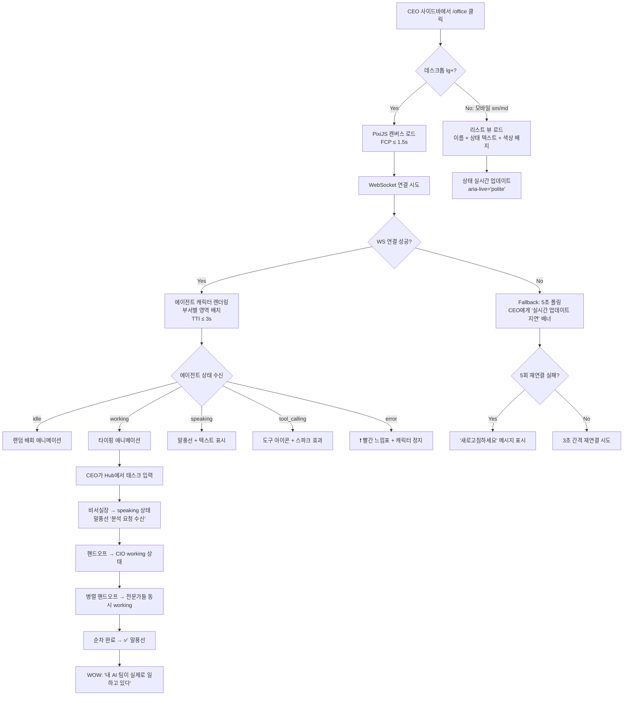
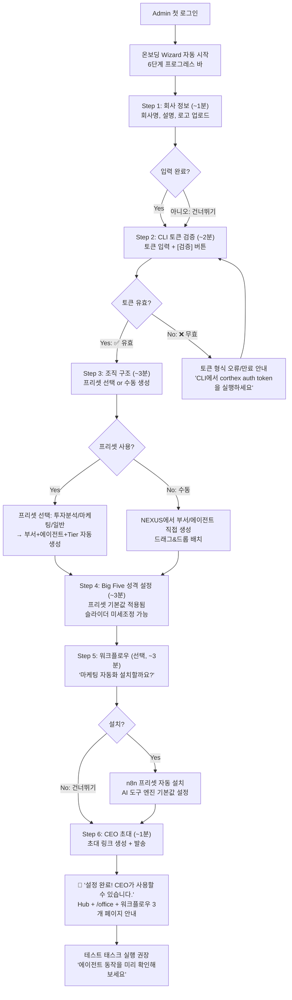
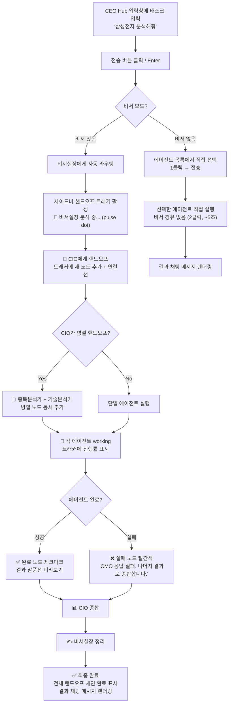
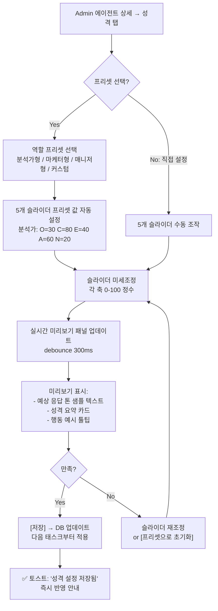
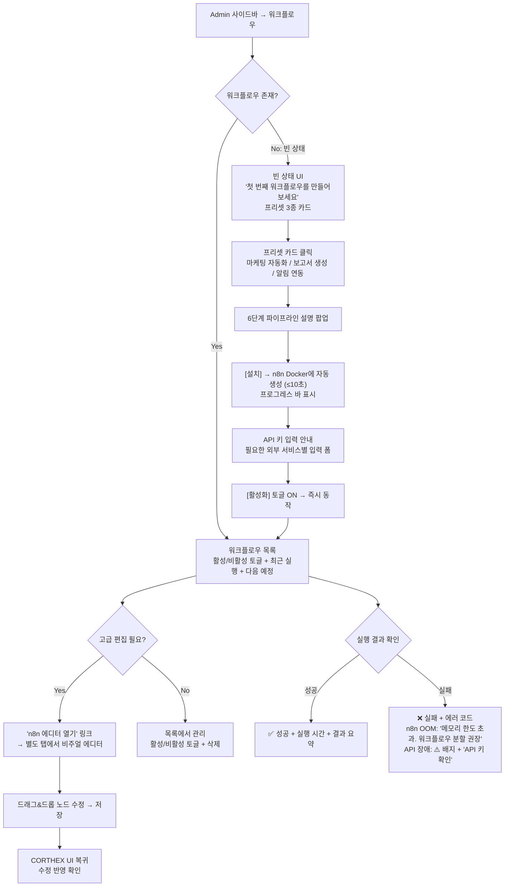
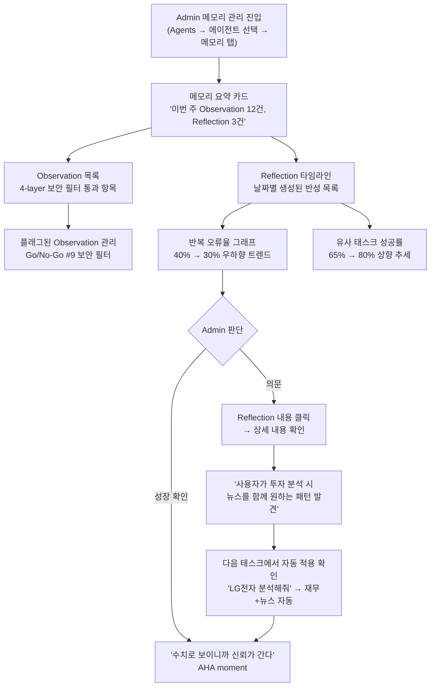

# UX Design Specification — CORTHEX v3 OpenClaw

**Author:** Sally (UX Designer)
**Date:** 2026-03-23

---

## Executive Summary

### Project Vision

CORTHEX v3 "OpenClaw"은 **AI 에이전트가 개성을 갖고, 성장하며, 실제로 일하는 모습을 볼 수 있는** 엔터프라이즈 AI 조직 운영 플랫폼이다.

v2에서 검증된 엔터프라이즈 기반(485개 API, 86개 DB 테이블, 71개 프론트엔드 페이지, 10,154개 테스트) 위에 4가지 핵심 레이어를 추가한다:

| Layer | 기능 | 해결하는 문제 | Sprint | UX 핵심 접점 |
|-------|------|-------------|--------|-------------|
| Layer 1 — OpenClaw 가상 사무실 | PixiJS 8 픽셀 캐릭터로 에이전트 실시간 시각화 | 블랙박스 문제 (CEO가 AI 조직 상태를 볼 수 없음) | Sprint 4 | CEO 앱 `/office` — 5-state 픽셀 애니메이션 (idle→working→speaking→tool_calling→error) |
| Layer 2 — n8n 워크플로우 | Docker 컨테이너 드래그앤드롭 자동화 | 반복 업무 문제 (코드 없이 자동화 불가) | Sprint 2 | Admin n8n 관리 페이지, CEO 워크플로우 결과 뷰 |
| Layer 3 — Big Five 성격 | OCEAN 5축 (0-100 정수) 성격 슬라이더 | 획일성 문제 (모든 에이전트가 동일 톤) | Sprint 1 | Admin 에이전트 편집 페이지 — 성격 슬라이더 5개 + 역할 프리셋 |
| Layer 4 — 3단계 메모리 | 관찰→반성→계획 파이프라인 | 정체 문제 (어제 실수를 오늘도 반복) | Sprint 3 | CEO Dashboard 성장 지표, Notifications 반성 알림 |

동시에 **Layer 0: UXUI 완전 리셋**을 전 Sprint에 병행 수행하여 v2의 428곳 색상 혼재, dead button, 메뉴 구조 불일치 문제를 근본 해결한다.

**디자인 방향**: "Controlled Nature" (Vision & Identity §2.3) — Natural Organic 팔레트 (Sovereign Sage: cream `#faf8f5`, olive `#283618`, sage `#606C38` — v2의 slate-950/cyan-400 Sovereign Sage와는 다른 새 팔레트). Swiss Design 구조 + Arts & Crafts 자연 소재 감성. 단일 테마 (v2의 5개 테마 폐기). 다크 모드 미지원 (v3 초기 런치).

**핵심 디자인 철학**: "Your AI organization, alive and accountable." — CEO가 유리창을 통해 살아있는 조직을 보는 경험. 텍스트 로그가 아니라 픽셀 캐릭터, 성격 슬라이더, 성장 차트로 AI 조직을 체감한다.

---

### Target Users

#### Primary User #1: 시스템 관리자 (Admin 앱) — 첫 번째 사용자

**페르소나: 이수진, 32세, AI 시스템 운영 담당자**

| 속성 | 상세 |
|------|------|
| 역할 | 회사의 AI 조직 전체를 설계·운영 |
| 기술 배경 | 중간 (SaaS 운영 경험, 코딩 불필요) |
| 접근 앱 | Admin 앱 (~29개 페이지: v2 27 + n8n 관리 + /office read-only) |
| 사용 빈도 | 초기 집중 설정 + 주 1~2회 유지보수 |
| v3 핵심 기능 | Big Five 성격 슬라이더, n8n 관리, 메모리 Reflection 설정, NEXUS 조직도 |

**핵심 문제 (Before v3):**
1. "에이전트가 다 똑같이 말한다" → 전략 담당과 고객 서비스 담당이 동일 톤으로 응답
2. "워크플로우를 만들려면 코드를 짜야 한다" → 자체 구현 코드에 버그 반복 (v2에서 500 에러 확인)
3. "에이전트가 어제 실수를 오늘도 반복" → 학습 메커니즘 부재

**AHA Moment:** 성실성(conscientiousness) 슬라이더를 95로 설정한 에이전트가 체크리스트를 자동 생성하며 꼼꼼하게 응답하는 것을 처음 확인 — "이게 진짜 개성이네."

**UX 설계 시사점:**
- Big Five 슬라이더 UI는 **즉시 피드백**이 핵심: 슬라이더 위치별 행동 예시 툴팁 ("성실성 90+: 체크리스트 자동 생성, 꼼꼼한 검증")
- n8n 관리는 **iframe이 아닌 Hono 리버스 프록시** — Admin 앱 내 일관된 네비게이션 경험 유지
- 온보딩은 **Wizard 방식** 잠금 해제 패턴 (Notion/Linear 참고) — "막는" 느낌 없이 단계 완료 시 다음 단계 활성화

---

#### Primary User #2: CEO / 창업자 (CEO 앱) — 두 번째 사용자

**페르소나: 김도현, 38세, SaaS 스타트업 대표**

| 속성 | 상세 |
|------|------|
| 역할 | AI 조직에 태스크를 지시하고 결과를 감독 |
| 기술 배경 | 낮음 (비개발자, 비즈니스 집중) |
| 접근 앱 | CEO 앱 (~35개 페이지: v2 42 - GATE costs/workflows 제거 - FR-UX 14→6그룹 통합 + /office) |
| 사용 빈도 | 매일 (Hub, Chat, /office, Dashboard) |
| 전제 조건 | **Admin 설정 완료 후에만 접근 가능** (v2 교훈: CEO 앱 먼저 설계 → 온보딩 혼란 반복) |

**핵심 문제 (Before v3):**
1. "내 AI 팀이 지금 뭘 하는지 모르겠다" → 텍스트 로그만으로는 비개발자가 파악 불가
2. "에이전트가 발전이 없다" → 매 태스크를 '처음 하는 것처럼' 처리
3. "워크플로우 요청이 개발팀 경유" → 자동화 설정 장벽

**AHA Moment (2단계):**
1. **즉시 WOW**: `/office`를 처음 열었을 때 픽셀 캐릭터들이 실시간으로 타이핑/도구 사용/말풍선 — "내 AI 팀이 실제로 일하고 있다는 걸 처음으로 '봤다'."
2. **장기 WOW**: 한 달 후 동일 태스크를 에이전트가 수정 없이 1번에 완성 — "이 에이전트가 성장했다."

**UX 설계 시사점:**
- `/office` 성능 목표: **FCP (shell) ≤ 1.5초** + **TTI (캐릭터 표시 + WS 연결) ≤ 3초** — WOW 모먼트를 지연이 깨뜨리면 안 됨
- Admin이 사전에 **테스트 태스크 예약 실행** 권장 → CEO 첫 접속 시 에이전트 working 상태 목격 보장 (WOW 달성률 90%+ 목표)
- 에이전트 성장 체감은 **중간 피드백 설계** 필수: Dashboard "이번 주 반성 3건 생성", Performance 페이지 "유사 태스크 성공률 65%→80%" 지표
- 비개발자 — 기술 용어 최소화, 시각적 표현 우선 (차트, 아이콘, 픽셀 캐릭터)

---

#### Secondary User: 일반 직원 (CEO 앱 일부)

에이전트와 Messenger/Agora에서 직접 대화하는 사용자. v3 신규 기능 직접 사용 없음 — 기존 v2 기능 (Messenger, Agora) 그대로 유지. Zero Regression 원칙 적용.

---

#### 온보딩 플로우 (필수 순서)

```
Admin 계정 생성
  → 회사 설정 (이름, 구독 티어, 모델 선택)
  → 조직 구성 (부서 생성, 직원 등록)
  → AI 에이전트 설정 (역할, Big Five 성격 슬라이더, Soul Template)
  → [권장] 테스트 태스크 예약 실행 — CEO /office WOW 모먼트 보장
  → n8n 워크플로우 연결 (선택)
  → CEO 계정 초대
    → CEO 앱 사용 시작 (Hub, Chat, /office)
```

> **1인 창업자 케이스**: Admin=CEO 동일인 — Admin 설정 완료 후 CEO 앱으로 전환. 동일 계정으로 양 앱 접근 가능 (Admin: `/admin/...`, CEO: `/...`). 온보딩 순서는 동일 적용. UX 주의점: 1인이 양 앱을 오가므로 **앱 전환 네비게이션** 명확해야 함 (사이드바 하단 "Admin 앱으로 전환" / "CEO 앱으로 전환" 링크). 온보딩 Wizard의 "CEO 계정 초대" 단계는 1인 모드에서 스킵 가능하도록 조건부 표시.

---

### Key Design Challenges

#### DC-1: PixiJS Canvas 접근성 (Layer 1, Sprint 4)

**문제**: PixiJS `<canvas>` 요소는 스크린리더가 읽을 수 없고 키보드 내비게이션이 불가능하다. `/office`가 시각 전용이면 WCAG 2.1 AA 기본선 위반.

**UX 대응 방안:**
- `aria-live="polite"` **텍스트 대안 패널** 병행: "마케팅 에이전트: 현재 보고서 작성 중", "CIO: idle" — 스크린리더/키보드 전용 사용자 지원. **에러 상태는 `aria-live="assertive"`**: "에이전트 X: 실행 실패" 즉시 알림
- 5-state 구분: 색상 + 아이콘/애니메이션 **이중 인코딩** (색맹 접근성)
- 모바일/태블릿: PixiJS 캔버스 비활성 → **간소화 리스트 뷰** (상태 텍스트만 표시) — 배터리/성능 고려. **이 리스트 뷰는 번들 200KB 초과 시 데스크톱 fallback으로도 사용** (Go/No-Go #5 실패 대비)
- Admin `/office`: read-only 관찰 뷰 (태스크 지시 불가 — CEO 앱에서만)
- **WebSocket fallback**: `/ws/office` 연결 실패 시 → stale indicator (캐릭터 위에 "⏸ 연결 끊김" 오버레이) + 상단 retry banner ("연결이 끊겼습니다. 재연결 중...") + 3초 간격 자동 재연결 (최대 5회) + 5회 실패 시 "새로고침" 버튼 표시
- **로딩 상태**: PixiJS 캔버스 로딩 중 — 크림 배경 + 중앙 스피너 + "사무실 준비 중..." 텍스트 + skeleton 에이전트 실루엣. 타일맵 로딩 → 캐릭터 로딩 → WS 연결 순서로 점진적 표시
- **빈 상태**: 에이전트 0명 시 — 빈 사무실 타일맵 + 중앙 CTA "첫 번째 에이전트를 만들어보세요" (Admin은 에이전트 생성 링크, CEO는 Admin 문의 안내)

#### DC-2: 대규모 에이전트 인지 과부하 (Layer 1, Sprint 4)

**문제**: 에이전트 20명 이상 시 한 화면에 모든 캐릭터를 표시하면 인지 과부하 발생.

**UX 대응 방안 (에이전트 수 기반 단계적 전략):**
- **≤10명**: 단일 뷰 — 모든 에이전트 한 화면에 표시, 줌/패닝 지원
- **11~30명**: 부서별 "방(room)" 분리 + 미니맵 도입 — 부서 탭/선택으로 이동, NEXUS 조직 구조와 시각적 연동
- **30명+**: 미니맵 필수 + 에이전트 검색 + 상태 필터 (working만/error만 표시) — 전체 뷰는 미니맵으로만 제공
- 모든 단계에서 상태 필터 (idle/working/speaking/tool_calling/error) 토글 가능

#### DC-3: Big Five 슬라이더 직관성 (Layer 3, Sprint 1)

**문제**: OCEAN 5축은 심리학 전문 용어다. "신경성(Neuroticism)"을 비개발자 Admin이 직관적으로 이해하기 어렵다.

**UX 대응 방안:**
- 슬라이더 위치별 **행동 예시 툴팁**: "성실성 90+: 체크리스트 자동 생성", "외향성 80+: 열정적 이모지 사용"
- **역할 프리셋** ("전략 분석가", "고객 서비스", "창작 콘텐츠") → 1-click 적용 후 미세 조정 가능
- 각 슬라이더: `aria-valuenow`, `aria-valuemin="0"`, `aria-valuemax="100"`, 특성 설명 `aria-label` — 키보드 Arrow keys 조작
- 프리셋 선택 시 설정 시간 ≤ 30초, 수동 설정 시 ≤ 2분/에이전트
- **에러 경로**: 슬라이더 저장 실패 시 → 인라인 에러 메시지 ("성격 설정 저장에 실패했습니다. 다시 시도해주세요.") + 슬라이더 값 복원 (optimistic update 롤백). API Zod 검증 실패 (범위 0-100 외) 시 → 슬라이더 UI에서 물리적으로 범위 밖 입력 불가 (min/max 속성)
- **로딩 상태**: 슬라이더 초기 로딩 시 → 5개 슬라이더 skeleton (회색 바) + "성격 프로필 불러오는 중..." 텍스트

#### DC-4: 에이전트 성장 체감의 시간 지연 (Layer 4, Sprint 3)

**문제**: 3단계 메모리 효과는 즉시 보이지 않는다. Reflection 크론은 일 1회 실행 — 사용자가 "이 기능이 작동하는 건가?"라고 의심할 수 있다.

**UX 대응 방안:**
- **중간 피드백 루프 설계**: Notifications에서 "오늘 반성(Reflection) 3건 생성됨" 실시간 알림 (Reflection 크론 완료 시)
- Dashboard "이번 주 Reflection N건" 위젯, Performance 페이지 "유사 태스크 성공률 추이" 차트
- 에이전트 프로필에 "학습 이력" 요약 섹션 (최근 Reflection 3건 + confidence 점수)
- 접근성: 성장 지표 차트 키보드 탐색, 데이터 포인트 `aria-label`, 스크린리더용 텍스트 요약 대안
- **빈 상태 (Day 1)**: Reflection 0건 시 Dashboard 위젯 → "아직 반성(Reflection) 기록이 없습니다. 에이전트가 태스크를 수행하면 매일 자동으로 학습합니다." + 작동 원리 간단 일러스트. Performance 차트 → "데이터 수집 중 — 첫 Reflection까지 약 24시간 소요" 안내
- **에러 경로**: Reflection 크론 실행 실패 시 → Admin Notifications "Reflection 크론 실패 — [에이전트명] 학습 중단됨" 알림 + Dashboard 위젯 경고 아이콘
- **Admin Tier별 Reflection 한도 설정 UI**: Admin 에이전트 설정 → Reflection 섹션에서 Tier별 일일 Reflection 한도 ($0.10~$0.50/agent/day Haiku 기준, PRD §Tier 비용), 한도 초과 시 해당 Tier Reflection 자동 중단 + Admin 알림
- **Admin Reflection 비용 모니터링**: Admin Dashboard에 "Reflection 일일 비용 추이" 위젯 + 일일 한도 80% 도달 시 경고 배너 ("Reflection 비용이 일일 한도의 80%에 도달했습니다"), 100% 초과 시 적색 알림

#### DC-5: n8n 임베딩 UX 일관성 (Layer 2, Sprint 2)

**문제**: n8n은 외부 Docker 컨테이너 — Admin 앱 내에서 n8n 에디터를 보여줄 때 UI/UX 일관성이 깨질 수 있다 (다른 폰트, 다른 컬러, 다른 인터랙션 패턴).

**UX 대응 방안:**
- Hono 리버스 프록시 `/admin/n8n/*` 경유 — 직접 외부 접근 차단
- Admin 앱 내 **워크플로우 목록/실행 이력 페이지는 네이티브 구현** (CORTHEX 디자인 토큰 적용)
- n8n 에디터 자체는 `/admin/n8n-editor/*` 프록시로 전체 화면 제공 — "외부 도구 모드"임을 명시
- 빈 상태: 워크플로우 0개 시 "첫 번째 워크플로우 만들기" 온보딩 가이드
- 에러 경로: n8n Docker 다운/OOM 시 "워크플로우 서비스 일시 중단" 안내 (Admin: "n8n 컨테이너 재시작 필요", CEO: "관리자에게 문의하세요") + Admin 알림. n8n Docker `--memory=2g` 제한 하에서 OOM 빈도: 복잡 워크플로우 동시 5+ 실행 시 위험. **Degraded mode**: n8n 다운 시 기존 ARGOS 크론잡은 독립 작동 (Zero Regression) — 워크플로우 목록 페이지에 "n8n 오프라인 — 기존 예약 작업은 정상 작동 중" 배너
- **마케팅 자동화 (FR-MKT) UX 흐름**: Admin → n8n 관리 → 마케팅 프리셋 워크플로우 6단계 파이프라인 (이미지 생성→영상→나레이션→자막→편집→배포). 각 단계 외부 AI API Switch 노드 — API 실패 시 fallback 엔진 자동 전환 + 실패 단계 시각적 하이라이트 (적색). Admin AI 도구 설정 페이지 (`/admin/marketing-settings`)에서 각 단계별 엔진 선택 UI (드롭다운). CEO 앱에서 마케팅 워크플로우 결과 확인 (읽기 전용)

#### DC-6: ~67페이지 점진적 UXUI 전환 (Layer 0, 전 Sprint)

**문제**: v2 71페이지 - GATE 제거 4개 (admin/CEO workflows + costs 전면 제거) + v3 신규 3개 = **~67페이지** (Brief §4 기준). 428곳 하드코딩 색상 + dead button을 한 번에 수정하면 리스크 과대. Sprint별 점진적 전환 시 "반은 새 테마, 반은 옛 테마" 어색한 상태가 발생.

**UX 대응 방안:**
- **3단계 분리**: L0-A (블로킹: 디자인 토큰 확정, Pre-Sprint) → L0-B (병렬: 428색상→토큰 전환) → L0-C (내장: 신규 페이지 테마)
- Sprint 2 종료 시점 게이팅: ~67페이지 중 ≥ 60% 스펙 매칭 + 하드코딩 색상 0 + dead button 0 미달 시 레드라인 검토
- ESLint 룰로 하드코딩 색상 자동 차단 — `themes.css` 토큰만 허용
- Playwright E2E로 dead button 자동 감지

#### DC-7: 서버 리소스 병목의 UX 영향 (전 Layer)

**문제**: Oracle ARM 4코어 24GB VPS에서 Bun + PostgreSQL + n8n Docker + CI/CD runner가 공존. 배포 중 성능 저하, WebSocket 50conn/company 초과, n8n+PG 동시 CPU 포화 시 사용자 체감 저하.

**UX 대응 방안:**
- **WebSocket 접속 초과 (50conn/company, 500/server)**: 초과 시 연결 거부 + "접속자가 많습니다. 잠시 후 다시 시도해주세요." 메시지 (HTTP 429 기반)
- **배포 중 성능 저하**: CI/CD 실행 중 API 응답 지연 가능 — 전역 토스트 "시스템 업데이트 중 — 일시적으로 느려질 수 있습니다" (Admin이 배포 알림 토글 설정 가능)
- **Graceful degradation 순서**: 1차: `/ws/office` 업데이트 주기 늘림 (500ms→2s) → 2차: PixiJS 60fps→30fps → 3차: 리스트 뷰 fallback

---

### Design Opportunities

#### DO-1: "/office" WOW 모먼트 — 시장 유일의 AI 조직 시각화

AI Town이 시뮬레이션 데모인 반면, OpenClaw는 실제 `agent-loop.ts` 실행 로그를 픽셀 동작으로 변환한다. "같은 엔진, 다른 창문" — 비개발자 CEO에게 AI 조직의 투명성을 처음으로 제공하는 UX. 첫 접속 WOW 모먼트 설계가 핵심 경쟁력.

**설계 포인트**: Admin 테스트 태스크 사전 예약 → CEO 첫 접속 시 에이전트 활동 보장 → FCP (shell) ≤ 1.5초 + TTI (캐릭터+WS) ≤ 3초 → 즉시 WOW. PixiJS 번들 ≤ 200KB gzipped 하드 한도 준수 (tree-shaking 필수, PixiJS v8 ESM + Vite/Rollup). **번들 초과 fallback**: Go/No-Go #5 실패 시 모바일 간소화 리스트 뷰를 데스크톱에서도 사용 — PixiJS 없이 에이전트 상태 텍스트 + 아이콘으로 대체 제공.

#### DO-2: Big Five 성격 — AI에 "인격"을 부여하는 UX

어떤 경쟁 SaaS도 에이전트에 OCEAN 5축 성격을 부여하는 UI를 제공하지 않는다. 슬라이더 조작 → 응답 톤 변화 → "같은 LLM, 다른 개성" 체감 — 에이전트를 도구가 아닌 팀원으로 느끼게 하는 감정적 UX 기회.

**설계 포인트**: 역할 프리셋 1-click → 즉각적 행동 예시 툴팁 → 저장 후 Chat에서 톤 변화 체감. 4-layer sanitization (Key Boundary→API Zod→extraVars strip→Template regex)으로 prompt injection 차단 — 보안이 투명하게 작동.

#### DO-3: 에이전트 성장 서사 — "함께 자라는 AI 팀"

3단계 메모리(관찰→반성→계획)는 단순 기능이 아니라 **서사(narrative)**다. 에이전트가 매일 경험에서 배우고 성장하는 과정을 사용자가 체감하면, CORTHEX는 "도구"가 아니라 "성장하는 조직"이 된다.

**설계 포인트**: Performance 페이지 "유사 태스크 성공률 추이" 차트 + 에이전트 프로필 "학습 이력" + Notifications "오늘 반성 N건 생성" → 중간 피드백 루프가 장기 리텐션의 핵심.

#### DO-4: 온보딩 — Admin→CEO 2단계 구조의 UX 혁신

v2 교훈: CEO 앱 먼저 설계 → 혼란 반복. v3에서 Admin-first 온보딩 Wizard는 **"준비된 조직에 CEO가 합류"** 경험을 제공한다. Linear/Notion의 Step-by-step 잠금 해제 패턴을 채택하되, 마지막 단계에서 "테스트 태스크 예약"을 권장하여 CEO 첫 접속 WOW를 Admin이 설계하는 구조.

#### DO-5: Sovereign Sage 팔레트 — SaaS 시장의 시각적 차별화

15개 벤치마크 사이트 (Linear, Vercel, Supabase, Notion 등) 중 Natural Organic 팔레트를 사용하는 곳은 없다. cream/olive/sage는 "AI = 차가운 테크"라는 고정관념을 깨고 "AI 조직 = 자연스러운 성장"이라는 브랜드 아이덴티티를 수립한다. 5개 테마 → 1개 테마 단일화로 v2의 428곳 color-mix 사고를 구조적으로 방지.

---

## Core User Experience

### Defining Experience

CORTHEX v3의 핵심 경험은 **두 앱, 두 역할, 하나의 AI 조직**으로 정의된다.

#### CEO 앱 — 핵심 행위: "지시하고, 관찰하고, 성장을 체감한다"

CEO가 가장 자주 수행하는 행위는 **Hub/Chat에서 에이전트에게 태스크를 지시하고, `/office`에서 실시간 진행을 관찰하며, Dashboard에서 성과를 확인하는** 루프다.

```
CEO Core Loop (일일 반복):
  1. Hub → 조직 현황 한눈에 확인 (active agents, pending tasks, 알림)
  2. Chat → 에이전트에게 태스크 자연어 지시 ("영업 보고서 작성해줘")
  3. /office → 픽셀 캐릭터로 실시간 진행 관찰 (working→speaking→tool_calling)
  4. Dashboard → 결과 확인 + 성장 지표 체크 ("유사 태스크 성공률 65%→80%")
  5. Notifications → "오늘 Reflection 3건 생성" 확인 → 에이전트 성장 체감
```

**절대적으로 완벽해야 하는 하나의 인터랙션**: Chat에서 자연어로 태스크를 지시하면, 비서(Secretary) 에이전트가 올바른 에이전트에게 자동 라우팅하고, 결과가 스트리밍으로 돌아오는 흐름. 이 흐름이 깨지면 전체 플랫폼의 가치가 무너진다. 비서 라우팅 정확도 목표: 첫 시도 80%+ (Soul 튜닝 후 95%+).

**비서 라우팅 실패 시 CEO 복구 UX** (80% 정확도 = 5번 중 1번 misroute):
- **인지**: Chat 응답 상단에 항상 `[에이전트명 · 부서명]` 태그 표시 → CEO가 응답 에이전트 즉시 확인
- **재라우팅**: 응답 하단 "다른 에이전트에게 다시 물어보기" 버튼 → 에이전트 목록 드롭다운 (부서별 그룹) → 수동 선택 후 재전송
- **피드백 루프**: misroute 시 "잘못된 라우팅 신고" 1-click → activity_logs 기록 → Secretary Soul 개선 데이터로 활용
- **자동 개선**: misroute 빈도 3회+ 동일 패턴 시 Admin Notifications "비서 라우팅 정확도 저하 — Soul 재검토 권장"

#### Admin 앱 — 핵심 행위: "설계하고, 조율하고, 비용을 통제한다"

Admin의 핵심 행위는 **NEXUS에서 조직을 시각적으로 설계하고, 에이전트에 개성(Big Five)과 역할(Soul)을 부여하며, Reflection 비용을 Tier별로 통제하는** 것이다.

```
Admin Core Loop (초기 설정 + 주간 유지보수):
  초기:
    1. 온보딩 Wizard → 회사 설정 → 부서/직원 → 에이전트 생성
    2. Big Five 슬라이더 → 역할별 성격 부여 (프리셋 또는 수동)
    3. Soul Template → 에이전트 행동 규칙 정의
    4. n8n → 비즈니스 자동화 워크플로우 설정
    5. 테스트 태스크 예약 → CEO WOW 모먼트 보장
    6. CEO 초대
  주간:
    1. Dashboard → Reflection 비용 추이 + Tier 한도 확인
    2. /office read-only → 에이전트 운영 상태 모니터링
    3. NEXUS → 조직 구조 미세 조정 (필요시)
    4. n8n → 워크플로우 실행 이력 확인 + 새 자동화 추가
```

**절대적으로 완벽해야 하는 하나의 인터랙션**: NEXUS에서 부서를 만들고, 에이전트를 드래그&드롭으로 배치하고, Soul을 편집하면 **저장 즉시 반영, 배포 0회**. "코드 없이 AI 조직 설계" — 이것이 CORTHEX의 시장 유일 차별점.

---

### Platform Strategy

| 속성 | 결정 | 근거 |
|------|------|------|
| **플랫폼** | Web-first SPA (React 19 + Vite) | 기존 v2 아키텍처 유지. 네이티브 모바일 앱 없음 — VPS 단일 서버 제약 |
| **반응형** | 데스크톱 우선, 모바일 지원 (lg=1024px 분기) | CEO는 주로 데스크톱, 모바일은 Hub/Chat 확인용 |
| **입력 방식** | 마우스/키보드 우선 + 터치 지원 | NEXUS 드래그&드롭, Big Five 슬라이더 — 정밀 조작 필요 |
| **오프라인** | 미지원 | 실시간 WebSocket 의존 (16+1채널), AI API 호출 필수 |
| **브라우저** | Chrome P0, Safari P1, Firefox/Edge P2 | PRD NFR-Browser 기준 |
| **상태 관리** | Zustand 5 (클라이언트) + React Query 5 (서버) | Architecture §311 기준. `/office` WS = Zustand store, API 데이터 = React Query 캐시 |
| **디바이스 활용** | 없음 (카메라, GPS, NFC 등 미사용) | 순수 웹 대시보드 — 디바이스 API 불필요 |

**반응형 전략 (4-breakpoint):**

| Breakpoint | 이름 | 레이아웃 | `/office` 처리 |
|-----------|------|---------|---------------|
| < 640px | Mobile (sm) | 단일 컬럼, 햄버거 네비, 카드 스택 | 리스트 뷰 (PixiJS 비활성) |
| 640–1023px | Tablet (md) | 단일 컬럼 + 넓은 카드, 햄버거 네비 | 리스트 뷰 (PixiJS 비활성) |
| 1024–1439px | Desktop (lg) | 사이드바 280px + 2열 그리드 | PixiJS 캔버스 (30fps) |
| ≥ 1440px | Wide (xl) | 사이드바 280px + 3열 그리드, max-width 1440px | PixiJS 캔버스 (60fps) |

**Tailwind 커스텀 breakpoint 주의**: `md: 640px` (기본 768px과 다름), `xl: 1440px` (기본 1280px과 다름) — `tailwind.config.ts`의 `theme.screens` 설정 필수.

**fps 전환 동작**: lg(30fps) ↔ xl(60fps) 경계 (1440px) 리사이즈 시 **500ms debounce 후 전환**. PixiJS Ticker `maxFPS`를 `matchMedia('(min-width: 1440px)')` 리스너로 제어. 즉시 전환 아닌 debounce로 리사이즈 중 불필요한 fps 토글 방지. **주의**: 30fps는 타이핑/말풍선 애니메이션에 부족할 수 있음 — Sprint 4 벤치마크에서 lg 30fps 적정성 검증 필수 (부적합 시 60fps 통일).

**앱 셸 구조 (확정):**
- Layout: 사이드바 (280px, olive `#283618`) + Topbar (56px, cream `#faf8f5`) + Content area (fluid, cream `#faf8f5`)
- 사이드바: 영구 좌측 패널 (데스크톱), 오버레이 슬라이드인 (모바일) — backdrop blur
- 페이지 컴포넌트: **content area만 렌더링** — 사이드바/Topbar 절대 중복 금지 (UXUI Rule #2)
- 라우팅: React Router v7 (`react-router-dom ^7.13.1`), React.lazy 코드 분할 — 페이지 전환 애니메이션 없음 (즉시 swap)

---

### Effortless Interactions

#### EI-1: Soul 편집 = 즉시 행동 변화 (Zero Deploy)

Soul(시스템 프롬프트)을 편집하면 에이전트 행동이 **즉시** 바뀐다. 코드 수정 0줄, 배포 0회, 재시작 0회. Admin이 NEXUS 또는 에이전트 편집에서 Soul 텍스트를 수정하고 저장하면, 다음 Chat 메시지부터 새 Soul이 적용된다.

- **경쟁사 대비**: CrewAI/LangGraph는 코드 수정 + 배포 필요. CORTHEX는 텍스트 편집만으로 워크플로우 변경.
- **자동화**: Soul Template 변수 `{{personality_traits}}`, `{{relevant_memories}}`, `{{department_context}}`가 자동 주입 — Admin은 변수 존재만 알면 됨, 기술적 구현은 `soul-enricher.ts` (PRD §soul-enricher, Sprint 1 신규 — `soul-renderer.ts` renderSoul()에 extraVars 전달)가 처리.

#### EI-2: Big Five 프리셋 → 1-Click 성격 부여

"전략 분석가" 프리셋 선택 → 성실성 90, 개방성 85, 외향성 30, 친화성 60, 신경성 20 자동 설정 → 저장. 30초 이내에 에이전트에 전문가 수준의 성격 프로파일 적용 완료.

- **자동**: 프리셋 적용 시 행동 예시 툴팁 자동 갱신
- **수동 조정 가능**: 프리셋 적용 후 개별 슬라이더 미세 조정 — "전략 분석가인데 좀 더 외향적으로"

#### EI-3: n8n 워크플로우 → 코드 없이 자동화

**일반 워크플로우** (≤ 10분): "매일 9시 영업 보고서 → Slack 전송" — 프리셋 선택 + API 키 입력으로 완성. 코드 0줄.

**마케팅 자동화 파이프라인** (≤ 30분, FR-MKT): 6단계 파이프라인 (리드 수집 → 세분화 → 콘텐츠 생성 → 멀티채널 배포 → A/B 테스트 → 성과 분석) — 단계별 노드 그룹 프리셋 제공, 외부 API 연결 필요. 일반 워크플로우보다 복잡하므로 별도 "마케팅 파이프라인" 프리셋 카테고리로 분리.

- **자동**: n8n Docker 컨테이너 시작/중지/상태 모두 Admin이 관리 — CEO는 결과만 확인
- **빈 상태**: 첫 방문 시 "마케팅 자동화", "보고서 생성", "알림 연동" 3개 프리셋 템플릿 제공
- **마케팅 외부 API fallback**: 외부 API (Mailchimp, GA4 등) 연결 실패 시 해당 노드에 경고 배지 + "API 키 확인" CTA — 파이프라인 전체 중단 아닌 해당 노드만 일시정지

#### EI-4: `/office` 접속 = 즉시 조직 상태 파악

CEO가 `/office`를 열면 **1.5초 내에 셸이 표시되고 3초 내에 에이전트 캐릭터와 WebSocket이 연결**된다. 스크롤, 클릭, 설정 없이 — 열면 바로 AI 조직이 눈에 들어온다.

- **자동**: WebSocket `/ws/office` 채널이 `agent-loop.ts` 활동 로그를 실시간 수신 → 픽셀 캐릭터 상태 자동 갱신
- **자동 재연결**: WS 끊김 시 3초 간격 자동 재연결 (최대 5회) — 사용자 개입 불필요

#### EI-5: 에이전트 성장 = 자동 학습, 수동 개입 0

Reflection 크론이 매일 자동 실행 → 관찰(observations) 분석 → 반성(reflections) 생성 → 다음 태스크에 자동 적용. CEO/Admin은 성장 지표만 확인하면 됨. 설정할 것: Tier별 일일 한도 1개뿐.

- **자동**: `memory-reflection.ts` 크론 + pgvector 시맨틱 검색 + `soul-enricher.ts` (PRD §soul-enricher, Sprint 1 신규) `{relevant_memories}` 주입
- **피드백**: Notifications "오늘 Reflection 3건 생성" + Dashboard 성공률 추이 차트
- **데이터 가시성 권한**: Admin = 전체 에이전트 Reflection 열람, CEO = 자사 에이전트만 열람, 일반 직원 = 접근 불가 (PRD 역할 기반 접근 제어)

---

### Critical Success Moments

#### CSM-1: CEO 첫 `/office` 접속 — "내 AI 팀이 살아있다" (Sprint 4)

**시나리오**: Admin이 테스트 태스크를 사전 예약 → CEO 첫 접속 시 픽셀 캐릭터들이 책상에서 타이핑/도구 사용/말풍선 표시.

| 요소 | 기준 | 실패 시 |
|------|------|--------|
| FCP (shell) | ≤ 1.5초 | 빈 화면 2초+ → "느리다" 인식 → WOW 불발 |
| TTI (캐릭터+WS) | ≤ 3초 | 정적 화면 3초+ → "이게 뭐지?" 혼란 |
| 에이전트 활동 | ≥ 1명 working 상태 | 전원 idle → "뭐하는 건지 모르겠다" → WOW 불발 |
| 시각적 품질 | 부드러운 애니메이션 (60fps desktop) | 버벅임 → "완성도 낮다" 인식 |
| 접근성 (a11y) | aria-live 패널 — 상태 변경 5초 내 스크린리더 전달, WebGL 미지원 시 리스트 뷰 fallback (DC-1) | 스크린리더 사용자 상태 파악 불가 |

**보장 메커니즘**: Admin 온보딩 마지막 단계에서 "테스트 태스크 예약" 권장 (선택이나 강력 안내) → CEO 첫 접속 WOW 달성률 90%+ 목표.

#### CSM-2: Big Five 슬라이더 첫 변경 — "진짜 개성이 있네" (Sprint 1)

**시나리오**: Admin이 성실성 슬라이더를 95로 올림 → 저장 → CEO 앱 Chat에서 해당 에이전트에게 태스크 지시 → 응답이 체크리스트 형태 + 꼼꼼한 검증 톤으로 변화.

| 요소 | 기준 | 실패 시 |
|------|------|--------|
| 슬라이더 반응 | 즉시 (드래그 지연 0) | 랙 → "이 UI 구린데" |
| 툴팁 피드백 | 슬라이더 이동 중 실시간 예시 업데이트 | 무반응 → 슬라이더 의미 파악 불가 |
| 성격 반영 | 다음 Chat 메시지부터 톤 변화 | 변화 없음 → "이 기능 작동 안 하는 거 아닌가?" |
| 저장 확인 | Toast "성격 설정 저장 완료 ✓" (≤ 500ms) | 저장 여부 불확실 → 반복 저장 |
| 접근성 (a11y) | 키보드 Arrow keys로 5개 슬라이더 전부 조작 가능, role="slider" + aria-valuemin/max/now | 키보드 사용자 성격 설정 불가 |

#### CSM-3: 첫 번째 Reflection 알림 — "에이전트가 배우고 있다" (Sprint 3)

**시나리오**: 에이전트 태스크 수행 1주일 후 → Reflection 크론 실행 → Notifications "마케팅 에이전트: 오늘 반성 3건 생성 (보고서 형식 개선, 데이터 출처 명시, 시각화 추가)" → CEO가 "이 에이전트가 실제로 학습하고 있구나" 체감.

| 요소 | 기준 | 실패 시 |
|------|------|--------|
| 알림 도착 | Reflection 크론 완료 후 즉시 (Notifications + 벨 아이콘 배지) | 무알림 → 기능 존재 인지 불가 |
| 알림 내용 | 구체적 학습 항목 3개 나열 | "Reflection 완료" 한 줄 → 가치 전달 불가 |
| Dashboard 연동 | "이번 주 Reflection 3건" 위젯 + 성공률 차트 업데이트 | 지표 없음 → 장기 성장 추적 불가 |
| 접근성 (a11y) | Reflection 알림 스크린리더 읽기 가능 — Notifications 벨 배지 aria-label "새 알림 N건" | 시각 장애 사용자 알림 인지 불가 |

#### CSM-4: Admin 온보딩 완료 — "우리 AI 조직이 준비됐다" (Pre-Sprint ~ Sprint 1)

**시나리오**: Admin이 Wizard 6단계 완료 (회사설정 → CLI 토큰 → 조직 + 에이전트 → Big Five → [n8n] → CEO 초대) → ≤ 15분 내 완료 → CEO에게 초대 링크 발송 → "AI 조직이 준비됐다"는 성취감.

| 요소 | 기준 | 실패 시 |
|------|------|--------|
| 총 소요 시간 | ≤ 15분 (프리셋 사용 기준) | 30분+ → "이거 너무 복잡하다" 이탈 |
| 진행 표시 | 6단계 프로그레스 바 (현재 3/6) | 남은 단계 불명 → 불안감 |
| 단계별 완료 피드백 | 각 단계 완료 시 체크마크 + "다음: [단계명]" | 완료 여부 불확실 → 반복 작업 |
| 최종 완료 | 축하 화면 + CEO 초대 CTA | 무반응 → "끝난 건가?" |
| 접근성 (a11y) | Wizard 6단계 키보드만으로 완료 가능 + 단계 전환 시 focus 자동 이동, 프로그레스 바 aria-valuenow | 키보드 사용자 온보딩 불가 |

#### CSM-5: 첫 n8n 워크플로우 성공 실행 — "코드 없이 자동화했다" (Sprint 2)

**시나리오**: Admin이 "Slack 알림" 프리셋 워크플로우 선택 → API 키 입력 → 활성화 → 첫 자동 실행 성공 → Slack에 메시지 도착.

| 요소 | 기준 | 실패 시 |
|------|------|--------|
| 프리셋 → 활성화 | ≤ 10분 (API 키 입력 포함) | 30분+ → "그냥 개발자한테 맡길게" |
| 실행 결과 확인 | 워크플로우 목록에 "성공 ✓" + 실행 시간 | 결과 불명 → 불안감 |
| n8n Docker 가용성 | 99%+ (Hono healthcheck `/admin/n8n/healthz` 30초 간격) | OOM → "서비스 일시 중단" + 재시도 가이드 |
| 마케팅 파이프라인 | ≤ 30분 (6단계 프리셋 + API 키), 진행률 표시 | 복잡도로 인한 중도 포기 |
| 접근성 (a11y) | 워크플로우 목록/실행 이력 키보드 탐색 가능 (n8n 에디터 자체는 제외 — 외부 의존) | 키보드 사용자 결과 확인 불가 |

---

### Experience Principles

CORTHEX v3의 모든 UX 결정은 다음 5가지 원칙에 따른다:

#### EP-1: "보여주고, 설명하지 말라" (Show, Don't Tell)

AI 조직의 상태를 텍스트 로그가 아닌 **시각적 표현**으로 전달한다. `/office` 픽셀 캐릭터, Big Five 슬라이더, 성장 차트, NEXUS 조직도 — 비개발자 CEO가 한눈에 파악할 수 있는 시각적 인터페이스가 우선이다.

- **적용**: 에이전트 상태 = 픽셀 애니메이션 (텍스트 로그 ✕), 성격 = 슬라이더 (JSON 편집 ✕), 조직 = 노드 그래프 (테이블 ✕)
- **예외**: Chat 영역은 텍스트 중심 (대화 본질)

#### EP-2: "코드 0줄, 배포 0회" (Zero-Code, Zero-Deploy)

Admin/CEO가 수행하는 모든 설정 변경은 **저장 즉시 반영**된다. Soul 편집, Big Five 조정, 조직 구조 변경, n8n 워크플로우 — 모두 코드 수정과 배포 없이 완료.

- **적용**: Soul 저장 → 다음 메시지부터 적용, NEXUS 저장 → 즉시 반영, Big Five 저장 → 다음 태스크부터 적용
- **안전망**: "즉시 반영 = 실수도 즉시 반영". NEXUS 에이전트 이동/부서 삭제 시 확인 모달 ("정말 삭제하시겠습니까?"), Ctrl+Z undo (최근 10회 액션 스택). Soul 편집은 저장 전 diff 미리보기.
- **보안**: 저장 전 4-layer sanitization (성격), 8-layer 보안 (n8n) — 편의성과 보안은 양립

#### EP-3: "준비된 무대, 놀라운 첫인상" (Prepared Stage)

사용자의 첫 경험은 **사전에 설계**된다. Admin 온보딩이 CEO의 WOW 모먼트를 보장하는 구조. 빈 상태는 절대 방치하지 않는다 — 항상 다음 행동을 안내하는 CTA가 있다.

- **적용**: 테스트 태스크 예약 → CEO 첫 접속 WOW, 워크플로우 프리셋 3개 → 빈 n8n 페이지 방지, 역할 프리셋 → 빈 슬라이더 방지
- **빈 상태 패턴**: "첫 번째 [X]를 만들어보세요" + 작동 원리 일러스트 + CTA 버튼

#### EP-4: "성장이 눈에 보인다" (Visible Growth)

에이전트의 학습과 성장은 **즉시 눈에 보이지 않지만, 중간 피드백으로 기대감을 유지**한다. Reflection 알림, 성공률 차트, 학습 이력 — 매일 조금씩 성장하는 AI 조직을 사용자가 체감할 수 있는 장치를 모든 접점에 배치한다.

- **적용**: Notifications Reflection 알림, Dashboard 성공률 추이, 에이전트 프로필 학습 이력, Performance 페이지 비교 차트
- **서사**: "오늘은 아직 변화가 크지 않지만, 한 달 후에는 분명히 다릅니다"

#### EP-5: "실패해도 안전하다" (Safe to Fail)

모든 에러 상태에 **명확한 원인 + 다음 행동**을 제시한다. WebSocket 끊김, n8n OOM, 슬라이더 저장 실패, Reflection 크론 에러 — 사용자가 "뭔가 잘못됐는데 어떻게 해야 하는지 모르겠다" 상태에 빠지지 않도록 한다.

- **적용**: 에러 메시지 형식 `[E-XXX-NNN] 한국어 설명 + 다음 행동` (v3 UX 신규 형식 — XXX=모듈 코드, NNN=에러 번호), retry 자동 재시도, degraded mode 안내, 서버 부하 시 graceful degradation (DC-7 3단계)
- **보안 에러**: 4-layer sanitization 실패 시 사용자에게 "입력에 문제가 있습니다" (상세 원인 비노출) — 공격자에게 정보 유출 방지

---

## Desired Emotional Response

### Primary Emotional Goals

CORTHEX v3는 사용자에게 세 가지 핵심 감정을 전달해야 한다:

**1. "내가 이 AI 조직의 CEO다" — 통제감 (Sense of Command)**

CEO 김도현이 Chat에서 지시하고, `/office`에서 관찰하고, Dashboard에서 결과를 확인하는 루프를 돌 때, "내가 이 조직을 통제하고 있다"는 감정이 핵심이다. 에이전트가 자율적으로 움직이되 CEO의 지시에 즉시 반응하는 구조 — 자동화의 편리함과 통제의 안정감이 동시에 전달되어야 한다.

- **촉발 순간**: Chat에서 "보고서 작성해줘" → 에이전트 즉시 응답 시작 → `/office`에서 해당 에이전트 working 상태 확인
- **감정 강도**: 매일 반복하는 core loop에서도 **꾸준히** 느껴야 하는 baseline 감정 (흥분이 아닌 안정감)
- **실패 시**: "이 에이전트들이 뭘 하는지 모르겠다" → 통제감 상실 → 플랫폼 불신

**2. "진짜 성장하고 있구나" — 경이로움 (Wonder of Growth)**

Admin 이수진이 Big Five 슬라이더를 조정하고, 1주일 후 Reflection 알림을 확인하고, 한 달 후 성공률 차트가 올라간 것을 볼 때 "이 AI가 진짜 배우고 있다"는 감정. CORTHEX만의 고유한 감정 — 경쟁사(CrewAI, LangGraph)에서는 에이전트 "성장"이라는 개념 자체가 없다.

- **촉발 순간**: Notifications "마케팅 에이전트: 반성 3건 생성" + Dashboard 성공률 65%→80% 추이
- **감정 강도**: 드물지만 강렬한 WOW 모먼트 (CSM-3). 첫 Reflection 알림이 가장 강렬
- **실패 시**: "1주일째 아무 변화 없다" → "이 기능 작동하긴 하는 거야?" → 핵심 차별점 무효화

**3. "코드 한 줄 없이 이걸 만들었다" — 성취감 (Empowerment)**

Admin이 온보딩 Wizard 15분 만에 AI 조직을 완성하고, NEXUS에서 드래그&드롭으로 조직을 재설계하고, n8n에서 코드 없이 자동화를 구축할 때 — "비개발자인 내가 이 복잡한 시스템을 직접 만들었다"는 성취감.

- **촉발 순간**: CSM-4 온보딩 완료 축하 화면, CSM-5 첫 워크플로우 성공 실행
- **감정 강도**: 초기 설정 시 강렬 → 일상 사용 시 은은한 자신감으로 전환
- **실패 시**: "이거 너무 복잡하다, 개발자한테 맡겨야겠다" → Zero-Code 가치명제 붕괴

---

### Emotional Journey Mapping

```
Phase 1: 발견 (Discovery)
  Admin: "이런 게 있었어?" → 호기심 + 약간의 회의감
  감정 온도: ★★★☆☆ (neutral-positive)
  핵심 UX: 랜딩 페이지 / 소개 영상 — 30초 내 "코드 없이 AI 조직" 메시지 전달

Phase 2: 첫 설정 (Onboarding)
  Admin: "생각보다 쉽다!" → 성취감 상승 + 기대감
  감정 온도: ★★★★☆ (positive, building)
  핵심 UX: Wizard 6단계 프로그레스 바, 프리셋 1-click, 단계 완료 체크마크
  위험: 15분 넘어가면 → "복잡하다" → 이탈. 각 단계 ≤2.5분 목표

Phase 3: 첫 WOW (First Wow Moment)
  CEO: "와, 진짜 살아있는 것 같다!" → 놀라움 + 흥분
  감정 온도: ★★★★★ (peak positive)
  핵심 UX: CSM-1 `/office` 첫 접속 — 픽셀 캐릭터 활동 + 말풍선
  위험: 사전 태스크 없으면 전원 idle → WOW 불발. Admin 온보딩이 보장

Phase 4: 일상 사용 (Daily Use)
  CEO: "편하다, 매일 쓰게 된다" → 안정적 만족감 + 통제감
  Admin: "주간 체크만 하면 된다" → 가벼운 책임감 + 효율성
  감정 온도: ★★★★☆ (sustained positive)
  핵심 UX: Hub 대시보드 한눈 확인, Chat 즉시 응답, 사이드바 네비게이션
  위험: "매번 똑같다" → 무감각. Reflection 알림 + 성장 차트로 변화 주기

Phase 5: 성장 체감 (Growth Recognition)
  CEO/Admin: "진짜 똑똑해졌다!" → 경이로움 + 애착
  감정 온도: ★★★★★ (renewed peak)
  핵심 UX: CSM-3 Reflection 알림 + 성공률 차트 추이 + Performance 비교
  위험: Reflection 품질 낮으면 → "별 거 아니네" → 기능 무시

Phase 6: 에러/장애 (Failure Recovery)
  CEO/Admin: "잠깐 문제가 있었지만, 금방 해결됐다" → 안심 + 신뢰 유지
  감정 온도: ★★★☆☆ → ★★★★☆ (dip then recovery)
  핵심 UX: EP-5 에러 메시지 + 자동 재연결 + degraded mode 안내
  위험: 원인 불명 에러 → "뭐가 잘못된 거야?" → 신뢰 붕괴

Phase 7: 재방문 (Return)
  CEO: "오늘은 뭐가 달라졌을까?" → 기대감 + 호기심
  감정 온도: ★★★★☆ (anticipation)
  핵심 UX: Hub "마지막 접속 이후 변경사항" 위젯, 새 Reflection 알림 배지
  위험: "어제랑 똑같다" → 흥미 감소. 최소 주 1회 변화 포인트 필요
```

---

### Micro-Emotions

| 대비쌍 | 목표 감정 | 위험 감정 | 핵심 UX 장치 |
|--------|----------|----------|-------------|
| **자신감 vs 혼란** | Admin이 "다음 단계가 뭔지 안다" | "뭘 해야 하는지 모르겠다" | Wizard 프로그레스 바, 빈 상태 CTA, 단계별 안내 |
| **신뢰 vs 의심** | "에이전트가 제대로 작동하고 있다" | "이거 진짜 되는 건가?" | `/office` 실시간 상태, activity logs, 성공률 지표 |
| **흥분 vs 불안** | CEO 첫 `/office` "와!" | "뭐가 잘못된 건 아니지?" | 사전 태스크 예약, 로딩 스켈레톤, FCP ≤1.5s |
| **성취 vs 좌절** | "15분 만에 AI 조직 완성!" | "30분째인데 아직 절반도 안 했다" | 프리셋, 소요시간 표시, 단계 스킵 옵션 (1인 창업자) |
| **기쁨 vs 무감각** | "Reflection 알림이 왔다!" | "또 알림이야..." | 구체적 학습 항목 3개 나열 (추상적 "완료" ✕), 주간 요약 |
| **안전 vs 두려움** | "실수해도 되돌릴 수 있다" | "잘못 누르면 다 날아가는 거 아냐?" | Ctrl+Z undo, 삭제 확인 모달, Soul diff 미리보기 |
| **소속감 vs 고립** | "내 AI 팀이다" | "혼자서 이 복잡한 걸..." | `/office` 팀 시각화, 에이전트 개성(Big Five), 성장 서사 |

---

### Design Implications

감정 목표를 구체적 UX 선택으로 연결한다:

**통제감 → 즉시성 (Immediacy)**
- Soul 편집 = 다음 메시지부터 적용 (EI-1). 배포 대기 0초
- `/office` WebSocket 실시간 상태 갱신 (EI-4). 새로고침 불필요
- Chat 응답 스트리밍 — 타이핑 중 바로 보기, 완료 대기 불필요
- 설계 규칙: **모든 사용자 액션의 피드백 ≤ 500ms** (Toast, 상태 변경, 애니메이션 시작)

**경이로움 → 점진적 발견 (Progressive Disclosure)**
- 첫 주: "/office 예쁘다" (시각적 WOW)
- 1주 후: "Reflection이 뭐지?" → 알림 → "오, 배우고 있다!"
- 1개월 후: "성공률이 올랐다!" (성장 차트)
- 설계 규칙: **기능을 한꺼번에 보여주지 않는다.** 사용자가 준비됐을 때 자연스럽게 발견 (알림 → 호기심 → 탐색)

**성취감 → 축하와 확인 (Celebration & Confirmation)**
- 온보딩 완료 → 축하 화면 + "CEO 초대" CTA
- 워크플로우 첫 성공 → "성공 ✓" + 실행 시간 표시
- Big Five 저장 → Toast "성격 설정 저장 완료 ✓"
- 설계 규칙: **모든 의미 있는 완료에 피드백** — 무반응 = 불확실성 = 좌절

**안전 → 예측 가능성 (Predictability)**
- 에러 메시지 항상 동일 형식 `[E-XXX-NNN] 원인 + 다음 행동`
- 자동 재연결 3초 간격 (최대 5회) — 사용자 개입 없이 복구 시도
- 위험한 액션 (부서 삭제, 에이전트 제거) = 항상 확인 모달
- 설계 규칙: **예외 없는 일관성** — 같은 유형의 상호작용은 항상 같은 방식으로 동작

---

### Emotional Design Principles

**EDP-1: "1초 안에 반응하라"**
사용자가 액션을 취하면 **1초 안에 시각적 피드백**이 있어야 한다. 500ms 내 Toast/로딩/애니메이션 시작. 피드백 없는 1초 = "고장났나?" 감정 발생. 이 원칙은 EP-2 "Zero Deploy"와 결합하여 "즉시 반응하는 AI 조직"이라는 핵심 감정을 만든다.

**EDP-2: "실패를 축소하지 말라"**
에러가 발생하면 **숨기지 않되, 공포를 조장하지도 않는다.** "뭔가 잘못됐습니다"(모호) ✕, "WebSocket 연결이 끊어졌습니다. 자동 재연결 중... (3/5)" ✓. 사용자는 문제의 크기와 해결 진행을 **동시에** 알아야 안심한다. EP-5 "Safe to Fail"의 감정적 근거.

**EDP-3: "성장을 이야기로 만들어라"**
숫자만으로는 경이로움을 만들 수 없다. "성공률 80%"보다 **"마케팅 에이전트가 보고서 형식을 스스로 개선했습니다 (3일 전 피드백 반영)"**이 더 강력한 감정을 만든다. Reflection 알림은 항상 **구체적 학습 항목**을 포함하고, Dashboard는 **변화의 서사**를 보여준다.

**EDP-4: "첫인상은 두 번째 기회가 없다"**
CEO의 첫 `/office` 접속, Admin의 첫 Big Five 조정, 첫 워크플로우 실행 — 이 순간들은 **사전에 설계**되어야 한다. 빈 상태를 절대 보여주지 않는 것이 EP-3 "Prepared Stage"의 감정적 근거. 첫인상에서의 WOW가 장기 사용의 기반이다.

**EDP-5: "복잡함을 느끼게 하지 말라"**
CORTHEX는 내부적으로 복잡하다 (4-layer sanitization, 8-layer 보안, 3단계 메모리). 하지만 사용자는 이 복잡성을 **절대 느끼면 안 된다.** 슬라이더 하나, 프리셋 하나, 텍스트 편집 하나 — 복잡성은 시스템이 흡수하고 사용자에게는 단순함만 전달한다. 이것이 "코드 0줄, 배포 0회"의 감정적 본질이다.

---

## UX Pattern Analysis & Inspiration

### Inspiring Products Analysis

CORTHEX v3의 4가지 핵심 경험 영역별로 가장 적합한 영감 소스를 분석한다:

#### 1. Linear — 프로젝트 관리 대시보드 UX

**핵심 배울 점**: "오파시티와 타이포그래피만으로 정보 위계를 만든다"
- **네비게이션**: 좌측 사이드바 + 키보드 단축키 (Cmd+K). 모든 액션에 키보드 경로 존재.
- **정보 밀도**: 높은 정보 밀도를 깔끔하게 처리 — 데이터가 많아도 "복잡하다"고 느끼지 않음
- **빈 상태**: "No issues match" + 필터 초기화 CTA — 빈 상태에서 다음 행동이 명확
- **속도감**: SPA 페이지 전환이 즉시 (인지 가능한 로딩 없음). 옵티미스틱 업데이트 활용.
- **CORTHEX 적용**: Hub/Dashboard의 정보 위계, 사이드바 네비게이션, 옵티미스틱 업데이트 패턴

#### 2. Notion — 에디터 + 블록 기반 UX

**핵심 배울 점**: "비개발자가 복잡한 구조를 직관적으로 만든다"
- **블록 기반**: 드래그&드롭으로 콘텐츠 재배치 — 코드 없이 복잡한 문서 구조 생성
- **슬래시 커맨드**: `/` 입력 → 기능 팔레트 — 발견 가능한(discoverable) 기능 접근
- **실시간 협업**: 변경 사항 즉시 반영 (Zero Deploy 감성과 동일)
- **온보딩**: 첫 워크스페이스에 샘플 콘텐츠 미리 채워둠 → 빈 상태 방지
- **CORTHEX 적용**: NEXUS 드래그&드롭 조직 편집, Soul Template 에디터, 빈 상태 프리셋 패턴

#### 3. Figma — 캔버스 기반 실시간 협업

**핵심 배울 점**: "캔버스 위의 실시간 상태가 '살아있음'을 전달한다"
- **커서 프레즌스**: 다른 사용자의 커서가 실시간으로 보임 → "함께 작업 중" 감각
- **캔버스 조작**: Pan, Zoom, Select가 매끄럽게 동작 (60fps)
- **컴포넌트 시스템**: 재사용 가능한 디자인 블록 → 일관성 보장
- **CORTHEX 적용**: `/office` PixiJS 캔버스에서 에이전트 캐릭터의 실시간 상태 표시 = Figma 커서 프레즌스의 변형. Pan/Zoom 조작감 참고. "살아있는 조직" 느낌의 핵심 레퍼런스.

#### 4. Vercel Dashboard — DevOps 상태 모니터링

**핵심 배울 점**: "시스템 상태를 비개발자도 이해할 수 있게 시각화한다"
- **배포 상태**: Building → Ready → Error 상태가 색상 + 아이콘으로 즉시 파악
- **로그 스트리밍**: 실시간 빌드 로그 스트리밍 — "진행 중"임을 확인
- **에러 UX**: 에러 발생 시 원인 + 해결 가이드 링크 — "무엇이 잘못됐고 어떻게 고치나"
- **CORTHEX 적용**: n8n 워크플로우 실행 상태 (Success/Failed/Running), Chat 응답 스트리밍, 에러 메시지 형식

#### 5. Habitica — 게이미피케이션 + 성장 시각화

**핵심 배울 점**: "보이지 않는 성장을 게이미피케이션으로 체감시킨다"
- **캐릭터 성장**: 습관 완료 → XP 획득 → 레벨업 + 외형 변화
- **시각적 피드백**: 모든 행동에 시각 + 사운드 피드백 (완료 = 체크마크 + 금화 효과)
- **일일 목표**: 매일 방문할 이유를 만듦 — 연속 기록(streak) 동기부여
- **CORTHEX 적용**: 에이전트 성장 시각화 — Reflection으로 인한 "성장" 느낌을 전달하는 방법. `/office` 픽셀 캐릭터의 시각적 상태 변화 참고. 과도한 게이미피케이션은 경계 (비즈니스 도구 ≠ 게임).

---

### Transferable UX Patterns

**네비게이션 패턴:**

| 패턴 | 출처 | CORTHEX 적용 | 영역 |
|------|------|-------------|------|
| 좌측 고정 사이드바 + Cmd+K 팔레트 | Linear | 사이드바 280px + 전역 검색 팔레트 | 전체 앱 |
| 빵가루 네비게이션 (breadcrumb) | Notion | Admin 앱 깊은 뎁스 페이지 (Settings > Tier > 편집) | Admin |
| 탭 기반 서브네비게이션 | Vercel | Settings 10탭, 에이전트 상세 (Soul/Big Five/Memory) | Admin |

**인터랙션 패턴:**

| 패턴 | 출처 | CORTHEX 적용 | 영역 |
|------|------|-------------|------|
| 드래그&드롭 캔버스 | Figma/Notion | NEXUS 조직 편집, `/office` pan/zoom | Admin, CEO |
| 옵티미스틱 업데이트 | Linear | Soul 저장 → UI 즉시 반영 (서버 응답 전) | 전체 |
| 슬라이더 + 실시간 프리뷰 | Spotify EQ | Big Five 슬라이더 → 행동 예시 실시간 갱신 | Admin |
| 스트리밍 응답 | ChatGPT | Chat 에이전트 응답 토큰 스트리밍 | CEO |
| 자동 재연결 인디케이터 | Slack | WebSocket 끊김 → 상단 배너 "재연결 중..." | CEO |

**시각 패턴:**

| 패턴 | 출처 | CORTHEX 적용 | 영역 |
|------|------|-------------|------|
| 상태 색상 체계 (green/yellow/red) | Vercel | 에이전트 idle/working/error, 워크플로우 성공/실패 | 전체 |
| 활동 히트맵/차트 | GitHub Contribution Graph | Dashboard 에이전트 활동 추이, 성공률 차트 | CEO |
| 픽셀아트 캐릭터 | Habitica | `/office` 에이전트 시각화 (8방향 이동 + 4 상태 애니메이션) | CEO |
| 빈 상태 일러스트 + CTA | Linear/Notion | "첫 번째 에이전트를 만들어보세요" + 아이콘 + 버튼 | 전체 |

---

### Anti-Patterns to Avoid

**AP-1: "AI 답변 로딩 스피너" (ChatGPT 초기 버전)**
AI 응답을 기다리는 동안 로딩 스피너만 보여주면 "멈춘 건가?" 불안감 유발. CORTHEX는 **토큰 스트리밍**으로 응답이 실시간으로 생성되는 과정을 보여준다. `/office`에서도 에이전트가 "working" 상태일 때 타이핑 애니메이션 표시.

**AP-2: "설정 미로" (Jira 초기 설정)**
Jira의 프로젝트 설정은 수십 개 탭과 복잡한 옵션으로 인해 "시작하기 전에 지침" 현상 유발. CORTHEX의 Admin 온보딩은 **6단계 Wizard + 프리셋**으로 제한. 고급 설정은 Wizard 완료 후 선택적 탐색.

**AP-3: "기능 과부하 사이드바" (Slack 채널 폭발)**
Slack의 채널이 수십 개가 되면 사이드바가 스크롤 지옥이 됨. CORTHEX CEO 앱은 **6그룹**으로 통합 (FR-UX), 가장 자주 쓰는 Hub/Chat/Office를 상단 고정.

**AP-4: "데이터 없는 대시보드" (비어있는 Analytics)**
Google Analytics를 처음 열면 "데이터 수집 중" 빈 차트만 보임 → 실망. CORTHEX는 Admin 온보딩에서 **테스트 태스크 예약**으로 CEO 첫 접속 시 빈 대시보드 방지. 데이터 최소 1건 보장.

**AP-5: "과도한 게이미피케이션" (뱃지 범람)**
Habitica의 강점을 차용하되, 비즈니스 도구에서 XP/레벨/뱃지를 남발하면 "장난감 같다"는 인식 유발. CORTHEX의 성장 시각화는 **비즈니스 지표** (성공률, Reflection 품질, 비용 추이)로 제한. 에이전트 픽셀 캐릭터의 시각적 표현은 허용하되 점수/랭킹 게이미피케이션은 금지.

**AP-6: "확인 없는 파괴적 액션" (실수로 삭제)**
에이전트/부서 삭제, Soul 초기화 등 되돌리기 어려운 액션을 확인 없이 실행하면 치명적. 모든 파괴적 액션에 **확인 모달 + Ctrl+Z undo** 안전망 (EP-2 보강).

---

### Design Inspiration Strategy

**채택 (Adopt) — 검증된 패턴 그대로 적용:**

| 패턴 | 출처 | 이유 |
|------|------|------|
| 좌측 고정 사이드바 | Linear | v2에서 이미 사용 중. CEO/Admin 모두 익숙한 패턴 |
| 옵티미스틱 업데이트 | Linear | "저장 즉시 반영" (EP-2) 감정의 기술적 구현 |
| 토큰 스트리밍 | ChatGPT | Chat AI 응답의 표준 UX. 사용자 기대치 형성 완료 |
| 빈 상태 CTA | Linear/Notion | 모든 빈 상태에 "만들기" CTA + 설명 일러스트 |
| 에러 + 해결 가이드 | Vercel | EP-5 에러 형식 `[E-XXX-NNN] 원인 + 다음 행동` |

**적응 (Adapt) — 패턴을 CORTHEX에 맞게 변형:**

| 패턴 | 출처 | 변형 | 이유 |
|------|------|------|------|
| 캔버스 실시간 상태 | Figma 커서 | 에이전트 픽셀 캐릭터 상태 | Figma는 사용자 커서, CORTHEX는 AI 에이전트 상태 |
| 캐릭터 성장 시각화 | Habitica | 비즈니스 지표 기반 성장 | 게임 XP → 성공률/Reflection 품질로 대체 |
| 드래그&드롭 편집 | Notion 블록 | NEXUS 조직도 노드 | 문서 블록 → 부서/에이전트 노드로 변형 |
| 슬라이더 프리뷰 | Spotify EQ | Big Five 행동 예시 | 소리 프리뷰 → 성격 행동 텍스트 프리뷰로 변형 |

**금지 (Avoid) — CORTHEX에 맞지 않는 패턴:**

| 패턴 | 출처 | 금지 이유 |
|------|------|----------|
| XP/레벨/랭킹 게이미피케이션 | Habitica | 비즈니스 도구 = 진지함. "장난감" 인식 방지 |
| 복잡한 초기 설정 (수십 옵션) | Jira | 온보딩 ≤15분 목표. 프리셋 + Wizard로 단순화 |
| 무한 채널/카테고리 사이드바 | Slack | CEO 앱 6그룹 제한 (FR-UX). 사이드바 스크롤 지옥 방지 |
| AI 응답 로딩 스피너 (비스트리밍) | ChatGPT 초기 | 토큰 스트리밍 필수. 로딩만 보여주면 "멈춤" 인식 |
| 다크 테마 기본 (테크 감성) | GitHub/Linear | Natural Organic 팔레트 = cream/olive/sage. "AI = 차가운 테크" 고정관념 탈피 |

---

## Design System Foundation

### Design System Choice

**Themeable System: Radix UI primitives + Tailwind CSS v4 + shadcn/ui 패턴**

CORTHEX v3는 완전 커스텀도 아니고 기성 디자인 시스템(Material, Ant)도 아닌, **Radix UI 무스타일 프리미티브 위에 Tailwind v4로 Sovereign Sage 팔레트를 입히는** 접근 방식을 채택한다. shadcn/ui의 "copy-paste 컴포넌트" 철학을 따르되, 토큰은 Phase 3 Design System에서 정의된 `corthex-*` 네임스페이스를 사용한다.

| 속성 | 선택 | 버전 (pinned) |
|------|------|---------------|
| **CSS 프레임워크** | Tailwind CSS v4 | `tailwindcss ^4.x` (CSS-first config, `@theme` 디렉티브) |
| **UI 프리미티브** | Radix UI | `@radix-ui/react-*` (Dialog, Dropdown, Tabs, Select, Slider 등) |
| **컴포넌트 패턴** | shadcn/ui 스타일 | Copy-paste into `packages/ui/src/components/` — 외부 의존성 아닌 소스 코드 소유 |
| **아이콘** | Lucide React | `lucide-react` (pinned version, no ^) — tree-shaken per-icon. v2에서 사용 중 |
| **폰트** | Inter + JetBrains Mono + Noto Serif KR | v2: CSS `font-family` 선언만 존재 (시스템 fallback). v3: `@fontsource/*` 설치하여 self-hosted 전환 (Pre-Sprint Layer 0) |
| **차트** | Recharts (v3 신규) 또는 Subframe Chart 유지 | v2: Subframe 내장 AreaChart/BarChart/LineChart 사용 중. v3: Recharts 도입 시 `recharts` 설치 필요, 또는 Subframe Chart를 `corthex-*` 토큰으로 리스타일하여 유지 (Sprint 시점 결정) |
| **캔버스** | PixiJS 8 + @pixi/react | `/office` 전용 — WebGL 2D 렌더링 |
| **조직도** | React Flow | NEXUS 캔버스 — 기존 v2 사용 중 |

---

### Rationale for Selection

**왜 Material Design / Ant Design이 아닌가:**

| 기준 | Material Design 3 | Ant Design 5 | Radix + Tailwind (선택) |
|------|-------------------|-------------|------------------------|
| **시각적 독자성** | Google 스타일 강제 — CORTHEX 브랜드와 충돌 | 중국 기업 대시보드 느낌 — 차별화 어려움 | 무스타일 → Sovereign Sage 100% 적용 가능 |
| **번들 크기** | MUI `@mui/material` ~300KB+ gzipped | Ant Design ~200KB+ gzipped | Radix 개별 import ~5-15KB/컴포넌트 |
| **Tailwind 호환** | MUI의 sx prop과 Tailwind 충돌 가능 | Less CSS 기반 — Tailwind와 이질적 | **네이티브 Tailwind** — 클래스 직접 적용 |
| **접근성** | 양호 (WCAG 2.1 AA) | 양호 | **Radix = WAI-ARIA 기본 내장** (Dialog, Tabs, Select 등) |
| **커스터마이징** | theme 오버라이드 복잡 | Less 변수 수정 | CSS 클래스만 수정 — 가장 유연 |
| **v2 기존 코드** | 미사용 | 미사용 | v2 미사용 — **v3 신규 도입**. 단, Subframe의 Radix 기반 구조와 개념적 유사성 있음 |

**왜 shadcn/ui 패턴인가:**

1. **소스 소유**: `npx shadcn@latest add` → 컴포넌트 소스가 프로젝트에 복사됨. 외부 패키지 의존 아닌 자체 코드 → 완전한 커스터마이징 자유.
2. **Radix 기반**: 접근성(WAI-ARIA), 키보드 네비게이션, 포커스 관리가 기본 내장. WCAG 2.1 AA 준수 부담 대폭 감소.
3. **Tailwind v4 네이티브**: `@theme` 디렉티브로 `corthex-*` 토큰을 등록하면 `bg-corthex-bg`, `text-corthex-accent` 같은 유틸리티 클래스가 자동 생성.
4. **트렌드 검증**: 2025-2026 React 생태계에서 shadcn/ui가 사실상 표준 컴포넌트 라이브러리로 자리잡음 (GitHub 80K+ stars).

**v3 신규 도입 전제 사항:**

Radix UI는 v2 코드베이스에 존재하지 않는 **v3 신규 의존성**이다. v2는 `@subframe/core ^1.154.0`을 사용 중이며, Radix와 직접적 관계가 없다. Sprint 1 사전 작업으로 다음 패키지 설치가 필요하다:

```
신규 설치 필요 (Pre-Sprint Layer 0):
@radix-ui/react-dialog
@radix-ui/react-dropdown-menu
@radix-ui/react-select
@radix-ui/react-slider (Big Five용)
@radix-ui/react-tabs
@radix-ui/react-toast
@radix-ui/react-tooltip
@radix-ui/react-slot (Button 패턴)
```

**아키텍처 의사결정 필요 (Pre-Sprint):**

Radix UI는 `architecture.md` L286-334 패키지 목록에 없는 **미계획 신규 의존성**이다. 도입 전 다음을 해결해야 한다:
1. **Architecture Decision 추가**: Radix UI 도입 근거를 D-number로 architecture.md에 등록
2. **React 19 호환성 검증**: 프로젝트 React 버전 (`react ^19.x`). Radix는 React 메이저 버전 업데이트에 대한 지원이 늦는 이력이 있으므로, 8개 패키지 전부 React 19 호환 확인 필수
3. **대안 검토 (리스크 낮음)**: Subframe 프리미티브를 유지하면서 `corthex-*` 토큰으로 리스타일하는 방식. Radix 도입보다 변경 범위가 작고 동일한 시각적 결과 달성 가능. 단, Subframe의 WAI-ARIA 준수 수준 검증 필요.

**최종 결정은 Pre-Sprint Architecture Review에서 확정.** 이 UX 스펙은 Radix를 기본 권장으로 기술하되, Subframe 리스타일 대안도 수용 가능한 경로로 명시한다.

**왜 완전 커스텀이 아닌가:**

1인 팀(Admin 이수진)이 운영하는 VPS 단일 서버 프로젝트에서 Dialog, Select, Tabs, Slider 같은 기본 컴포넌트를 처음부터 구현하는 것은 비효율적. Radix 또는 Subframe이 접근성과 키보드 인터랙션을 해결하므로 CORTHEX는 **비즈니스 로직과 시각 디자인에 집중**할 수 있다.

---

### Implementation Approach

#### 토큰 시스템: `corthex-*` 네임스페이스 단일화

```
packages/app/src/index.css
├── @import "tailwindcss"
├── @theme { /* corthex-* 토큰 전체 정의 */ }
├── @keyframes { /* pulse-dot, slide-in 등 */ }
└── @media (prefers-reduced-motion) { /* 0.01ms override */ }
```

**핵심 토큰 구조** (Phase 3 Design Tokens 기준):

| 카테고리 | 토큰 접두사 | 예시 | 출처 |
|----------|-----------|------|------|
| 배경 | `corthex-bg`, `corthex-surface`, `corthex-elevated` | `bg-corthex-bg` = `#faf8f5` | Design Tokens §1.2 |
| 크롬 | `corthex-chrome`, `corthex-chrome-hover` | `bg-corthex-chrome` = `#283618` | Design Tokens §1.2 |
| 액센트 | `corthex-accent`, `corthex-accent-hover`, `corthex-accent-secondary` | `bg-corthex-accent` = `#606C38` | Design Tokens §1.2 |
| 텍스트 | `corthex-text-primary`, `corthex-text-secondary`, `corthex-text-chrome` | `text-corthex-text-primary` = `#1a1a1a` | Design Tokens §1.3 |
| 시맨틱 | `corthex-success`, `corthex-warning`, `corthex-error`, `corthex-info`, `corthex-handoff` | `text-corthex-error` = `#dc2626` | Design Tokens §1.4 |
| 차트 | `corthex-chart-1` ~ `corthex-chart-6` | 4 hue family, CVD-safe | Design Tokens §1.5 |
| 포커스 | `corthex-focus`, `corthex-focus-chrome` | `ring-corthex-focus` = `#606C38` | Design Tokens §1.6 |

#### 컴포넌트 계층 구조

```
packages/ui/src/components/       ← 공유 컴포넌트 (CEO + Admin)
├── primitives/                   ← Radix 기반 무스타일 래퍼
│   ├── button.tsx               ← Radix Slot + cva() 변형
│   ├── dialog.tsx               ← Radix Dialog + corthex 스타일
│   ├── dropdown-menu.tsx        ← Radix DropdownMenu
│   ├── select.tsx               ← Radix Select
│   ├── slider.tsx               ← Radix Slider (Big Five용)
│   ├── tabs.tsx                 ← Radix Tabs
│   ├── toast.tsx                ← Radix Toast
│   └── tooltip.tsx              ← Radix Tooltip
├── composed/                     ← 비즈니스 컴포넌트
│   ├── agent-card.tsx           ← 에이전트 카드 (상태 dot + 이름 + 부서)
│   ├── big-five-panel.tsx       ← 5개 슬라이더 + 프리셋 + 행동 예시
│   ├── soul-editor.tsx          ← Monaco-lite Soul 템플릿 편집기
│   ├── office-canvas.tsx        ← PixiJS 캔버스 컨테이너
│   ├── nexus-canvas.tsx         ← React Flow 조직도
│   └── workflow-status.tsx      ← n8n 워크플로우 상태 카드
└── layout/                       ← 앱 셸 컴포넌트
    ├── sidebar.tsx              ← 280px olive 사이드바
    ├── topbar.tsx               ← 56px 상단바
    ├── mobile-nav.tsx           ← 모바일 하단 네비 (≤1023px)
    └── page-container.tsx       ← content max-width 1440px 래퍼
```

#### 레거시 마이그레이션: Subframe UI → Radix UI

v2 코드베이스에 **Subframe UI 컴포넌트 44개** (`packages/app/src/ui/components/`)가 존재하며, `theme.css`의 `brand-*`, `neutral-*` 토큰을 사용 중 (~290 usages).

| Phase | 전략 | 범위 |
|-------|------|------|
| **Pre-Sprint (Layer 0)** | `theme.css` 색상값을 `corthex-*` 동일값으로 정렬 + `index.css` 시맨틱 색상 5개 Design Tokens 기준으로 변경 + `--content-max` 1160→1440px + Radix UI 8개 패키지 설치 | `--color-brand-500` = `#606C38` (이미 동일), surface/bg 정렬. 시맨틱 색상: success `#34D399`→`#4d7c0f`, warning `#FBBF24`→`#b45309`, error `#c4622d`→`#dc2626`, info `#60A5FA`→`#2563eb`, handoff `#A78BFA`→`#7c3aed` |
| **Sprint 1~4** | 신규 페이지는 Radix + `corthex-*` 전용. 기존 페이지는 Subframe 유지 | 점진적 교체 — 신규/리팩터 시 교체 |
| **Post-v3** | Subframe 44개 컴포넌트 전수 교체 → `theme.css` + `@subframe/core` 제거 | ~60KB CSS 절감 |

**공존 규칙**: 같은 페이지에 Subframe + Radix 컴포넌트 혼재 허용하되, **신규 컴포넌트는 반드시 Radix + `corthex-*`** 사용. Subframe 컴포넌트에 `corthex-*` 클래스 직접 적용 금지 (토큰 충돌).

**CSS 공존 정책**: Subframe과 Radix 컴포넌트는 **토큰 네임스페이스 분리**로 공존한다. Subframe은 `brand-*`/`neutral-*` 토큰 (`theme.css` 기반, `SubframeCore.createTwClassNames()`으로 Tailwind 유틸리티 클래스 생성), Radix는 `corthex-*` 토큰 (`@theme {}` 기반). 같은 컴포넌트에 두 네임스페이스 혼용 금지. `!important` 금지 — 충돌 발생 시 wrapper `className` override 패턴으로만 해결.

---

### Customization Strategy

#### 색상: Sovereign Sage (60-30-10 규칙)

**"Controlled Nature" 철학**: 구조적 정밀함을 유기적 따뜻함으로 감싸는 팔레트.

| 영역 | 비율 | 색상 | Tailwind 클래스 | 감정적 역할 |
|------|------|------|----------------|------------|
| **Dominant (60%)** | 배경, 카드, 패널 | Cream `#faf8f5`, Surface `#f5f0e8`, Sand `#e5e1d3` | `bg-corthex-bg`, `bg-corthex-surface` | "따뜻하고 열린 공간" — Sage(현자)의 작업대 |
| **Secondary (30%)** | 사이드바, 크롬 | Olive `#283618` | `bg-corthex-chrome` | "권위와 안정감" — Ruler(통치자)의 경계 |
| **Accent (10%)** | 버튼, 활성 표시 | Sage `#606C38`, `#5a7247` | `bg-corthex-accent` | "성장과 생명력" — 통제와 성장의 교차점 |

**WCAG 검증 완료 주요 대비비** (Design Tokens Appendix B):

| 조합 | 대비비 | AA 기준 | 상태 |
|------|--------|---------|------|
| Text primary `#1a1a1a` on cream `#faf8f5` | 16.42:1 | 4.5:1 | PASS |
| Text secondary `#6b705c` on cream | 4.83:1 | 4.5:1 | PASS |
| Chrome text `#a3c48a` on olive `#283618` | 6.63:1 | 4.5:1 | PASS |
| White `#fff` on accent `#606C38` | 5.68:1 | 4.5:1 | PASS (버튼 텍스트) |
| White on accent-hover `#4e5a2b` | 7.44:1 (white-on) / 7.02:1 (on cream) | 4.5:1 | PASS |
| Focus ring `#606C38` on cream | 5.35:1 | 3:1 (UI) | PASS |
| Focus ring `#a3c48a` on olive (사이드바) | 6.63:1 | 3:1 (UI) | PASS |
| Input border `#908a78` on cream | 3.25:1 | 3:1 (1.4.11) | PASS |

**금지 조합**:
- `#e5e1d3` (decorative border)를 인터랙티브 입력 경계로 사용 금지 (1.23:1 — WCAG 1.4.11 FAIL)
- `#606C38` (accent)를 olive 사이드바 위 포커스 링으로 사용 금지 (2.27:1 — FAIL). 사이드바는 `#a3c48a` 사용
- `#a3a08e` (disabled text)를 정보 전달 텍스트로 사용 금지 (2.48:1 — FAIL). 장식용으로만

#### 타이포그래피: Inter + JetBrains Mono

| 역할 | 폰트 | 용도 | 감성 |
|------|------|------|------|
| **UI (primary)** | Inter 400-700 | 전체 UI 텍스트, 네비게이션, 버튼, 폼 | 기하학적 정밀함 — Ruler의 체계적 격자 |
| **Code/Data** | JetBrains Mono 400-500 | Agent ID, 비용값 `$0.0042`, API 엔드포인트, 코드 블록 | 고정폭 정밀함 — Sage의 분석적 데이터 |
| **한국어 세리프** | Noto Serif KR 400, 700 | 장문 한국어 콘텐츠 (Knowledge Library 문서) | 유기적 따뜻함 — 전통 붓글씨의 흐름 |

**2-폰트 규칙**: 단일 뷰에 최대 2종 폰트. Inter (UI) + JetBrains Mono (데이터). Noto Serif KR는 Knowledge 문서에서만 등장.

**타입 스케일** (Major Third 1.250 비율): xs:12 → sm:14 → base:16 → lg:18 → xl:20 → 2xl:24 → 3xl:32 → 4xl:40 → 5xl:48px.

#### 공간: 8px 그리드

모든 간격은 8px 배수 (4px 반간격 허용). 8px 그리드가 예측 가능한 시각적 리듬을 만들고 개발자 판단 비용을 제거한다.

| 토큰 | 값 | Tailwind | 주요 용도 |
|------|-----|----------|----------|
| `space-0.5` | 4px | `gap-1` | 아이콘-텍스트 간격, 인라인 배지 |
| `space-1` | 8px | `gap-2` | 태그, 콤팩트 버튼 패딩 |
| `space-2` | 16px | `gap-4` | 카드 내부 패딩, 폼 필드 간격 |
| `space-3` | 24px | `gap-6` | 콘텐츠 영역 패딩, 카드 그리드 간격 |
| `space-4` | 32px | `gap-8` | 페이지 콘텐츠 패딩 (카드 16px의 2:1 비율) |

#### 모션: 목적적 애니메이션만

| 원칙 | 적용 |
|------|------|
| **transform + opacity만 애니메이트** | width, height, margin 등 레이아웃 촉발 속성 금지 |
| **페이지 전환 애니메이션 없음** | React.lazy 즉시 swap. 인지 가능한 로딩 0 |
| **`prefers-reduced-motion` 필수** | 모든 애니메이션에 0.01ms override |
| **에이전트 상태 펄스만 무한** | `opacity 1→0.5→1` 2s cycle — "살아있음" 신호 |

| 토큰 | 시간 | 용도 |
|------|------|------|
| `duration-fast` | 100ms | 호버, 포커스 링, 버튼 프레스 |
| `duration-normal` | 200ms | 모달 열기/닫기, 커맨드 팔레트, 사이드바 접기 |
| `duration-slow` | 300ms | 모바일 드로어 슬라이드, 바텀 시트 |
| `duration-pulse` | 2000ms | Working 상태 인디케이터 (무한) |

#### 접근성: WCAG 2.1 AA 준수

| 영역 | 구현 | 세부 |
|------|------|------|
| **색상 대비** | 텍스트 ≥4.5:1, UI 컴포넌트 ≥3:1 | 전체 팔레트 검증 완료 (Design Tokens Appendix B) |
| **포커스 관리** | 2px solid ring + 2px offset | Light bg: `#606C38`, Dark bg: `#a3c48a` |
| **키보드 네비게이션** | Radix 기본 내장 | Dialog Esc 닫기, Tabs Arrow 이동, Select 키보드 열기 |
| **스크린리더** | 시맨틱 HTML + ARIA | `aria-live` 상태 변경, `aria-label` 아이콘 버튼, `aria-current="page"` 네비 |
| **색상 단독 금지** | 아이콘 + 텍스트 라벨 필수 | 시맨틱 색상 항상 Lucide 아이콘과 쌍 (CheckCircle, AlertTriangle 등) |
| **CVD 안전** | 차트 4 hue family | olive, blue, salmon, amber — deuteranopia 안전 |
| **터치 타겟** | ≥44px (모바일), ≥36px (데스크톱) | 버튼 `h-11`, 네비 `py-3`, FAB `56px` |
| **강제 색상 모드** | Windows High Contrast fallback | 사이드바, 카드, Zone-B에 `border: 1px solid ButtonText` |
| **감소 모션** | 전체 애니메이션 0.01ms override | `@media (prefers-reduced-motion: reduce)` |

#### 7가지 레이아웃 타입

CORTHEX의 ~67개 페이지는 7가지 레이아웃 타입으로 분류된다:

| 타입 | CSS 패턴 | 해당 페이지 (예시) |
|------|---------|-------------------|
| **Dashboard** | `auto-fit grid` (minmax 반응형) | Hub, Dashboard, Performance |
| **Master-Detail** | `280px list + flex-1 detail` | Chat, Agents, Notifications |
| **Canvas** | `full-bleed` (사이드바 제외 전체) | `/office` (PixiJS), NEXUS (React Flow) |
| **CRUD** | `single-col max-width form` | Settings, Agent Edit, Dept Edit |
| **Tabbed** | `tabs + content area` | Agent Detail (Soul/Big Five/Memory), Settings 10탭 |
| **Panels** | `2×2 grid` (동시 비교) | Performance (비교 모드), Trading |
| **Feed** | `720px centered column` | Activity Log, SNS, Agora |

**공통 앱 셸 (모든 레이아웃에 적용):**
- Sidebar 280px (olive `#283618`) — 데스크톱: 고정, 모바일: 오버레이
- Topbar 56px (cream `#faf8f5`) — breadcrumb + 검색 + 벨 아이콘
- Content area = fluid, max-width 1440px, padding 32px (현재 코드베이스 `--content-max: 1160px`). **주의**: xl breakpoint = 1440px에서 max-width 1440px = 사이드 패딩 0px. Design Tokens 값을 그대로 사용할지, 1280px로 조정할지 Pre-Sprint에서 확정 필요. 1280px 사용 시 양쪽 80px 여유 공간 확보.
- 페이지 컴포넌트는 **content area만 렌더링** (UXUI Rule #2)

#### 단일 테마 전략 (v2 5-테마 → v3 1-테마)

v2에서 5개 테마 (Sovereign/Imperial/Tactical/Mystic/Stealth) 유지로 428곳 `color-mix` 사고가 발생했다. v3는 **Sovereign Sage 단일 테마**로 통합한다.

| v2 (폐기) | v3 (확정) |
|-----------|----------|
| 5개 테마, `themes.css` | 1개 테마, `index.css @theme` |
| `color-mix()` 428곳 | `corthex-*` 토큰 직접 참조 |
| 다크 모드 기본 (slate-950) | **라이트 모드 전용** (cream #faf8f5) |
| 테마 전환 UI 필요 | 전환 UI 없음 — 일관된 경험 |

**다크 모드**: v3 초기 출시 범위 밖. 추후 단일 다크 테마 추가 시, 토큰 매핑 레이어 (`--bg-primary: #1a1f14` 등)로 대응 — 5-테마 반복 금지. Design Tokens §7.4에 참고용 매핑 사전 정의됨.

---

## Defining Experience Deep Dive

Step 3에서 정의한 CEO/Admin Core Loop을 "이 제품을 친구에게 한 문장으로 설명한다면?"이라는 관점에서 심화 분석한다.

### The One Interaction

> **"자연어로 AI 팀에게 일을 시키면, 에이전트들이 실시간으로 일하는 모습을 눈으로 본다."**

CORTHEX v3의 존재 이유를 한 문장으로 압축하면 이것이다. Chat에서 "분기 실적 분석해줘"를 입력하는 순간 → Secretary가 CIO에게 라우팅 → CIO가 전문가 4명에게 병렬 핸드오프 → `/office`에서 5개 픽셀 캐릭터가 동시에 타이핑 → 완료 시 말풍선 "분석 완료" — 이 **전체 흐름이 3초 안에 시작되고, 눈으로 확인되며, 결과가 스트리밍으로 돌아오는 것**.

이 인터랙션이 완벽하면 나머지(Dashboard, Settings, n8n)는 자연스럽게 따라온다. 이 인터랙션이 깨지면 — 응답이 늦거나, 잘못된 에이전트가 받거나, `/office`에서 아무 움직임이 없으면 — 플랫폼 전체의 가치가 무너진다.

**왜 이것인가:**

| 경쟁사 | 핵심 인터랙션 | CORTHEX 차별점 |
|--------|-------------|---------------|
| ChatGPT | 1:1 대화 | **1:N 조직** — 하나의 지시가 여러 에이전트로 분산 |
| CrewAI | 코드로 에이전트 정의 → CLI 실행 | **자연어 지시 + 실시간 시각화** — 코드 0줄, 결과를 눈으로 봄 |
| LangGraph | 그래프 정의 → 프로그래밍 실행 | **드래그&드롭 조직 설계 + 자연어 운영** — 비개발자 완전 접근 |
| AutoGen | 에이전트 그룹 채팅 (텍스트 로그) | **픽셀 캐릭터 + 상태 애니메이션** — "살아있는 조직" 체감 |

### User Mental Model

#### CEO의 멘탈 모델: "진짜 회사처럼"

CEO 김도현은 CORTHEX를 **실제 회사 운영과 동일한 프레임**으로 이해한다:

```
실제 회사 운영          →   CORTHEX v3
────────────────────    ───────────────────
사무실에 출근            →   /office 열기
비서에게 "이거 해줘"     →   Chat에서 자연어 지시
직원들이 각자 작업        →   에이전트 병렬 실행
사무실 돌아보기          →   /office 캐릭터 관찰
결과 보고 받기           →   Chat 스트리밍 응답
주간 성과 확인           →   Dashboard 성공률/비용 차트
```

**핵심 기대**: "내가 말하면 알아서 처리하고, 진행 상황을 내가 확인할 수 있어야 한다." 기술적 세부사항(API, WebSocket, LLM 모델)은 CEO의 멘탈 모델에 존재하지 않는다. CEO가 인지하는 것: 에이전트 이름, 부서, 현재 상태(일하는 중 / 대기 / 에러).

**혼란 가능 지점과 해소:**

| 혼란 | 원인 | UX 해소 |
|------|------|--------|
| "왜 직접 에이전트를 고를 수 없지?" | Secretary 자동 라우팅 개념 미숙지 | Chat 상단에 `[비서 → CIO]` 라우팅 경로 표시 + "다른 에이전트에게" 재라우팅 버튼 |
| "이 에이전트가 지금 뭘 하는 거지?" | `/office` 미접속, 텍스트만 봄 | Hub에서도 에이전트 상태 dot (idle/working/error) 표시 + `/office` 바로가기 |
| "성격을 바꿨는데 차이를 모르겠다" | Big Five 변경 효과가 미묘할 수 있음 | Chat 응답 상단에 `[성격 프로필: 성실성 85]` 표시 (Admin 설정 시 toggle) |
| "Reflection이 뭐야?" | 3단계 메모리 개념 생소 | Notifications에 "에이전트가 스스로 학습한 내용"이라는 부제 + 구체적 학습 항목 나열 |

#### Admin의 멘탈 모델: "HR + IT 관리자"

Admin 이수진은 CORTHEX를 **HR 조직 설계 + IT 인프라 관리의 합성**으로 이해한다:

```
HR 관리                 →   CORTHEX Admin
────────────────────    ───────────────────
조직도 작성              →   NEXUS 드래그&드롭
직원 채용 + 역할 부여    →   에이전트 생성 + Soul 편집
성격/적성 평가           →   Big Five 슬라이더 조정
워크플로우 표준화         →   n8n 프리셋 설치 + 커스터마이즈
인사 평가               →   Dashboard 성공률 + Reflection 모니터링
예산 관리               →   Tier 비용 한도 설정
```

**핵심 기대**: "처음에 잘 설계해두면, 이후에는 가끔 확인만 하면 된다." Admin은 **초기 설정 비용이 높고 유지 비용이 낮은** 구조를 기대한다. 매일 들어와서 무언가를 조정해야 한다면 실패.

**혼란 가능 지점과 해소:**

| 혼란 | 원인 | UX 해소 |
|------|------|--------|
| "Soul을 어떻게 써야 하지?" | 프롬프트 엔지니어링 경험 부재 | 역할별 Soul 프리셋 5개+ (분석가, 마케터, 고객지원 등) + "이 변수가 자동 주입됩니다" 안내 |
| "Big Five 숫자가 뭘 의미하는 건지" | 심리학 용어 생소 | 각 슬라이더에 행동 예시 실시간 표시 ("성실성 85 → 체크리스트 자동 생성, 빠짐없이 검증") |
| "n8n 에디터가 복잡하다" | n8n 자체 학습곡선 | CORTHEX React UI에서 워크플로우 CRUD + 활성화만 관리. n8n 에디터는 고급 사용자용 선택 접근 |
| "Reflection 비용이 얼마나 나오는 거지?" | 비용 예측 불가 | 온보딩에서 Tier별 일일 한도 설정 강제 안내 ($0.10~$0.50/agent/day) + Dashboard 비용 추이 위젯 |

#### 공통 멘탈 모델: "AI 조직 = 소규모 회사"

CEO와 Admin 모두 CORTHEX를 **"AI 에이전트로 구성된 소규모 회사"**로 이해한다. 이 은유(metaphor)가 플랫폼 전체 UX의 기반이다:

- **부서** = 에이전트 그룹 (실제 회사 부서와 동일 개념)
- **비서** = 프론트 데스크 (요청을 올바른 부서로 연결)
- **Soul** = 직무기술서 (Job Description)
- **Big Five** = 성격/적성 (실제 직원의 성향)
- **Reflection** = 업무 회고 (실제 직원의 자기 성장)
- **NEXUS** = 조직도 (실제 회사 org chart)
- **`/office`** = 사무실 CCTV (실시간 모니터링)

이 은유가 깨지면 — 예를 들어 "Soul"을 "시스템 프롬프트"라고 표시하거나, Reflection을 "vector embedding 기반 메모리 콘솔리데이션"이라고 설명하면 — 비개발자 사용자의 멘탈 모델이 붕괴한다. **모든 UI 라벨과 설명은 회사 운영 은유를 따른다.**

---

### Success Criteria for Core Experience

"이 제품이 작동한다"고 사용자가 느끼는 순간을 정량적으로 정의한다.

#### SC-1: Chat 지시 → 올바른 에이전트 응답 (Secretary 라우팅)

| 기준 | 수치 목표 | 측정 방법 |
|------|----------|----------|
| **라우팅 정확도** | 첫 시도 ≥80%, Soul 튜닝 후 ≥95% | `activity_logs`에서 misroute 신고 비율 |
| **첫 응답 시작** | ≤3초 (processing 이벤트 포함) | Chat UI 타임스탬프 — 전송 → 첫 토큰 |
| **라우팅 경로 표시** | 100% (모든 응답) | `[비서 → 에이전트명 · 부서명]` 태그 유무 |
| **재라우팅 성공** | 1-click, ≤2초 | "다른 에이전트에게" 버튼 → 재전송 → 응답 시작 |

**"작동한다" 감정**: CEO가 "영업 보고서 작성해줘"를 입력하고 3초 안에 올바른 에이전트(영업부 담당)가 응답을 시작하면 → "알아서 잘 돌아간다" 신뢰 형성.

**"작동 안 한다" 감정**: 5초 지나도 응답 없거나, HR 에이전트가 영업 보고서를 작성하면 → "이거 쓸 수 있는 건가?" 신뢰 붕괴.

#### SC-2: `/office` 실시간 상태 반영

| 기준 | 수치 목표 | 측정 방법 |
|------|----------|----------|
| **FCP (shell)** | ≤1.5초 | Lighthouse/Web Vitals |
| **TTI (캐릭터+WS)** | ≤3초 | WebSocket onopen → 첫 캐릭터 렌더 |
| **상태 반영 지연** | ≤500ms | agent_status 변경 → `/office` 애니메이션 시작 |
| **최소 활동** | ≥1명 working (첫 접속 시) | Admin 사전 태스크 예약 메커니즘 |
| **프레임레이트** | 60fps (xl), 30fps (lg) — Sprint 4 성능 테스트에서 최종 확정 | PixiJS Ticker stats |

**병렬 실행 전제**: Shell 렌더링(FCP)과 WebSocket 연결(TTI)은 **병렬 실행**한다. Shell paint 중 WS handshake 시작 → FCP 1.5s 시점에 WS 연결 이미 진행 중 → TTI ≤3s 달성. 순차 실행 시 1.5+2=3.5s로 TTI 초과.

**"작동한다" 감정**: `/office`를 열면 2초 안에 에이전트들이 각자 자리에서 움직이고, Chat에서 지시하면 해당 에이전트가 0.5초 내에 타이핑을 시작하면 → "내 AI 팀이 살아있다" WOW.

**"작동 안 한다" 감정**: 3초 넘게 빈 화면이거나, 전원 idle이거나, Chat 지시 후 `/office`에 변화가 없으면 → "이게 뭐지?" 혼란.

#### SC-3: Big Five → 행동 변화 인지

| 기준 | 수치 목표 | 측정 방법 |
|------|----------|----------|
| **슬라이더 반응** | 프레임 누락 없음 (60fps 유지) | Radix Slider + requestAnimationFrame |
| **저장 피드백** | ≤500ms Toast | 클릭 → Toast 타임스탬프 |
| **행동 변화** | 다음 Chat 응답부터 톤 변화 체감 | A/B 비교 (성실성 30 vs 85 응답 톤) |
| **프리뷰 갱신** | 슬라이더 이동 중 실시간 | debounce 100ms → 행동 예시 텍스트 갱신 |

**"작동한다" 감정**: 성실성 슬라이더를 85로 올리고 저장 → CEO가 태스크 지시 → 응답이 체크리스트 형태 + 꼼꼼한 톤으로 돌아옴 → "진짜 개성이 있네!"

**기대 관리**: LLM 성격 반영은 미묘할 수 있다. 극단값(≤20 또는 ≥80)에서는 차이가 명확하지만 중간 범위(40-60)는 체감이 어려울 수 있음. UX 대응: (1) Admin Big Five 패널에 "극단값일수록 성격 차이가 뚜렷합니다" 안내, (2) 슬라이더 저장 후 "성격 비교" 버튼 → 변경 전/후 동일 프롬프트로 샘플 응답 2개 나란히 표시 (A/B 미리보기), (3) 중간값 선택 시 "미묘한 톤 차이가 있을 수 있습니다" 부제.

#### SC-4: 에이전트 성장 체감 (Reflection → 행동 개선)

| 기준 | 수치 목표 | 측정 방법 |
|------|----------|----------|
| **Reflection 생성** | reflected=false AND confidence ≥ 0.7 관찰 ≥20건 누적 시 크론 실행 (PRD FR-MEM3, Architecture D28) | `agent_memories` reflected=true 카운트 |
| **알림 구체성** | 학습 항목 ≥3개 나열 | Notifications 텍스트 파싱 |
| **성공률 변화** | 4주 후 ≥10%p 개선 (baseline 대비, v3 UX 신규 제안 — PRD 명시값 없음) | Dashboard 성공률 추이 차트 |
| **비용 통제** | Tier별 일일 한도 내 | `costs` 테이블 vs `tier_settings` 한도 |

**"작동한다" 감정**: 1주일째 Notifications "CIO: 투자 분석 시 뉴스 자동 포함 학습" → 3주 후 Dashboard 성공률 65%→75% → "이 에이전트가 정말 배우고 있다!"

#### SC-5: Admin 온보딩 → CEO WOW 보장

| 기준 | 수치 목표 | 측정 방법 |
|------|----------|----------|
| **온보딩 소요 시간** | ≤15분 (프리셋 기준) | Wizard 시작 → 완료 타임스탬프 |
| **단계 이탈률** | 각 단계 ≤5% | Wizard 진행률 로그 |
| **CEO 초대 전환율** | ≥80% (온보딩 완료 → CEO 초대) | 초대 링크 발송 로그 |
| **CEO 첫 접속 WOW** | 사전 태스크 활성 비율 ≥90% | Admin 태스크 예약 + CEO 접속 시 에이전트 ≥1명 working |

---

### Novel vs. Established UX Patterns

CORTHEX v3의 인터랙션을 **사용자가 이미 알고 있는 패턴**과 **교육이 필요한 새로운 패턴**으로 분류한다.

#### Established Patterns (기존 UX 차용)

사용자가 별도 학습 없이 즉시 사용할 수 있는 검증된 패턴:

| 패턴 | 참조 | CORTHEX 적용 | 교육 필요도 |
|------|------|-------------|-----------|
| Chat 대화 입력 | ChatGPT, Slack | Hub/Chat — 자연어 입력 → AI 응답 스트리밍 | ☆☆☆ (없음) |
| 좌측 사이드바 네비게이션 | Linear, Notion, Gmail | 280px olive 사이드바 — 6그룹 메뉴 | ☆☆☆ (없음) |
| CRUD 폼 (생성/수정/삭제) | 모든 SaaS | 에이전트 생성, 부서 생성, 회사 설정 | ☆☆☆ (없음) |
| Dashboard 차트/카드 | Vercel, Linear | Hub 현황 카드, Dashboard 성공률 차트 | ☆☆☆ (없음) |
| 알림 벨 아이콘 + 배지 | 모든 웹앱 | Topbar 벨 → Notifications 드롭다운 | ☆☆☆ (없음) |
| 토큰 스트리밍 응답 | ChatGPT | Chat AI 응답 실시간 표시 | ☆☆☆ (없음) |
| 옵티미스틱 업데이트 | Linear | 저장 → UI 즉시 반영 (서버 응답 전) | ☆☆☆ (없음) |
| 탭 기반 상세 뷰 | Vercel, GitHub | Agent Detail (Soul/Big Five/Memory), Settings | ☆☆☆ (없음) |

#### Novel Patterns (CORTHEX 고유)

CORTHEX에서 처음 경험하는 패턴. 교육 전략이 필수적이다:

| 패턴 | 혁신 포인트 | 참조 은유 | 교육 전략 |
|------|-----------|----------|----------|
| **`/office` 가상 사무실** | AI 에이전트를 PixiJS 픽셀 캐릭터로 실시간 시각화 | Habitica + Figma 커서 | 첫 접속 시 "이곳은 AI 팀의 사무실입니다" 온보딩 오버레이 (1회) + 캐릭터 클릭 → 에이전트 상세 팝업 (탐색 유도) |
| **Secretary 자동 라우팅** | 자연어 입력 → 비서가 올바른 에이전트에게 자동 전달 | 회사 비서 (프론트 데스크) | Chat 라우팅 경로 `[비서 → CIO]` 상시 표시. 첫 사용 시 "비서가 가장 적합한 팀원에게 전달합니다" 툴팁 |
| **Big Five 성격 슬라이더** | 0-100 정수 슬라이더 5개로 AI 에이전트 성격 설정 | Spotify EQ + RPG 캐릭터 생성 | 역할 프리셋 1-click으로 초기 진입 장벽 제거. 각 슬라이더 옆 행동 예시 실시간 갱신. "성실성 85 = 체크리스트 자동 생성" |
| **Reflection 자동 학습** | 에이전트가 업무 피드백으로 자동 성장 (observations → reflections → planning) | 신입 직원의 업무 회고 | Notifications에 "에이전트가 배운 것" 구체적 나열 (추상적 "완료" 금지). Dashboard 성공률 차트로 시각적 성장 확인 |
| **Soul 편집 → 즉시 행동 변화** | 텍스트 편집만으로 에이전트 행동 실시간 변경, 배포 0회 | 직무기술서(JD) 수정 | 프리셋 Soul 템플릿 제공 + 변수 `{{personality_traits}}` 자동 주입 설명. diff 미리보기로 변경 확인 |
| **NEXUS 조직도 편집** | 드래그&드롭으로 AI 조직 구조 시각적 설계 (React Flow) | Figma + Notion 블록 편집 | v2에서 이미 사용 중. v3에서 에이전트 상태 색상(4색) 실시간 표시 추가 — 기존 사용자는 즉시 적응 |

**재교육 경로**: 온보딩 오버레이(1회)로 최초 학습 후 잊어버리는 사용자를 위해 — (1) 각 Novel 패턴 페이지 우상단 `?` 아이콘 → "사용 가이드" 미니 팝업 (항시 접근 가능), (2) Settings > "튜토리얼 다시 보기" 옵션으로 온보딩 오버레이 재실행, (3) Hub "도움말" 위젯에 Novel 패턴별 30초 안내 링크.

#### Innovative Combinations (기존 패턴의 새로운 조합)

CORTHEX의 진정한 혁신은 개별 패턴이 아닌 **조합**에 있다:

**IC-1: "지시하고 관찰하기" (Chat × `/office`)**

Chat에서 지시 → `/office`에서 실시간 관찰 → Chat에서 결과 수신. 두 화면을 동시에 열면 "입력 → 시각적 진행 → 결과"가 하나의 흐름으로 연결된다. ChatGPT(텍스트만) + Habitica(캐릭터만)에서 각각 가져왔지만, **AI 업무 지시의 실시간 시각화**라는 조합은 시장에 존재하지 않는다.

**IC-2: "설계하고 생명 불어넣기" (NEXUS × Big Five × Soul)**

NEXUS에서 조직 구조 설계 → 각 에이전트에 Big Five 성격 부여 → Soul 템플릿으로 행동 규칙 정의. "조직도를 그리면 AI 팀이 만들어진다"는 경험은 Figma(디자인) + RPG(캐릭터 생성)의 융합이다. 코드 0줄로 **개성 있는 AI 조직**을 설계하는 것은 CrewAI/LangGraph/AutoGen 어디에도 없다.

**IC-3: "성장이 보인다" (Reflection × Dashboard × `/office`)**

Reflection 알림(텍스트) + Dashboard 성공률 차트(수치) + `/office` 캐릭터 행동 변화(시각). 세 가지 채널에서 동시에 "에이전트가 성장하고 있다"는 증거를 제공한다. 한 가지만으로는 부족 — 숫자만 보면 "그래서 뭐?", 텍스트만 보면 "진짜야?", 시각만 보면 "기분 탓 아닐까?" → 세 채널이 합쳐져 **"진짜 배우고 있구나" 확신**을 만든다.

---

### Experience Mechanics

핵심 인터랙션 "지시 → 관찰 → 성장"의 스텝별 상세 흐름.

#### EM-1: "태스크 지시" 흐름 (CEO Chat → 에이전트 실행)

```
[Initiation]
  CEO가 사이드바에서 "Chat"을 클릭하거나, Hub에서 빠른 입력 필드에 접근한다.
  → 비서가 있는 사용자: 채팅창 상단 "[비서실장] 에이전트가 응답합니다" 표시
  → 비서 없는 사용자: 에이전트 선택 드롭다운 활성

[Interaction]
  1. CEO가 자연어 입력: "분기 실적 종합 분석해줘"
  2. 전송 (Enter 또는 Send 버튼)
  3. 즉시 피드백: 입력 메시지 채팅창에 표시 + "[처리 중...]" 인디케이터

[Processing — 사용자에게 보이는 것]
  4. [0.5초] Secretary routing 완료 → Chat에 `[비서 → CIO · 투자분석부]` 태그 표시
     (Secretary = Haiku tier 기준 ~300ms. Sonnet tier 사용 시 ~1s로 증가 가능)
  5. [1초] CIO 첫 토큰 스트리밍 시작 → 메시지 버블에 텍스트가 한 글자씩 나타남
  6. [1~2초] CIO가 전문가에게 핸드오프 시 → Chat에 `📨 종목분석가, 기술분석가에게 병렬 위임` 표시
  7. [3~20초] 전문가들 병렬 실행 → CIO 종합 → 결과 스트리밍 계속
  8. [완료] 최종 응답 렌더링 완료 → `[✅ 완료 · 12초]` 타임스탬프

[동시에 /office에서 (split-screen 또는 별도 탭 — 데스크톱 전용)]
  (모바일: /office 대신 Hub 에이전트 상태 리스트 뷰로 대체 — Step 3 Platform Strategy 반응형 참조)
  4'. 비서실장 캐릭터: 말풍선 "분석 요청 수신" + 타이핑 애니메이션
  5'. CIO 캐릭터: 도구 아이콘 + 스파크 효과 (tool_calling 상태)
  6'. 종목분석가 + 기술분석가 동시 타이핑 시작 (병렬 핸드오프 시각화)
  7'. 완료된 에이전트: ✅ 말풍선 → idle 복귀 (랜덤 배회)
  8'. 비서실장: "분석 완료" 말풍선

[Error Path]
  - Secretary 라우팅 실패 (baseline 80% = 5회 중 1회 misroute):
    · 자동 감지: PRD 3단계 폴백 — (1) Soul 규칙 매칭 → (2) 부서 태그 매칭 → (3) 프리라우팅 테이블
    · CEO 인지: 응답 상단 `[비서 → 에이전트명]` 태그로 즉시 확인
    · 수동 복구: 응답 하단 "다른 에이전트에게" 버튼 → 에이전트 목록 (부서별 그룹)
    · 피드백 루프: "잘못된 라우팅 신고" 1-click → misroute 3회+ 동일 패턴 시 Admin 알림
  - 에이전트 타임아웃 (15초): "에이전트가 응답하지 못했습니다. 나머지 결과로 종합합니다." + /office에서 해당 캐릭터 빨간 느낌표
  - WebSocket 끊김: 상단 배너 "재연결 중... (2/5)" + 3초 간격 자동 재시도
  - Rate limit 초과 (Chat REST API 60 req/min): "메시지 전송이 일시적으로 제한됩니다. 잠시 후 다시 시도해주세요." + Send 버튼 비활성 (cooldown 표시)

[접근성: Step 2 DC-1 aria-live 참조. 에러 메시지 aria-live="assertive", 라우팅 태그 aria-live="polite"]
```

#### EM-2: "AI 조직 설계" 흐름 (Admin NEXUS + Big Five + Soul)

```
[Initiation]
  Admin이 사이드바에서 "NEXUS"를 클릭한다.
  → 기존 조직도가 React Flow 캔버스에 로드 (노드 = 부서/에이전트, 엣지 = 소속 관계)
  → 빈 상태: "첫 번째 부서를 만들어보세요" + CTA 버튼

[Interaction — 조직 구조]
  1. [+ 부서] 버튼 클릭 → 부서 이름 입력 ("마케팅부") → 노드 생성
  2. [+ 에이전트] 부서 노드 내부 클릭 → 에이전트 이름 + Tier 선택 → 캐릭터 노드 생성
  3. 드래그&드롭: 에이전트를 다른 부서로 이동 (비서실장에서 마케팅부로 연결 드래그)
  4. [저장] → Toast "조직 구조 저장 완료 ✓" (≤500ms)
  5. 즉시 반영: CEO 앱에서 비서가 새 부서를 인식 → 자동 라우팅 경로 업데이트

[Interaction — 성격 설정]
  6. 에이전트 노드 더블클릭 → 에이전트 상세 패널 (슬라이드인)
  7. [Big Five] 탭 선택
  8. 프리셋 드롭다운: "분석가형" 선택 → 5개 슬라이더 자동 설정 (성실성 80, 개방성 30 등)
  9. 미세 조정: 성실성 슬라이더를 85로 드래그 → 우측 패널 실시간 갱신:
     "성실성 85: 체크리스트를 자동 생성하고, 모든 항목을 빠짐없이 검증합니다."
  10. [저장] → Toast "성격 설정 저장 완료 ✓"

[Interaction — Soul 편집]
  11. [Soul] 탭 선택 → 코드 에디터에 Soul 템플릿 로드
      (에디터 선택: CodeMirror 6 (~100KB) 권장. Monaco (~5-10MB)는 번들 크기 과대 — v3 신규 의존성이므로 Architecture Decision 필요)
  12. 편집: "뉴스 반드시 참고" 한 줄 추가
  13. 변수 자동 완성: `{{` 입력 → `personality_traits`, `relevant_memories`, `department_context` 팝업
  14. [저장] → diff 미리보기 ("+ 뉴스 반드시 참고") → 확인 → Toast "Soul 저장 완료 ✓"
  15. 즉시 반영: 다음 Chat 메시지부터 새 Soul 적용

[Completion]
  → NEXUS로 돌아가면 방금 편집한 에이전트 노드에 "편집됨" 배지 (5분 유지)
  → CEO 앱에서 해당 에이전트에게 태스크 지시 → 변경된 행동 확인

[Error Path]
  - 부서 삭제 시: 확인 모달 "마케팅부를 삭제하면 소속 에이전트 3명도 함께 삭제됩니다. 진행하시겠습니까?"
  - 에이전트 이동 후 실수: Ctrl+Z undo (최근 10회 액션 스택, EP-2 안전망 — v3 UX 신규 제안) → 이전 위치로 복귀
  - Soul 템플릿 구문 오류: 저장 시 변수 유효성 검사 → 잘못된 `{{unknown}}` 경고 표시

[접근성: Step 2 DC-3 슬라이더 aria-valuenow/min/max + 키보드 Arrow 참조. Toast 알림 aria-live="polite"]
```

#### EM-3: "성장 확인" 흐름 (Reflection → Dashboard → /office)

```
[Initiation — 자동 (크론)]
  1. 매일 새벽 3시 Reflection 크론 실행
  2. 조건: reflected=false AND confidence ≥ 0.7 관찰 ≥20건 누적 시에만 실행 (미달 시 스킵, PRD FR-MEM3)
  3. 실행: observations → Voyage AI 시맨틱 분석 → reflections 생성

[Feedback — 사용자에게 전달되는 3개 채널]

  Channel A: Notifications (즉시)
  4. Notification 생성: "📊 CIO: 오늘 반성 3건 생성"
     - 학습 항목 구체적 나열:
       "1. 투자 분석 시 뉴스 자동 포함 (7/10 태스크 피드백 반영)"
       "2. 보고서 형식 개선 (표 + 요약 추가)"
       "3. 데이터 출처 명시 (신뢰성 향상)"
  5. CEO 다음 접속 시: 벨 아이콘 빨간 배지 + "새 알림 3건" aria-label

  Channel B: Dashboard (접속 시)
  6. CEO가 Dashboard 접속 → "에이전트 성과" 위젯 업데이트
  7. 성공률 추이 차트: 1주차 65% → 2주차 70% → 3주차 75% (상승 트렌드 표시)
  8. "이번 주 Reflection 3건" 카운터 + "상세 보기" 링크

  Channel C: /office (시각적 변화)
  9. Reflection이 적용된 에이전트의 캐릭터에 미묘한 변화:
     - 이전: 단순 타이핑 애니메이션
     - 이후: 타이핑 + 도구 사용 빈도 증가 (학습된 패턴 반영)
     - 에이전트 클릭 → 팝업에 "최근 학습: 뉴스 자동 포함" 표시

[Completion — CEO의 인지]
  10. 3개 채널 종합: "알림이 왔고(A), 수치가 올랐고(B), 행동이 바뀌었다(C)" → "진짜 배우고 있구나" 확신
  11. CEO의 감정: CSM-3 "에이전트가 배우고 있다" (경이로움) → 플랫폼 신뢰 + 지속 사용 동기

[Admin 관리 경로]
  - Admin → 에이전트 상세 → 메모리 탭: Reflection 목록 + 관찰 통계
  - 잘못된 Reflection: Admin이 삭제 → 다음 크론에서 남은 관찰 기반 재생성
  - 비용 초과: Tier 일일 한도 ($0.10~$0.50) 도달 시 크론 자동 일시 중지 + Admin 알림

[Error Path]
  - Reflection 크론 실패: 메모리 탭 "마지막 Reflection 실패 (날짜)" 경고. 3회 연속 실패 시 Admin Notification
  - Observation 보안 위반: 4-layer 필터 차단 → Admin 대시보드에 🔴 플래그 표시

[접근성: Step 2 DC-4 Reflection 알림 스크린리더 참조. Dashboard 차트에 데이터 테이블 대체 제공]
```

#### EM-4: "온보딩 → CEO WOW 보장" 흐름 (Admin Wizard → CEO 첫 접속)

```
[Initiation]
  Admin 이수진이 초대 링크를 통해 Admin 앱에 첫 접속.
  → Wizard 화면: "AI 조직을 만들어볼까요?" + 6단계 프로그레스 바

[Interaction — 6단계 Wizard]
  Step 1 (≤1분): 회사 정보 입력 (이름, 업종, 설명)
  Step 2 (≤3분): Human 직원 등록 + CLI 토큰 검증 + 비서 유무 설정
    → 1인 창업자: "CEO 초대" 단계 조건부 스킵 옵션 + 앱 전환 네비게이션 안내
  Step 3 (≤3분): 부서 생성 + 에이전트 배치 + Tier 설정
    → 프리셋 조직 구조 3종: "소규모 투자팀", "마케팅+영업", "범용 사무실"
  Step 4 (≤3분): Big Five 성격 설정 (역할 프리셋 1-click)
    → "이 프리셋이면 충분합니다. 나중에 미세 조정 가능합니다." 안내
  Step 5 (선택, ≤3분): n8n 워크플로우 프리셋 설치
    → "건너뛰기" 허용 — 핵심 경험에 필수 아님
  Step 6 (≤2분): CEO 초대 + 테스트 태스크 예약
    → "CEO가 처음 접속할 때 에이전트가 일하는 모습을 보여주려면, 테스트 태스크를 예약하세요." 강력 안내
    → 추천: "모든 부서에 간단한 분석 요청 1건씩 예약" 1-click 옵션

[Completion]
  → 축하 화면: "🎉 AI 조직이 준비되었습니다!" + CEO 초대 링크 복사 버튼
  → "CEO가 접속하면 에이전트들이 일하는 모습을 바로 볼 수 있습니다." 피드백
  → "대시보드로 가기" + "NEXUS에서 조직 확인하기" 2가지 CTA

[CEO 첫 접속 — WOW 보장]
  1. CEO가 초대 링크 클릭 → CEO 앱 로그인
  2. Hub: "환영합니다, 김도현 님! AI 팀이 이미 일하고 있습니다." + 활성 에이전트 카운트
  3. 사이드바 /office 항목에 "NEW" 배지 (첫 방문 유도)
  4. /office 접속: Admin이 예약한 테스트 태스크 실행 중 → 픽셀 캐릭터 활동 + 말풍선
  5. WOW 달성: "내 AI 팀이 이미 일하고 있다!" → CSM-1 성공

[WOW Fallback — Admin 테스트 태스크 미예약 시]
  → CEO 첫 접속 시 활성 에이전트 0명 감지 → 시스템이 자동 데모 태스크 트리거:
    "비서실장에게 '안녕하세요, 간단한 자기소개 해주세요' 자동 전송"
  → 에이전트 ≥1명 working 상태 전환 → /office에서 활동 시각화
  → Hub에 "AI 팀이 인사를 준비하고 있습니다!" 안내 배너

[Error Path]
  - 15분 초과: "나중에 계속하기" 저장 → 다음 로그인 시 이어서 완료
  - CLI 토큰 검증 실패: "토큰이 올바르지 않습니다. 재발급 방법 →" 가이드 링크
  - CEO 초대 미완료: Admin Dashboard에 "CEO 초대 미완료" 배너 지속 표시

[접근성: Step 2 CSM-4 Wizard 키보드 완료 + focus 이동 참조. 프로그레스 바 aria-valuenow]

**온보딩 시간**: SC-5 목표 ≤15분은 PRD Journey 4 ~10분 + 프리셋 사용 여유 + n8n 선택 단계 포함. PRD Journey 4는 v2 기준 최소 경로 10분이며, v3에서 Big Five(Step 4) + n8n(Step 5) 추가로 ≤15분 확장.
```

#### EM-5: "워크플로우 자동화" 흐름 (Admin n8n 관리)

```
[Initiation]
  Admin이 사이드바에서 "워크플로우"를 클릭한다.
  → CORTHEX React UI: 워크플로우 목록 (활성/비활성 토글, 최근 실행 결과, 다음 예정)
  → 빈 상태: "첫 번째 워크플로우를 만들어보세요" + 프리셋 3종 카드 (마케팅 자동화, 보고서 생성, 알림 연동)

[Interaction — 프리셋 설치]
  1. "마케팅 자동화" 프리셋 카드 클릭 → 6단계 파이프라인 설명 팝업
  2. [설치] → n8n Docker에 프리셋 워크플로우 자동 생성 (≤10초)
  3. API 키 입력 안내: 필요한 외부 서비스 (Slack, GA4 등) API 키 입력 폼
  4. [활성화] 토글 ON → 즉시 동작 시작

[Interaction — 커스터마이즈 (고급)]
  5. "n8n 에디터 열기" 링크 → Admin 전용 n8n 비주얼 에디터 (별도 탭)
  6. 드래그&드롭으로 노드 추가/수정 → 저장
  7. CORTHEX UI로 복귀 → 수정된 워크플로우 반영 확인

[Feedback — 실행 결과]
  8. 워크플로우 실행 완료 → 목록에 "✅ 성공" + 실행 시간 + 결과 요약
  9. CEO 앱: 워크플로우 결과 읽기 전용 뷰 (실행 이력, 성공/실패)

[Error Path]
  - n8n Docker OOM (2G 한도): "워크플로우 실행 실패: 메모리 한도 초과. 워크플로우를 분할하거나 Admin에게 문의하세요." + 자동 재시작
  - 외부 API 장애: 해당 노드에 ⚠️ 배지 + "API 키 확인" CTA. 파이프라인 전체 중단 아닌 해당 노드만 일시정지
  - n8n Error Workflow: 타임아웃 30s + 재시도 2회 + fallback 엔진 자동 전환 → Slack/Admin 알림

[접근성: Step 3 CSM-5 워크플로우 목록 키보드 탐색 참조. n8n 에디터 자체는 외부 의존 — 접근성 제외]
```

---

## Visual Design Foundation

CORTHEX v3의 시각 디자인 기반은 **"Controlled Nature"** 철학 — 구조적 정밀함(Swiss Design의 그리드, Dieter Rams의 "Less, but better")과 유기적 따뜻함(자연 소재에서 추출한 색상, Wabi-sabi의 소박한 아름다움)의 의도적 긴장 위에 구축된다.

이 섹션은 Phase 0 Vision & Identity(브랜드 방향)와 Phase 3 Design Tokens(기술 사양)에서 검증된 결정들을 UX 스펙 차원에서 통합하고, Step 4의 감정 목표(Authority & Trust → Curiosity & Delight → Calm Confidence)를 시각적으로 실현하는 구체적 가이드라인을 제공한다.

---

### Color System

#### Brand Assessment: "Sovereign Sage" Palette

CORTHEX v3는 **기존 브랜드 가이드라인이 존재**한다. Phase 0-2를 거쳐 확정된 "Natural Organic" (Option C) 방향에서 추출한 **Sovereign Sage** 팔레트가 유일 공식 색상 체계다. v2의 5-테마 시스템(Sovereign/Imperial/Tactical/Mystic/Stealth)은 428곳 색상 불일치 사건 이후 **전면 폐기** — v3는 단일 테마로 출시한다.

**왜 "Sovereign Sage"인가:**

| 이름 요소 | 의미 | 시각 표현 |
|-----------|------|----------|
| **Sovereign** (통치자) | CEO의 절대적 통제권 — 모든 에이전트는 CEO 아래 위계. Ruler archetype | Dark olive `#283618` 사이드바: 권위의 경계, 대지(earth) 위에 세워진 구조 |
| **Sage** (현자) | 지식과 지혜의 공간 — 에이전트가 학습하고 성장하는 터전. Sage archetype | Cream `#faf8f5` 콘텐츠 영역: 양피지 위에 기록되는 인사이트 |
| **Tension** (긴장) | 통제와 성장이 만나는 교차점 — 살아있는 요소 | Sage accent `#606C38`: 올리브 잎 녹색, 어둠과 따뜻함을 잇는 다리 |

**60-30-10 색상 분배 원칙:**

이 비율은 인테리어 디자인에서 검증된 시각 균형 법칙이며, CORTHEX에서는 사용자의 시선 흐름을 의도적으로 제어하는 장치다.

| 구역 | 비율 | 색상 | 적용 위치 | 감정 효과 (Step 4 연동) |
|------|------|------|----------|------------------------|
| **60% Dominant** | 배경, 표면, 콘텐츠 | Cream `#faf8f5`, Surface `#f5f0e8`, Sand `#e5e1d3` | 페이지 배경, 카드, 패널, 디바이더 | "넓은 하늘 아래 정원" — Calm Confidence. 시야가 트인 open space. CEO가 안도감을 느끼는 영역 |
| **30% Secondary** | 크롬, 구조적 프레임 | Olive dark `#283618`, Chrome hover `rgba(255,255,255,0.10)` | 사이드바, 드로어, CTA 배경 | "대지의 경계" — Authority & Trust. CEO의 통제 영역을 물리적으로 구획 |
| **10% Accent** | 인터랙티브 하이라이트 | Sage `#606C38`, Sage secondary `#5a7247` | 버튼, 활성 인디케이터, 포커스 링, 선택 상태 | "살아있는 싹" — Curiosity & Delight. 10%만 사용하여 희소성으로 주의 집중 |

**모바일에서의 60-30-10 변형:**

데스크톱의 280px 사이드바(30% chrome)가 사라지고 하단 네비가 등장하면 비율이 재조정된다:

| 구역 | 데스크톱 | 모바일 |
|------|---------|--------|
| 60% Dominant | Cream 콘텐츠 영역 | Cream 콘텐츠 영역 (동일) |
| 30% Secondary | Olive 사이드바 (280px 상시 노출) | Olive 드로어 (온디맨드) + 하단 네비 바 (cream + 상단 보더) |
| 10% Accent | Sage 버튼, 활성 인디케이터 | Sage FAB, 활성 하단 탭 (`#1a1a1a` + 2px 인디케이터), 활성 드로어 항목 |

> **모바일 주의:** 하단 네비는 60% zone(cream 배경)에 속하며, 30% chrome이 아니다. 올리브 30%는 드로어가 열릴 때만 나타난다. "열린 하늘" 메타포 유지 — CEO는 모바일에서도 확장된 콘텐츠를 보지, 구조적 크롬에 둘러싸이지 않는다.

#### Primary Palette — 구체적 색상값과 용법

**배경 & 표면 (60% 영역):**

| 역할 | 토큰 | Hex | RGB | 용도 | WCAG 참고 |
|------|------|-----|-----|------|----------|
| 페이지 배경 | `--bg-primary` | `#faf8f5` | 250, 248, 245 | 전체 페이지 배경, 콘텐츠 영역 | N/A (기준면) |
| 카드/패널 표면 | `--bg-surface` | `#f5f0e8` | 245, 240, 232 | 카드, 패널, 테이블 헤더, 모달 배경 | 배경 대비 3% 명도차 |
| NEXUS/모바일 표면 | `--bg-nexus` | `#f0ebe0` | 240, 235, 224 | NEXUS 캔버스 배경, 모바일 카드 (높은 대비) | 배경 대비 더 강한 분리감 |
| 장식 보더 | `--border-primary` | `#e5e1d3` | 229, 225, 211 | 카드 테두리, 디바이더, **비인터랙티브** 구분선 | 1.23:1 (장식 전용) |
| 강한 보더 | `--border-strong` | `#d4cfc4` | 212, 207, 196 | 장식 요소 호버 보더 | 1.47:1 (장식) |
| **입력 보더** | `--border-input` | `#908a78` | 144, 138, 120 | 폼 컨트롤 경계 — input, select, checkbox, textarea | **3.25:1** (WCAG 1.4.11 준수) |

> **입력 보더 규칙 (WCAG 1.4.11):** `--border-primary` (#e5e1d3, 1.23:1)는 **장식 디바이더 전용**. 모든 인터랙티브 폼 컨트롤 경계에는 반드시 `--border-input` (#908a78, 3.25:1)을 사용한다. 여기에는 `<input>`, `<select>`, `<textarea>`, checkbox, radio button, 그리고 인터랙티브 경계를 가진 모든 요소가 포함된다.

**크롬 영역 (30% 영역):**

| 역할 | 토큰 | Hex / Value | 용도 |
|------|------|-------------|------|
| 사이드바 배경 | `--bg-chrome` | `#283618` | 사이드바, 올리브 크롬 영역 |
| 크롬 호버 | `--bg-chrome-hover` | `rgba(255,255,255,0.10)` | 사이드바 호버/활성 상태 |
| 크롬 활성 | `--bg-chrome-active` | `rgba(255,255,255,0.15)` | 현재 페이지 인디케이터 |

**액센트 (10% 영역):**

| 역할 | 토큰 | Hex | 용도 | WCAG cream 대비 |
|------|------|-----|------|----------------|
| 기본 액센트 | `--accent-primary` | `#606C38` | 기본 버튼, 활성 인디케이터, **UI 컴포넌트 전용** | **5.35:1** (AA) |
| 호버 액센트 | `--accent-hover` | `#4e5a2b` | 버튼 호버 상태 | **7.02:1** (AA) |
| 보조 액센트 | `--accent-secondary` | `#5a7247` | 보조 버튼, 태그, 본문 링크 | **5.04:1** (AA) |
| 음소거 액센트 | `--accent-muted` | `rgba(96,108,56,0.10)` | 호버 배경, 선택 행 틴트 | N/A (오버레이) |

#### Semantic Color Mapping — 상태별 색상 체계

모든 시맨틱 색상은 **색상 단독**으로 정보를 전달하지 않는다. 반드시 아이콘 + 텍스트 라벨과 함께 사용한다.

| 역할 | 토큰 | Hex | Cream 대비 | Lucide 아이콘 | 텍스트 라벨 예시 |
|------|------|-----|-----------|--------------|----------------|
| 성공 | `--semantic-success` | `#4d7c0f` | **4.71:1** | `CheckCircle` | "완료", "온라인", "통과" |
| 경고 | `--semantic-warning` | `#b45309` | **4.74:1** | `AlertTriangle` | "예산 한도 임박", "주의" |
| 오류 | `--semantic-error` | `#dc2626` | **4.56:1** | `AlertCircle` | "실패", "오프라인", "오류" |
| 정보 | `--semantic-info` | `#2563eb` | **4.88:1** | `Info` | "안내", "도움말" |
| 핸드오프 | `--semantic-handoff` | `#7c3aed` | **5.38:1** | `ArrowRightLeft` | "위임", "핸드오프" |

> **Success ≈ Accent 혼동 방지:** `--semantic-success` (#4d7c0f)와 `--accent-primary` (#606C38)는 모두 올리브 계열 녹색으로 상호 대비가 1.14:1에 불과하다. Natural Organic 팔레트의 의도적 선택이지만, 혼동 방지를 위한 **필수 구분 규칙**이 있다: 성공 상태는 반드시 `CheckCircle` 아이콘 + "완료"/"온라인" 텍스트를 동반, 액센트/활성 상태는 배경 틴트(`--accent-muted`)를 사용하되 dot 없이 표현. 녹색 dot만으로 "온라인"과 "선택됨"을 구분하는 것은 금지.

#### Text Colors — 콘텐츠 가독성

| 역할 | 토큰 | Hex | Cream 대비 | Chrome 대비 | WCAG AA |
|------|------|-----|-----------|------------|---------|
| 기본 텍스트 | `--text-primary` | `#1a1a1a` | **16.42:1** | — | PASS |
| 보조 텍스트 | `--text-secondary` | `#6b705c` | **4.83:1** | — | PASS |
| 3차/플레이스홀더 | `--text-tertiary` | `#756e5a` | **4.79:1** | — | PASS |
| 비활성 텍스트 | `--text-disabled` | `#a3a08e` | 2.48:1 | — | FAIL (장식 전용 — 단독 정보 전달 금지) |
| 액센트 위 텍스트 | `--text-on-accent` | `#ffffff` | — | — | **5.68:1** on `#606C38` |
| 크롬 텍스트 | `--text-chrome` | `#a3c48a` | — | **6.63:1** | PASS |
| 크롬 텍스트 (흐림) | `--text-chrome-dim` | `rgba(163,196,138,0.80)` | — | **4.86:1** | PASS |

#### Chart Palette — 데이터 시각화 색상 (CVD-safe)

| 인덱스 | 토큰 | Hex | 용도 | 색맹 안전 |
|--------|------|-----|------|----------|
| 1 | `--chart-1` | `#606C38` | 1차 데이터 시리즈 | 기본 올리브 |
| 2 | `--chart-2` | `#2563eb` | 2차 데이터 시리즈 | 쿨 블루 (적녹색맹 구분 가능) |
| 3 | `--chart-3` | `#E07B5F` | 3차 데이터 시리즈 | 살몬/코랄 (sage `#8B9D77`에서 변경 — chart-1과 1.94:1로 CVD-unsafe) |
| 4 | `--chart-4` | `#b45309` | 4차 데이터 시리즈 | 따뜻한 앰버 (적녹색맹 구분 가능) |
| 5 | `--chart-5` | `#D4C5A9` | 5차 시리즈 | 샌드 |
| 6 | `--chart-6` | `#A68A64` | 6차 시리즈 | 따뜻한 브라운 |

> **색맹 안전:** 1-4 포지션은 4개 별개 색조 계열 사용: olive(녹), blue(청), coral(적), amber(주황). 적녹색맹(deuteranopia)에서: olive→brown, blue→blue, coral→gold-pink, amber→dark-gold — 모두 구분 가능. 3개 이상 시리즈 차트는 추가로 **패턴 채우기**(점선, 빗금)를 보조 구분자로 지원해야 한다.

> **프로바이더 색상 금지:** 대시보드 AI 사용량 차트에는 이 차트 팔레트를 사용하며, Anthropic/OpenAI/Google 브랜드 색상을 하드코딩하지 않는다.

#### Accent Color Usage Restrictions — 액센트 사용 제한

| 용도 | 허용? | 검증된 대비 |
|------|------|------------|
| 기본 버튼 배경 | YES | `#606C38` bg + `#ffffff` text = **5.68:1** |
| 버튼 호버 배경 | YES | `#4e5a2b` bg + `#ffffff` text = **7.44:1** |
| 활성 인디케이터 dot/bar | YES | UI 컴포넌트 ≥3:1 (**5.35:1** on cream) |
| 포커스 링 | YES | UI 컴포넌트 ≥3:1 (**5.35:1** on cream) |
| **본문 텍스트 링크 (≤17px)** | **`accent-secondary` 사용** | `#5a7247` (5.04:1) — 버튼 액센트와 시각적 구분을 위해 |
| 큰 텍스트 (≥18px bold / ≥24px) | YES | 대형 텍스트는 3:1만 필요 (5.35:1) |
| 액센트 배경 위 텍스트 | YES | White on `#606C38` = **5.68:1** |

> **링크 스타일 규칙:** 모든 텍스트 링크는 `text-corthex-accent-secondary` (#5a7247, 5.04:1) + `underline` + `hover:text-corthex-accent` (#606C38). 버튼 액센트 색상과 링크 색상을 시각적으로 분리하면서 WCAG 준수를 유지한다.

---

### Typography System

#### Typeface Selection — "Controlled Nature" in Type

CORTHEX의 타이포그래피는 세 가지 서체가 각각 **하나의 역할**을 담당하며, "Controlled Nature" 철학의 세 축을 구현한다:

| 역할 | 서체 | 웨이트 | Fallback Chain | 설치 | 철학적 의미 |
|------|------|--------|---------------|------|------------|
| **UI (primary)** | Inter | 400, 500, 600, 700 | 'Pretendard', 'Apple SD Gothic Neo', 'Malgun Gothic', system-ui, sans-serif | `@fontsource/inter` (self-hosted) | **Structure** — 기하학적 정밀함. Ruler의 체계적 그리드 |
| **Code / Monospace** | JetBrains Mono | 400, 500 | 'Fira Code', 'Cascadia Code', monospace | `@fontsource/jetbrains-mono` (self-hosted) | **Precision** — 고정폭 열. Sage의 분석적 데이터 공간 |
| **Korean Serif** | Noto Serif KR | 400, 700 | 'Batang', serif | `@fontsource-variable/noto-serif-kr` (self-hosted) | **Organicism** — 유려한 세리프. 전통 한국 붓글씨의 따뜻한 흐름 |

**Self-hosted 전략:** Google Fonts CDN 사용 금지. GDPR 추적 우려, FOIT/FOUT(CDN 레이턴시), 외부 네트워크 의존성을 제거한다. 모든 폰트는 앱 빌드에 번들링되어 동일 오리진에서 서빙. `main.tsx`에서 import:

```tsx
import '@fontsource/inter/400.css';
import '@fontsource/inter/500.css';
import '@fontsource/inter/600.css';
import '@fontsource/inter/700.css';
import '@fontsource/jetbrains-mono/400.css';
import '@fontsource/jetbrains-mono/500.css';

// Noto Serif KR — lazy load on Korean long-form content pages only
// DO NOT import in main.tsx (CJK variable font ≈ 4-8MB)
// Dynamic import in Knowledge Library page component:
// import('@fontsource-variable/noto-serif-kr/wght.css');
```

> **Two-font rule:** 단일 뷰에서 최대 2개 폰트만 사용 — Inter(UI) + JetBrains Mono(데이터/코드). Noto Serif KR은 한국어 장문 콘텐츠(지식 라이브러리 문서 등)에서만 등장한다. 3개를 동시에 사용하는 뷰는 존재하지 않는다.

> **폰트 로딩 전략 & 성능 예산:**
> - **총 폰트 번들 목표: ≤ 300KB (woff2, 초기 로드)**
> - Inter 4 weights ≈ 120KB, JetBrains Mono 2 weights ≈ 60KB = **≈180KB 초기 로드** (목표 내)
> - Noto Serif KR: **dynamic import 전용** — CJK variable font ≈ 4-8MB, 초기 번들 포함 금지. 지식 라이브러리 페이지 진입 시 lazy load
> - `font-display: swap` — Inter, JetBrains Mono (FOUT 허용, FOIT 방지 — system fallback 즉시 표시)
> - `font-display: optional` — Noto Serif KR (캐시에 있으면 사용, 없으면 fallback 유지 — CJK 다운로드 대기 금지)

#### Type Scale — Major Third Ratio (1.250)

9단계 모듈러 스케일. 12px에서 48px까지 Major Third 비율(×1.250)로 증가한다. 각 단계 사이 시각적 위계가 명확하여 사용자가 정보 우선순위를 즉각적으로 파악할 수 있다.

| 토큰 | 크기 | Line Height | Letter Spacing | 웨이트 | 용도 | 감정 효과 |
|------|------|-------------|----------------|--------|------|----------|
| `--text-xs` | 12px (0.75rem) | 1.5 (18px) | 0 | 400–600 | 라벨, 배지, 타임스탬프, 빌드 번호, 섹션 헤더 | 구조적 안내 — "이것은 부수적 정보" |
| `--text-sm` | 14px (0.875rem) | 1.5 (21px) | 0 | 400–500 | 본문 텍스트, 네비 아이템, 폼 입력, 테이블 셀 | 편안한 가독성 — CEO의 일상 정보 소비 |
| `--text-base` | 16px (1rem) | 1.5 (24px) | 0 | 400–500 | 강조 본문, 카드 설명, 랜딩 본문 | 약간의 격상 — "이 내용을 주목" |
| `--text-lg` | 18px (1.125rem) | 1.5 (27px) | 0 | 500–600 | 섹션 제목, 카드 타이틀, 브랜드 "CORTHEX" | 구조적 기둥 — 페이지 골격 형성 |
| `--text-xl` | 20px (1.25rem) | 1.4 (28px) | -0.01em | 600 | 페이지 부제목, 모바일 콘텐츠 제목 | 집중점 — "여기서부터 새 맥락" |
| `--text-2xl` | 24px (1.5rem) | 1.3 (31px) | -0.02em | 600 | 페이지 타이틀 (topbar), 랜딩 섹션 타이틀 | **Authority 진입점** — "이 페이지의 주인" |
| `--text-3xl` | 32px (2rem) | 1.2 (38px) | -0.02em | 700 | 히어로 제목 (Dashboard 환영, Hub 인사) | **Delight 촉발** — CEO가 처음 보는 화면의 인사 |
| `--text-4xl` | 40px (2.5rem) | 1.1 (44px) | -0.03em | 700 | 랜딩 페이지 히어로 (CEO 앱 최대: `--text-3xl`) | 마케팅 드라마 — 방문자 주의 집중 |
| `--text-5xl` | 48px (3rem) | 1.1 (53px) | -0.03em | 700 | 랜딩 히어로 오버라이드 | 최대 임팩트 — 첫인상 극대화 |

#### Typography Rules — 일관성 보장 규칙

| 규칙 | 적용 |
|------|------|
| **웨이트 위계** | 400(본문) → 500(강조/네비 활성) → 600(제목) → 700(브랜드/히어로). 절대 건너뛰지 않는다 |
| **모노스페이스 = 데이터** | 에이전트 ID, 비용 값 (`$0.0042`), API 엔드포인트, 코드 블록, 빌드 번호 — 항상 JetBrains Mono |
| **브랜드 "CORTHEX"** | `text-lg` (18px) / weight 600. v2의 14px에서 격상 — 브랜드 존재감 강화 |
| **음수 자간** | 20px 이상 제목에 음수 letter-spacing 적용 — 디스플레이 타입의 타이트한 느낌 |
| **섹션 헤더 (사이드바)** | `text-xs` / weight 600 / uppercase / `letter-spacing: 0.05em` — 네비 아이템보다 확실히 하위 |
| **한국어 텍스트** | Inter가 fallback chain을 통해 한국어 글리프 처리. 혼합 KR/EN에서 폰트 전환 불필요 |

#### Heading:Body Ratios — 황금비 정렬

| 비율 | 값 | 황금비(1.618) 대비 |
|------|-----|-------------------|
| 페이지 제목 (24px) : 본문 (14px) | 1.714:1 | 근접 (황금비 ±6%) |
| 섹션 제목 (18px) : 본문 (14px) | 1.286:1 | 약간 아래 (Perfect Fourth 범위) |
| 히어로 제목 (32px) : 본문 (14px) | 2.286:1 | 위 (이중 황금비) |
| 랜딩 히어로 (48px) : 본문 (16px) | 3.0:1 | 삼중 — 마케팅 드라마에 적합한 극적 차이 |

---

### Spacing & Layout Foundation

#### Base Grid: 8px — "Less, but better"

모든 간격 값은 8px의 배수이며, 좁은 컨텍스트를 위한 4px 반보가 있다. 8px 그리드는 예측 가능한 시각적 리듬을 만들고, 개발자의 의사결정을 단순화한다. "이 간격이 6px인지 10px인지"를 고민할 필요가 없다 — 답은 항상 8의 배수다.

| 토큰 | 값 | Tailwind | 용도 |
|------|-----|----------|------|
| `--space-0.5` | 4px | `p-1` / `gap-1` | 아이콘-텍스트 간격, 인라인 배지 패딩, 그룹 내 네비 항목 간격 |
| `--space-1` | 8px | `p-2` / `gap-2` | 좁은 패딩 (pill, tag), 컴팩트 버튼 패딩 |
| `--space-1.5` | 12px | `p-3` / `gap-3` | 네비 항목 좌우 패딩, input 패딩 |
| `--space-2` | 16px | `p-4` / `gap-4` | 카드 내부 패딩, 폼 필드 간격, 사이드바 패딩 |
| `--space-3` | 24px | `p-6` / `gap-6` | 콘텐츠 영역 패딩, 페이지 내 섹션 간격, 카드 그리드 간격 |
| `--space-4` | 32px | `p-8` / `gap-8` | 페이지 콘텐츠 패딩 (카드 패딩의 2:1 비율 — Phase 2 수정) |
| `--space-6` | 48px | `p-12` | 주요 섹션 디바이더 |
| `--space-8` | 64px | `p-16` | 페이지 상/하단 마진 |
| `--space-12` | 96px | `p-24` | 랜딩 페이지 섹션 수직 패딩 |

#### Spacing Ratios — 지각적 그룹핑 (Gestalt Proximity)

"가까운 것은 한 그룹"이라는 게슈탈트 근접성 원리를 수학적으로 구현한다. 내부 간격:외부 간격의 비율이 최소 2:1 이상이어야 시각적 그룹이 형성된다.

| 컨텍스트 | 내부 간격 | 외부 간격 | 비율 | 2:1 최소 충족? |
|----------|----------|----------|------|--------------|
| 네비 섹션 내 항목 | 4px (`space-y-1`) | 20px (섹션 간격) | 5:1 | YES |
| 카드 콘텐츠 → 페이지 패딩 | 16px | 32px | 2:1 | YES (Phase 2 수정 적용) |
| 대시보드 카드 간격 → 섹션 간격 | 24px | 48px | 2:1 | YES |
| 테이블 행 → 테이블 섹션 | 8px | 24px | 3:1 | YES |

> **Phase 2 수정 반영:** 카드 패딩(16px) 대 페이지 마진이 1.5:1이었던 것을 32px 페이지 패딩으로 교정하여 2:1 비율 달성.

#### App Shell Dimensions — 앱 골격

| 요소 | 토큰 | 값 | 근거 |
|------|------|-----|------|
| 사이드바 너비 | `--sidebar-width` | 280px | 한국어 텍스트 수용 (영어 대비 +20% 길이) |
| 사이드바 축소 | `--sidebar-collapsed` | 64px | 아이콘 전용 모드 (8px × 8 = 64px; 22px 패딩 around 20px 네비 아이콘) |
| 탑바 높이 | `--topbar-height` | 56px (h-14) | 8px × 7 — breadcrumb + search + bell 공간 |
| 콘텐츠 최대폭 | `--content-max` | 1440px | 대시보드 그리드 최적 읽기 폭 |
| 콘텐츠 패딩 | — | 32px (p-8) | 4 × 8px — 호흡 공간 (24px에서 수정) |
| 피드 최대폭 | `--feed-max` | 720px | 센터 피드 칼럼 (Activity Log, SNS, Agora) |
| 마스터-디테일 리스트 | `--master-width` | 280px | 사이드바 너비와 동일 — 공간적 운율 (Phase 2 발견) |
| 모바일 전환점 | — | 1024px (lg) | 이하: 사이드바 → 오버레이 |

#### Responsive Breakpoints — 4단계 반응형

| 전환점 | 토큰 | 폭 | 레이아웃 | `/office` 처리 |
|--------|------|-----|---------|---------------|
| Mobile | `sm` | < 640px | 단일 컬럼, 하단 네비, 스택 카드 | 리스트 뷰 (PixiJS 비활성) |
| Tablet | `md` | 640–1023px | 단일 컬럼 넓게, 하단 네비, 2열 카드 가능 | 리스트 뷰 (PixiJS 비활성) |
| Desktop | `lg` | 1024–1439px | 사이드바 표시, 2열 그리드 | PixiJS 캔버스 (30fps) |
| Wide | `xl` | ≥ 1440px | 사이드바 표시, 3열 그리드, max-width 컨테이너 | PixiJS 캔버스 (60fps) |

> **Tailwind v4 커스텀 breakpoint 설정** — `md: 640px` (기본 768px과 다름), `xl: 1440px` (기본 1280px과 다름). Tailwind v4는 CSS-first config이므로 `@theme`에서 정의:
>
> ```css
> @theme {
>   /* 커스텀 breakpoints (TW4 기본값 오버라이드) */
>   --breakpoint-sm: 640px;   /* TW default: 640px — 동일 */
>   --breakpoint-md: 640px;   /* TW default: 768px → 640px로 하향 (태블릿 하단네비 조기 전환) */
>   --breakpoint-lg: 1024px;  /* TW default: 1024px — 동일 */
>   --breakpoint-xl: 1440px;  /* TW default: 1280px → 1440px로 상향 (3열 그리드 + content-max 정합) */
>   --breakpoint-2xl: 1536px; /* TW default: 1536px — 동일 */
> }
> ```

#### Grid System — 콘텐츠 배치

| 레이아웃 | 컬럼 | 거터 | 적용 페이지 |
|----------|------|------|------------|
| Dashboard 카드 그리드 | Desktop: 2열, Wide: 3열 | 24px (`gap-6`) | Dashboard, Hub 위젯 |
| Master-detail | 280px fixed + fluid | 0px (보더 분리) | Chat, Agents, Departments |
| 센터 피드 | 1열 (max 720px) | N/A | Activity Log, SNS, Agora |
| 폼 레이아웃 | 1열 (max 640px) | 16px (`gap-4`) | Settings, Agent Edit, Onboarding |
| Table 레이아웃 | 전체 너비 | 0px (셀 내부 패딩) | Trading, Jobs, Costs |

#### Border Radius System — 곡률 위계

"Controlled Nature" in 모서리: 곡률의 증가는 **Structure(직선)**에서 **Organicism(곡선)**으로의 이동이다. 작은 pill은 엄격한 구조, 아바타의 원형은 인간 얼굴의 유기적 형태를 반영.

| 토큰 | 값 | Tailwind | 용도 |
|------|-----|----------|------|
| `--radius-sm` | 4px | `rounded-sm` | 작은 pill, 인라인 배지 |
| `--radius-md` | 8px | `rounded-md` | 버튼, 입력 필드, 작은 카드 |
| `--radius-lg` | 12px | `rounded-lg` | 카드, 패널, 모달, 바텀시트 상단 |
| `--radius-xl` | 16px | `rounded-xl` | 대형 피처 카드, 히어로 섹션, 랜딩 스크린샷 |
| `--radius-full` | 9999px | `rounded-full` | 아바타, 상태 dot, FAB, 알림 배지 |

> **Tailwind v4 @theme 오버라이드:** `@theme { --radius-sm: 4px; --radius-md: 8px; --radius-lg: 12px; --radius-xl: 16px; }` 로 TW4 기본값(2px/6px/8px/12px)을 오버라이드한다. 따라서 `rounded-sm`=4px, `rounded-md`=8px, `rounded-lg`=12px, `rounded-xl`=16px. **TW 기본 클래스명과 우리 토큰명이 1:1 대응**되도록 @theme에서 정의.

#### Shadow / Elevation — 깊이 표현

그림자는 z-order(부유 상태 표시) **전용**이다. 장식 목적 사용 금지. 같은 평면의 시각 분리는 보더(`--border-primary`)가 담당. **같은 요소에 그림자 + 보더를 동시 사용하지 않는다.**

| 토큰 | 값 | Tailwind | 용도 |
|------|-----|----------|------|
| `--shadow-none` | `none` | `shadow-none` | 평면 표면 (기본 — 대부분의 요소) |
| `--shadow-sm` | `0 1px 2px rgba(0,0,0,0.05)` | `shadow-sm` | 미세 부양: cream 위 카드, 드롭다운 메뉴, 모바일 카드 (야외 가시성) |
| `--shadow-md` | `0 4px 6px rgba(0,0,0,0.07)` | `shadow-md` | 모달, 드로어, 플로팅 패널, 바텀시트 |
| `--shadow-lg` | `0 10px 15px rgba(0,0,0,0.10)` | `shadow-lg` | 토스트, 팝오버, 커맨드 팔레트, 랜딩 스크린샷 |

> **모바일 예외:** 모바일 카드는 `shadow-sm` 사용 가능 — cream→surface 대비(3% 명도)가 밝은 야외광에서 불충분하므로 미세 그림자로 보완.

#### Z-Index Scale — 레이어 계층

| 토큰 | 값 | 용도 |
|------|-----|------|
| `--z-base` | 0 | 콘텐츠 영역 요소 |
| `--z-sticky` | 10 | 스티키 헤더, 스티키 테이블 헤더 |
| `--z-sidebar` | 20 | 사이드바 (데스크톱) |
| `--z-overlay-backdrop` | 30 | 드로어/시트 배경 오버레이 |
| `--z-bottom-nav` | 30 | 모바일 하단 네비 |
| `--z-fab` | 30 | 플로팅 액션 버튼 |

> **z-index 30 공유 의도:** overlay-backdrop, bottom-nav, FAB가 모두 30인 것은 의도적이다. 이 세 요소는 **동시에 같은 뷰포트에 겹치지 않는다**: (1) overlay-backdrop은 드로어/시트가 열릴 때만 존재 → 이 때 FAB는 숨김, bottom-nav은 backdrop 아래. (2) FAB는 bottom-nav과 같은 레벨이나 우측 하단 고정 위치로 물리적 겹침 없음. 충돌 시나리오가 발생하면 드로어(z-40)가 backdrop(z-30) 위에 올라오므로 시각적 문제 없음.
| `--z-drawer` | 40 | 모바일 올리브 드로어 |
| `--z-sheet` | 40 | 바텀 시트 |
| `--z-dropdown` | 50 | 드롭다운 메뉴, 셀렉트 팝오버 |
| `--z-modal` | 60 | 다이얼로그 모달 |
| `--z-toast` | 70 | 토스트 알림 |
| `--z-tooltip` | 80 | 툴팁 |
| `--z-command-palette` | 100 | Cmd+K 커맨드 팔레트 (최상위) |

#### Touch Targets — 터치 접근성

| 컨텍스트 | 최소 크기 | 구현 | WCAG 레벨 |
|----------|----------|------|----------|
| 데스크톱 네비 항목 | 36px height | `py-2` (8px) + 20px content | AA |
| 모바일/터치 네비 항목 | 44px height | `py-3` (12px) + 20px content | AAA |
| 버튼 | 44px height | `h-11` minimum | AAA |
| 하단 네비 탭 | 56px height | 전체 너비의 1/5 viewport | AAA |
| FAB | 56px diameter | `w-14 h-14 rounded-full` | AAA |

---

### Accessibility Considerations

#### WCAG 2.1 AA Compliance — 전면 준수 목표

CORTHEX v3는 WCAG 2.1 AA를 **전면 준수** 목표로 한다. 이는 법적 의무가 아니라 "모든 CEO가 접근 가능한 AI 조직 관리"라는 제품 가치에서 비롯된다. 접근성은 기능 구현 후 추가하는 것이 아니라 **설계 시점에 내장**한다.

#### Color Contrast — 검증된 대비 체계

**전수 검증 완료된 대비 비율 (Phase 3 Design Tokens 기준):**

| 조합 | 대비 | 기준 | 결과 |
|------|------|------|------|
| Primary text (#1a1a1a) on cream (#faf8f5) | 16.42:1 | ≥4.5:1 (AA normal) | **PASS** |
| Secondary text (#6b705c) on cream | 4.83:1 | ≥4.5:1 (AA normal) | **PASS** |
| Tertiary text (#756e5a) on cream | 4.79:1 | ≥4.5:1 (AA normal) | **PASS** |
| Chrome text (#a3c48a) on olive (#283618) | 6.63:1 | ≥4.5:1 (AA normal) | **PASS** |
| Chrome dim text on olive | 4.86:1 | ≥4.5:1 (AA normal) | **PASS** |
| White on accent (#606C38) | 5.68:1 | ≥4.5:1 (AA normal) | **PASS** |
| White on accent hover (#4e5a2b) | 7.44:1 | ≥4.5:1 (AA normal) | **PASS** |
| Input border (#908a78) on cream | 3.25:1 | ≥3:1 (WCAG 1.4.11 UI) | **PASS** |
| Focus ring (#606C38) on cream | 5.35:1 | ≥3:1 (WCAG 1.4.11 UI) | **PASS** |
| Focus ring chrome (#a3c48a) on olive | 6.63:1 | ≥3:1 (WCAG 1.4.11 UI) | **PASS** |
| Success (#4d7c0f) on cream | 4.71:1 | ≥4.5:1 (AA normal) | **PASS** |
| Warning (#b45309) on cream | 4.74:1 | ≥4.5:1 (AA normal) | **PASS** |
| Error (#dc2626) on cream | 4.56:1 | ≥4.5:1 (AA normal) | **PASS** |
| Info (#2563eb) on cream | 4.88:1 | ≥4.5:1 (AA normal) | **PASS** |
| Handoff (#7c3aed) on cream | 5.38:1 | ≥4.5:1 (AA normal) | **PASS** |
| Disabled text (#a3a08e) on cream | 2.48:1 | — | **FAIL** (의도적 — 장식 전용, 단독 정보 전달 금지) |

> **사이드바 액센트 주의:** `--accent-primary` (#606C38) on olive sidebar (#283618) = 2.27:1 — **WCAG 1.4.11 불통과**. 사이드바에서는 반드시 `--focus-ring-chrome` (#a3c48a, 6.63:1)을 사용해야 한다.

#### Focus Management — 키보드 접근

| 원칙 | 구현 |
|------|------|
| **모든 인터랙티브 요소 포커스 가능** | Radix UI 프리미티브가 기본 제공 (Dialog, Tabs, Select 등 WAI-ARIA 내장) |
| **이중 포커스 링** | Cream 배경: `2px solid #606C38` (5.35:1) / Olive 사이드바: `2px solid #a3c48a` (6.63:1) |
| **포커스 링 오프셋** | `2px` — 요소 가장자리에서 이격하여 시인성 확보 |
| **포커스 트랩** | 모달, 드로어, 커맨드 팔레트 열림 시 포커스가 내부에 갇힘 — ESC로 탈출 |
| **포커스 복원** | 모달/드로어 닫힘 시 트리거 요소로 포커스 자동 복귀 |
| **건너뛰기 링크** | 페이지 최상단에 "본문 바로가기" (Skip to main content) — Tab 시 첫 번째 포커스 |

#### Color Independence — 색상 비의존

| 규칙 | 구현 |
|------|------|
| **시맨틱 색상 = 아이콘 + 텍스트 동반** | 성공(CheckCircle + "완료"), 오류(AlertCircle + "실패") 등 — 색상만으로 상태 전달 금지 |
| **차트 3+ 시리즈 = 패턴 채우기** | 색상 외에 점선, 빗금 등 시각적 패턴으로 이중 구분 |
| **링크 = 밑줄 + 색상** | 색상만으로 "이것은 링크"를 표현하지 않음 — `underline` 필수 |
| **폼 오류 = 보더 + 아이콘 + 메시지** | 빨간 보더만이 아닌, AlertCircle 아이콘 + 텍스트 오류 메시지 조합 |

#### Motion Accessibility — 움직임 접근성

```css
/* prefers-reduced-motion — 모든 애니메이션에 필수 적용 */
@media (prefers-reduced-motion: reduce) {
  *, *::before, *::after {
    animation-duration: 0.01ms !important;
    animation-iteration-count: 1 !important;
    transition-duration: 0.01ms !important;
    scroll-behavior: auto !important;
  }
}

/* Windows High Contrast Mode — 보더 fallback */
@media (forced-colors: active) {
  .sidebar { border-right: 1px solid ButtonText; }
  .card { border: 1px solid ButtonText; }
  .sidebar-zone-b { border-top-color: ButtonText; }
  .bottom-sheet { border-top: 2px solid ButtonText; }
}
```

| 원칙 | 구현 |
|------|------|
| **사용자 선호 존중** | `prefers-reduced-motion` 미디어 쿼리로 모든 애니메이션 래핑 |
| **축소 모드 fallback** | 즉시 상태 전환 (0.01ms duration) — 애니메이션 완전 비활성 |
| **성능 예산** | `transform`과 `opacity`만 애니메이션 — 레이아웃 트리거 속성(width, height, top, margin) 금지 |
| **페이지 전환 없음** | 라우트 변경은 React.lazy 즉시 교체 — 전환 애니메이션 자체가 부재 |
| **에이전트 펄스** | Working 상태 dot의 `opacity 1→0.5→1` 2초 cycle — 축소 모드에서 정적 dot |
| **High Contrast Mode** | `forced-colors: active` 감지 시 보더 fallback으로 크롬 영역 구분 보장 |

#### Iconography Accessibility

| 원칙 | 구현 |
|------|------|
| **장식 아이콘** | `aria-hidden="true"` — 스크린 리더에서 숨김 |
| **인터랙티브 아이콘** | 반드시 `aria-label` 제공 — 접근 가능한 이름 |
| **아이콘 크기** | 최소 16px — 시인성 보장 |
| **Lucide 전용** | 2px uniform stroke, `currentColor` 상속 — 일관된 시각 무게 |

#### Sidebar Badge Accessibility (Zone B)

사이드바 알림 배지는 특수 접근성 처리가 필요하다:

| 요소 | 전경 | 배경 | 대비 | CVD 보완 |
|------|------|------|------|----------|
| 알림 배지 텍스트 | `#ffffff` | `#dc2626` | **4.83:1** (AA PASS) | `ring-1 ring-white/80` (적색맹 대비 — 적색→갈색 변환 시 올리브 배경과 혼동 가능) |
| 배지 on olive bg | — | `#dc2626` on `#283618` | 2.67:1 (**UI 3:1 불통과**) | **복합 보완:** (1) 흰 텍스트 on 적색 4.83:1, (2) 흰색 아웃라인 링, (3) 원형 + 숫자 — 색조가 아닌 형태+텍스트+링에 의존 |

> **Red-on-olive 한계 인지:** 배지 배경(빨강)과 사이드바(올리브)의 2.67:1 대비는 단독으로는 불충분. 형태(원), 텍스트(숫자), 링(흰색 아웃라인)의 3중 보완으로 색상 의존을 제거했다.

---

## Design Direction Decision

### Design Directions Explored

UXUI Phase 0-2에서 3가지 디자인 방향을 벤치마크 및 평가하였다:

| 방향 | 이름 | 핵심 특성 | 평가 |
|------|------|----------|------|
| **Option A** | Dark Minimal | 어두운 배경, 네온 악센트, 개발자 친화적 | 기각 — Linear/Supabase와 차별화 불가, 비개발자 CEO에게 거리감 |
| **Option B** | Light Warm | 밝은 배경, 부드러운 파스텔, 소비자 친화적 | 기각 — Notion/Clerk과 유사, 시각적 독자성 부재 |
| **Option C** | **Natural Organic** | 올리브/크림/세이지, 자연 소재 감성, 경영자 권위 | **선택** — SaaS 시장에서 유일한 팔레트, CEO 페르소나에 최적 |

### Chosen Direction — Natural Organic "Sovereign Sage"

**선택 근거 (Phase 0 Benchmark Report §2.2에서 확정):**

| 기준 | Option A (Dark) | Option B (Light) | **Option C (Organic)** |
|------|----------------|-----------------|----------------------|
| 브랜드 적합 | 기술 지향적이나 범용적 | 친근하지만 평범 | **차별적 — 올리브/세이지는 SaaS에서 희소** |
| CEO 페르소나 | 개발자 중심 | 소비자 중심 | **경영자: 권위적이면서 따뜻한** |
| 접근성 | 고대비 리스크 | 양호한 대비 | **양호한 대비 + 따뜻한 가독성** |
| v3 /office 호환 | 어두운 배경이 픽셀아트와 충돌 | 밝지만 밋밋 | **유기적 팔레트가 픽셀 월드를 보완** |
| 경쟁 차별화 | Linear/Supabase 유사 | Notion/Clerk 유사 | **직접 경쟁자 없는 팔레트** |

### Design Rationale

1. **Ruler 아키타입 실현**: 올리브 다크 사이드바(`#283618`)가 CEO의 지휘 영역을 물리적으로 구획하여 통제감(Authority)을 제공. 크림 콘텐츠 영역(`#faf8f5`)은 Sage의 양피지 — 지식과 분석의 공간.

2. **감정 목표 정합 (Step 4)**: Authority & Trust(30% 올리브 크롬) → Curiosity & Delight(10% 세이지 악센트 — 희소성으로 주의 집중) → Calm Confidence(60% 크림 배경 — 열린 하늘 메타포).

3. **"Controlled Nature" 철학**: Swiss Design(구조적 그리드, 비대칭 레이아웃, 산세리프 타이포)과 Arts & Crafts(자연 소재 색상, 정직한 구성, 수공예적 독자성)의 의도적 긴장이 CORTHEX의 이중 정체성 — 정밀한 AI 시스템이면서 살아있는 유기 조직 — 을 시각적으로 구현.

4. **단일 테마 결정**: v2의 5-테마 시스템이 유발한 428곳 `color-mix` 불일치 사건을 근본 해결. v3는 Sovereign Sage 단일 테마만 출시. 다크 모드는 v3 초기 런치 이후 단일 대안 테마로 추가 가능.

### Implementation Approach

| 항목 | 구현 방식 |
|------|----------|
| 색상 시스템 | Tailwind v4 `@theme` 디렉티브로 `corthex-*` 네임스페이스 등록 — 전체 팔레트가 유틸리티 클래스로 자동 생성 |
| 타이포그래피 | `@fontsource/*` self-hosted (Inter + JetBrains Mono 즉시 로드, Noto Serif KR lazy load) |
| 컴포넌트 | Radix UI 프리미티브 + Tailwind — shadcn/ui 패턴의 copy-paste 소유 모델 |
| 테마 전환 | 없음 — 단일 테마. CSS 변수 레이어로 미래 다크 모드 확장 가능성만 확보 |
| 반응형 | 4단계 breakpoint (`@theme` 정의), 모바일 하단 내비 + 올리브 드로어 |
| /office 통합 | PixiJS 8 캔버스가 크림 배경 위에 렌더링. 올리브/세이지 색상이 픽셀아트 자연 배경과 조화 |

> **GATE 승인**: 디자인 방향 선택은 Phase 0-2에서 이미 확정(Option C Natural Organic). Step 9는 기존 결정을 UX 스펙에 공식 문서화하는 GATE 단계로, 추가 탐색이나 변형 생성 없이 자동 승인.

---

## User Journey Flows

PRD의 10개 사용자 여정(Journey 1-10)을 UX 관점에서 **인터랙션 플로우**로 재설계한다. Step 7의 Experience Map(EM-1~EM-5)이 "어떤 단계를 거치는가"를 정의했다면, 이 섹션은 **"각 단계에서 화면이 어떻게 반응하고, 사용자가 어떤 결정을 내리며, 오류 시 어떻게 복구하는가"**를 구체화한다.

### Critical Journey Selection

PRD 10개 여정에서 **v3 핵심 신규 기능**과 직결되는 6개를 선별하여 상세 플로우를 설계한다:

| 우선순위 | 여정 | PRD 출처 | v3 핵심 기능 | 플로우 복잡도 |
|----------|------|---------|-------------|-------------|
| **P0** | CEO /office 첫 경험 | Journey 9 | OpenClaw PixiJS 시각화 | 높음 — WebSocket + 5-state + 모바일 fallback |
| **P0** | Admin 온보딩 (초기 설정) | Journey 4 + 7 | Big Five + n8n + 메모리 | 높음 — 6-step wizard + 프리셋 |
| **P1** | CEO Hub 태스크 → 핸드오프 추적 | Journey 1 | 실시간 핸드오프 시각화 | 중간 — SSE/WS 실시간 업데이트 |
| **P1** | Admin Big Five 성격 설정 | Journey 4 (Sprint 1) | OCEAN 슬라이더 + 실시간 미리보기 | 중간 — Radix Slider + debounce |
| **P2** | Admin n8n 워크플로우 관리 | Journey 8 | 프리셋 설치 + 실행 이력 | 중간 — REST API + 상태 토글 |
| **P2** | CEO 에이전트 성장 확인 | Journey 10 (Sprint 3) | 메모리 대시보드 + 성장 지표 | 낮음 — 읽기 전용 데이터 뷰 |

---

### JF-1: CEO /office 첫 경험 (Journey 9)

**목표:** CEO가 `/office`를 처음 열었을 때 3초 이내에 에이전트가 실시간으로 일하는 모습을 목격 — "내 AI 팀이 살아있다" WOW 모먼트 달성.

**진입 조건:** Admin이 조직 설정 완료 + 최소 1개 에이전트가 working 상태 (Admin 테스트 태스크 사전 실행 권장)



**주요 결정 포인트:**

| 결정 | 선택지 | UX 처리 |
|------|--------|---------|
| 모바일에서 /office 접근 | PixiJS vs 리스트 | **리스트 뷰** — PixiJS 성능 부적합. 상태 텍스트 + 색상 배지로 동일 정보 제공 |
| WS 연결 실패 시 | 블록 vs 폴백 | **5초 폴링 fallback** + 배너 알림. 완전 차단하지 않음 |
| 50+ 에이전트 동시 표시 | 전체 vs 페이징 | **뷰포트 영역 내만 렌더링** + 팬/줌. 뷰포트 밖 에이전트는 스프라이트 비활성화 |
| heartbeat 지연 | 즉시 에러 vs 점진적 | **idle 30초 / active 5초 heartbeat** (PRD NFR-P15). 15초 미수신 → degraded(주황), 30초 → error(빨강) (PRD NRT-2) |

**오류 복구:**
- WS 끊김 → 3초 간격 자동 재연결 최대 5회 (EI-4, DC-1 정합) → 실패 시 폴링 모드 전환 + 수동 새로고침 안내
- 에이전트 에러 → 빨간 느낌표 + 캐릭터 정지 + NEXUS 노드 빨간색. CEO가 즉시 인지 → Admin 연락
- PixiJS 크래시 → `<canvas>` fallback으로 정적 조직도 표시 + "시각화 로드 실패" 메시지

**PixiJS 캔버스 접근성 (데스크톱 스크린리더):**
- `<canvas>` 요소에 `role="img"` + `aria-label="AI 조직 가상 사무실 — 에이전트 N명 활동 중"` (동적 업데이트)
- 캔버스 아래 `aria-live="polite"` 숨김 영역: 에이전트 상태 변경 시 텍스트 업데이트 (예: "CIO가 작업 시작", "비서실장이 대화 중")
- **텍스트 대체 뷰 토글**: `/office` 상단에 "텍스트 뷰로 전환" 버튼 → `<table>` 기반 에이전트 목록 (이름/상태/현재 태스크/부서) — 동일 WebSocket 데이터 소스 사용
- 키보드 사용자: Tab으로 텍스트 뷰 토글 → 테이블 행 탐색 가능. PixiJS 캔버스 내부 탐색은 지원하지 않음 (복잡도 대비 효용 낮음)

---

### JF-2: Admin 온보딩 — 초기 설정 (Journey 4 + 7)

**목표:** 비개발자 Admin이 15분 이내에 AI 조직 초기 설정을 완료하고, CEO가 사용 가능한 상태로 만든다.

**진입 조건:** 회원가입 완료, CLI 토큰 미검증 상태



**Wizard 인터랙션 규칙:**

| 규칙 | 구현 |
|------|------|
| **프로그레스 바** | 6단계 시각 표시 + `aria-valuenow` — 완료 단계는 체크마크, 현재 단계 하이라이트 |
| **건너뛰기** | Step 1(회사 정보)만 건너뛰기 가능 — 나중에 Settings에서 입력. Step 2(토큰)는 필수 |
| **되돌아가기** | 모든 단계에서 이전 단계로 복귀 가능 — 입력값 유지 |
| **15분 초과 시** | "나중에 계속하기" 저장 → 다음 로그인 시 중단 지점에서 재개 |
| **키보드 네비게이션** | Tab으로 단계 간 이동, Enter로 확인, Escape로 건너뛰기 |
| **포커스 자동 이동** | 단계 전환 시 첫 입력 필드로 포커스 자동 이동 |

---

### JF-3: CEO Hub 태스크 → 핸드오프 추적 (Journey 1)

**목표:** CEO가 Hub에서 태스크를 지시하면 실시간으로 핸드오프 체인이 시각적으로 흘러가는 것을 목격.



**핸드오프 트래커 UI 상세:**

| 요소 | 시각 표현 | 상태 |
|------|----------|------|
| 대기 중 에이전트 | 회색 dot + 이름 | `idle` |
| 실행 중 에이전트 | 세이지 pulse dot + 이름 + "분석 중..." | `working` |
| 완료 에이전트 | 초록 체크 + 이름 + 소요 시간 | `completed` |
| 실패 에이전트 | 빨간 X + 이름 + 오류 메시지 | `error` |
| 핸드오프 연결선 | 세이지 실선 (완료) / 점선 (진행 중) | — |

**오류 시나리오:**
- 에이전트 타임아웃 → "CMO가 응답하지 못했습니다. 나머지 결과로 종합합니다." (부분 실패 허용)
- 비서실장 자체 실패 → "비서실장 연결 실패. 에이전트를 직접 선택해주세요." (비서 없는 모드로 fallback)
- 범위 밖 요청 → "CTO: '투자 분석은 내 업무가 아닙니다. CIO를 선택해주세요.'" (안내형 거절)

---

### JF-4: Admin Big Five 성격 설정 (Journey 4, Sprint 1)

**목표:** Admin이 OCEAN 5축 슬라이더로 에이전트 성격을 설정하면, 우측 미리보기에서 예상 응답 톤이 실시간 변경.



**슬라이더 인터랙션 상세:**

| OCEAN 축 | 라벨 (한국어) | 낮은 값 행동 예시 | 높은 값 행동 예시 |
|----------|-------------|----------------|----------------|
| **O** Openness | 개방성 | "검증된 방법만 사용" | "새로운 접근 시도, 창의적 답변" |
| **C** Conscientiousness | 성실성 | "빠른 개요 제공" | "체크리스트 자동 생성, 꼼꼼한 검증" |
| **E** Extraversion | 외향성 | "간결하고 사실 중심" | "열정적이고 격려하는 톤" |
| **A** Agreeableness | 친화성 | "직설적 피드백" | "공감하며 부드럽게 조언" |
| **N** Neuroticism | 신경성 | "위험 무시, 낙관적" | "리스크 강조, 조심스러운 접근" |

**접근성:**
- Radix Slider: `aria-valuenow`, `aria-valuemin=0`, `aria-valuemax=100`
- 키보드: 좌우 화살표 1단위, Shift+화살표 10단위
- 스크린리더: "성실성 슬라이더, 현재 85, 최소 0, 최대 100"

---

### JF-5: Admin n8n 워크플로우 관리 (Journey 8)

**목표:** Admin이 코드 없이 마케팅 자동화 워크플로우를 설치하고 관리한다. 4시간/주 → 15분/주.



**오류 복구:**
- n8n Docker OOM (2G) → "워크플로우 실행 실패: 메모리 한도 초과" + 자동 재시작 + 분할 권장
- 외부 API 장애 → 해당 노드만 일시정지 (전체 중단 아님) + ⚠️ 배지
- n8n Error Workflow → 타임아웃 30s + 재시도 2회 + fallback 엔진 자동 전환 → Admin 알림

---

### JF-6: Admin 에이전트 메모리 모니터링 (Journey 10)

**목표:** Admin 이수진이 메모리 관리 화면에서 에이전트의 Observation/Reflection 기반 성장을 데이터로 확인.



**메모리 모니터링 위젯 구성 (Admin 전용):**

| 지표 | 시각화 | 데이터 소스 |
|------|--------|-----------|
| Observation 현황 | 숫자 카드 + 4-layer 필터 상태 | `agent_memories` type=observation |
| 반복 오류율 | 라인 차트 (주간) | `agent_memories` reflected observations |
| Reflection 생성 수 | 숫자 카드 + 스파크라인 + 크론 설정 (20개 threshold) | `agent_memories` type=reflection |
| 유사 태스크 성공률 | 막대 차트 (월간) | task completion + quality score |
| 메모리 활용도 | 프로그레스 바 + 30일 TTL 아카이브 상태 | reflection → soul 주입 횟수 |

**오류 복구:**
- Reflection 0건 (신규 에이전트/운영 초기) → 빈 상태 UI: "아직 반성 기록이 없습니다. 태스크를 20건 이상 실행하면 자동 생성됩니다." + Reflection 크론 설정 링크
- Observation 0건 → "에이전트가 아직 학습할 데이터가 없습니다. Hub에서 태스크를 실행해보세요." + Hub 바로가기 CTA
- `agent_memories` 쿼리 타임아웃 (5초 초과) → 스켈레톤 UI 유지 + "데이터 로딩이 느립니다. 잠시 후 자동 재시도합니다." + 10초 후 자동 재시도 1회 → 실패 시 "새로고침" 버튼
- 성장 데이터 부족 (운영 7일 미만) → 그래프 영역에 "데이터 수집 중 — 1주일 이상 운영 시 추세 분석 가능" 안내 + 수집된 raw 데이터 목록은 표시

---

### Journey Patterns — 여정 횡단 공통 패턴

6개 플로우에서 추출한 재사용 가능한 인터랙션 패턴:

#### Navigation Patterns

| 패턴 | 적용 여정 | 구현 |
|------|----------|------|
| **사이드바 → 콘텐츠** | 전체 | 사이드바 클릭 → 콘텐츠 영역 전환 (페이지 전환 애니메이션 없음, 즉시 교체) |
| **Master-detail** | JF-3 Hub, JF-5 워크플로우 | 좌측 목록 선택 → 우측 상세 패널. `--master-width: 280px` |
| **Wizard 순차 진행** | JF-2 온보딩 | 프로그레스 바 + 이전/다음 + 건너뛰기 + "나중에 계속" |
| **모바일 대체 뷰** | JF-1 /office | 데스크톱: 캔버스/그리드 → 모바일: 리스트/카드 스택 |

#### Decision Patterns

| 패턴 | 적용 여정 | 구현 |
|------|----------|------|
| **프리셋 → 미세조정** | JF-2 온보딩, JF-4 Big Five, JF-5 n8n | 프리셋 선택으로 빠른 시작 → 이후 세부 조정 가능 |
| **토글 활성화** | JF-5 워크플로우 | ON/OFF 토글 — 즉시 반영, 확인 대화상자 없음 (실행 취소 가능하므로) |
| **실시간 미리보기** | JF-4 Big Five | 입력 변경 → debounce 300ms → 미리보기 즉시 업데이트 |

#### Feedback Patterns

| 패턴 | 적용 여정 | 구현 |
|------|----------|------|
| **실시간 상태 스트리밍** | JF-1 /office, JF-3 핸드오프 | WebSocket → 에이전트 상태 실시간 업데이트. 연결 실패 시 폴링 fallback |
| **부분 실패 허용** | JF-3 핸드오프 | 1명 실패 → 나머지로 종합. 전체 차단하지 않음 |
| **토스트 확인** | JF-4 저장, JF-5 설치 | 성공: 초록 토스트 2초. 실패: 빨간 토스트 + 재시도 버튼 5초 |
| **점진적 성능 저하** | JF-1 WS, JF-5 n8n | heartbeat 5s→15s→30s, 에러 워크플로우 재시도 2회→fallback |

#### Error Recovery Patterns

| 패턴 | 적용 여정 | 구현 |
|------|----------|------|
| **자동 재시도 → 수동 안내** | JF-1 WS, JF-5 n8n | 자동 재시도 (WS: 3초 간격 최대 5회, n8n: 타임아웃 30s + 재시도 2회) → 실패 시 사용자에게 액션 안내 ("새로고침하세요", "Admin에게 문의") |
| **fallback 엔진** | JF-5 AI 도구 | 주 엔진 실패 → 대체 엔진 자동 전환 + 알림 |
| **안내형 거절** | JF-3 범위 밖 | "이 요청은 내 업무가 아닙니다. CIO를 선택해주세요." — 거절 + 올바른 경로 안내 |
| **저장 & 재개** | JF-2 온보딩 | "나중에 계속하기" → 다음 로그인 시 중단 지점 복원 |

---

### Flow Optimization Principles

| 원칙 | 적용 | 효과 |
|------|------|------|
| **최소 클릭 원칙** | 비서 있는 Hub = 0클릭 라우팅, 비서 없는 Hub = 2클릭 | CEO의 인지 부하 최소화 |
| **프리셋 우선** | 온보딩, Big Five, n8n 모두 프리셋 → 미세조정 | 초기 설정 시간 ≤15분 달성 |
| **점진적 공개** | /office는 먼저 캐릭터 → 클릭 시 상세 상태 | 정보 과부하 방지 |
| **부분 실패 = 부분 성공** | 핸드오프에서 1명 실패해도 나머지로 결과 제공 | CEO 경험 중단 방지 |
| **시각적 진행 표시** | 온보딩 프로그레스 바, 핸드오프 트래커, 성장 그래프 | "어디까지 왔는가"를 항상 알 수 있음 |
| **WOW 보장 설계** | Admin 테스트 태스크 → CEO /office 첫 진입 시 working 상태 보장 | WOW 달성률 90%+ (Step 2 목표) |

---

## Component Strategy

### Design System Coverage Analysis

**Radix UI + shadcn/ui 패턴**에서 제공되는 프리미티브와 CORTHEX v3 기능 요구사항의 갭 분석.

#### Available from Radix UI / shadcn/ui

| 카테고리 | Radix 프리미티브 | CORTHEX 용도 | 커스터마이징 수준 |
|----------|-----------------|-------------|------------------|
| **Layout** | — (Tailwind 전담) | Shell, Grid, Sidebar | 없음 — Tailwind v4 유틸리티로 직접 구성 |
| **Overlay** | Dialog, AlertDialog, Popover, Tooltip, HoverCard | 삭제 확인, 에이전트 상세, 노드 팝업 | 낮음 — Sovereign Sage 토큰만 적용 |
| **Navigation** | NavigationMenu, Tabs, Accordion | 사이드바, Settings 탭, FAQ | 중간 — olive sidebar 전용 스타일 |
| **Form** | Checkbox, RadioGroup, Select, Slider, Switch, Toggle | Big Five 슬라이더, 설정 토글, 프리셋 선택 | 높음 — Slider에 행동 예시 프리뷰 부착 |
| **Data Entry** | — (HTML input + Tailwind) | 회사명, 토큰, 검색 | 낮음 — cream 배경 + olive border 토큰 |
| **Feedback** | Toast, Progress | 저장 확인, 온보딩 프로그레스, 업로드 | 중간 — 토스트 색상 + 위치 커스텀 |
| **Data Display** | Table (Tanstack), ScrollArea | 에이전트 목록, 워크플로우 이력 | 높음 — 정렬/필터/가상스크롤 통합 |
| **Dropdown** | DropdownMenu, ContextMenu, Menubar | 에이전트 액션, 우클릭 메뉴 | 낮음 — 토큰 적용만 |

**Coverage Summary**: Radix UI가 기본 인터랙션 패턴의 ~65%를 커버. 나머지 ~35%는 CORTHEX v3 고유 기능으로 커스텀 컴포넌트 필요.

#### Gap Analysis — 커스텀 컴포넌트 필요 영역

| 갭 | 여정 참조 | 필요한 이유 | Radix로 해결 불가한 이유 |
|----|----------|-----------|------------------------|
| 가상 사무실 캔버스 | JF-1 /office | PixiJS 8 WebGL 렌더링 + 에이전트 캐릭터 | Canvas/WebGL — DOM 컴포넌트 아님 |
| 조직도 편집 캔버스 | JF-2 NEXUS | React Flow 노드 + 드래그&드롭 | 그래프 시각화 전용 라이브러리 영역 |
| 실시간 핸드오프 트래커 | JF-3 Hub | 에이전트 체인 진행 상황 시각화 | 커스텀 상태 머신 시각화 |
| Big Five 프리뷰 슬라이더 | JF-4 성격 설정 | 슬라이더 + 실시간 행동 예시 변화 | Radix Slider 확장 필요 |
| 토큰 스트리밍 메시지 | JF-3 Chat | AI 응답 타이핑 효과 + 마크다운 렌더링 | 실시간 스트림 특화 컴포넌트 |
| 워크플로우 파이프라인 뷰 | JF-5 n8n 관리 | n8n 실행 상태 읽기 전용 시각화 | DAG 시각화 전용 |
| 메모리 타임라인 | JF-6 Admin 메모리 | Observation/Reflection 시간순 목록 | 커스텀 타임라인 레이아웃 |
| 에이전트 성장 대시보드 | JF-6 성장 지표 | 라인/바 차트 + 스파크라인 조합 | Recharts 기반 커스텀 |

---

### Custom Components

#### CC-1: OfficeCanvas — 가상 사무실 시각화

**Purpose:** CEO가 /office에서 전체 AI 에이전트 팀의 실시간 상태를 공간적으로 인지하는 핵심 WOW 컴포넌트.

**기술 스택:** PixiJS 8 + `@pixi/react` wrapper — WebGL 2D 렌더링

**Content:**
- 에이전트 픽셀 캐릭터 (32×32px 스프라이트, 5-state 애니메이션)
- 부서 영역 경계 (올리브 반투명 배경)
- 에이전트 이름 라벨 (Inter 12px)
- 상태 말풍선 (현재 태스크 요약, 30자 이내)
- 핸드오프 연결선 (에이전트 간 점선 화살표)

**States:**

| 상태 | 시각적 표현 | 색상 | 스프라이트 |
|------|-----------|------|----------|
| idle | 앉아있는 캐릭터 + 연한 파란 dot | `--status-idle` (#94a3b8) | idle_sit.png |
| working | 타이핑 애니메이션 + 초록 dot | `--status-working` (#606C38) | working_type.png |
| speaking | 말풍선 팝업 + 초록 dot | `--status-speaking` (#606C38) | speaking_bubble.png |
| tool_calling | 톱니바퀴 아이콘 회전 + 초록 dot | `--status-tool` (#606C38) | tool_gear.png |
| error | 정지 + 빨간 느낌표 | `--semantic-error` (#DC2626) | error_stop.png |

**Performance Budget:**
- 50 에이전트 기준: Desktop 30fps 유지, 메모리 ≤200MB
- 뷰포트 내 에이전트만 스프라이트 활성화 (뷰포트 밖 = 비활성)
- 팬/줌: Ctrl+Wheel, 두 손가락 핀치 (모바일은 리스트 뷰 대체)

**Accessibility:** Step 10 JF-1 PixiJS 접근성 사양 참조 — `role="img"` + `aria-live="polite"` 상태 영역 + 텍스트 대체 뷰 토글

**Interaction:**
- 에이전트 클릭 → Radix Popover로 상세 상태 (현재 태스크, 최근 3건 이력, 성격 요약)
- 부서 더블클릭 → 해당 부서 줌인
- 빈 영역 드래그 → 팬
- ESC → 줌 리셋

---

#### CC-2: NexusCanvas — 조직도 편집 캔버스

**Purpose:** Admin이 부서/에이전트/Tier 구조를 시각적으로 편집하는 드래그&드롭 조직도.

**기술 스택:** React Flow v12 + `@reactflow/core` — v2에서 이미 사용 중

**Content:**
- 부서 노드 (올리브 border, 부서명 + 에이전트 수)
- 에이전트 노드 (cream 배경, 이름 + Tier 배지 + 5-state dot)
- 연결선 (보고 계통 실선, 핸드오프 관계 점선)
- Tier 레벨 시각 표시 (세로 레인 또는 색상 그라데이션)

**States:** 편집 모드 (드래그 활성) / 읽기 모드 (CEO 전용, 드래그 비활성) / 로딩 (스켈레톤 노드)

**Variants:**
- Admin 전체 편집: 노드 생성/삭제/연결/드래그
- CEO 읽기 전용: 클릭으로 상세 보기만, 편집 불가
- 온보딩 프리셋: 미리 배치된 기본 구조 + "이 조직도를 수정할 수 있습니다" 안내

**Accessibility:** 각 노드 `role="treeitem"` + `aria-level` (Tier), Tab 순서로 노드 탐색, Enter로 상세 열기, Delete로 삭제 확인 모달

---

#### CC-3: BigFiveSliderGroup — 성격 설정 컴포넌트

**Purpose:** Admin이 에이전트의 OCEAN 5가지 성격 축을 0-100 슬라이더로 조정하고, 실시간 행동 예시를 확인.

**기술 스택:** Radix Slider 확장 + 커스텀 프리뷰 패널

**Anatomy:**
```
┌─────────────────────────────────────────────────┐
│ [프리셋 드롭다운: "투자 분석가" / "마케팅 전문가" / "범용"]  │
├─────────────────────────────────────────────────┤
│ 개방성 (Openness)        ●━━━━━━━━━━○  30       │
│   낮음: 기존 방식 고수    높음: 새로운 접근 시도          │
│ 성실성 (Conscientiousness) ●━━━━━━━━━━━━━○  80  │
│   낮음: 유연한 마감       높음: 엄격한 검증 + 출처 명시     │
│ 외향성 (Extraversion)    ●━━━━━━━○  40          │
│   낮음: 간결 보고         높음: 상세 설명 + 추가 정보 제공   │
│ 우호성 (Agreeableness)   ●━━━━━━━━━○  60       │
│   낮음: 직설적 반론       높음: 공감적 톤 + 중재            │
│ 신경성 (Neuroticism)     ●━━○  20               │
│   낮음: 낙관적 톤         높음: 리스크 경고 빈번              │
├─────────────────────────────────────────────────┤
│ [행동 미리보기]                                    │
│ "이 설정의 에이전트는 기존 방식으로 꼼꼼하게 분석하며,     │
│  간결한 보고서를 작성하고, 리스크를 잘 짚어냅니다."        │
├─────────────────────────────────────────────────┤
│        [프리셋 초기화]    [저장]                     │
└─────────────────────────────────────────────────┘
```

**States:** 기본 (프리셋 로드) / 수정 중 (변경사항 있음, 저장 버튼 활성) / 저장 완료 (토스트) / 로딩 (스켈레톤 슬라이더)

**Accessibility:** `aria-valuenow`, `aria-valuemin="0"`, `aria-valuemax="100"`, `aria-label="개방성 30"`. Arrow로 1단위 조정, Shift+Arrow로 10단위. 행동 미리보기 `aria-live="polite"` (슬라이더 변경 시 300ms debounce 후 업데이트).

---

#### CC-4: HandoffTracker — 핸드오프 체인 시각화

**Purpose:** CEO가 Hub에서 태스크 지시 후 에이전트 간 핸드오프 진행을 실시간으로 추적.

**Anatomy:**
```
┌──────────────────────────────────────────────┐
│ [비서실장] ──▶ [CIO] ──▶ [전문가1] [전문가2]  │
│   ✅ 완료    ⚙️ 분석중   ⏳ 대기    ⏳ 대기    │
│                                              │
│ ━━━━━━━━━━━━━━━━━━━━━━━━━ 45%              │
│ 예상 완료: ~3분                               │
└──────────────────────────────────────────────┘
```

**Content:** 에이전트 아바타 체인 (좌→우 진행), 각 노드 상태 (완료/진행중/대기/에러), 전체 진행률 바, 예상 완료 시간

**States:**
- 진행 중: 노드 순차 활성화 + 진행률 증가
- 부분 실패: 에러 노드 빨간 표시 + 나머지 노드 계속 진행 (부분 성공 패턴)
- 완료: 전체 노드 ✅ + 결과 요약 카드 표시
- 병렬: 에이전트 2+ 동시 working → 수평 분기 표시

**Accessibility:** `role="progressbar"` + `aria-valuenow`, 각 에이전트 노드 `aria-label="CIO 분석 중 (45%)"`, 상태 변경 시 `aria-live="polite"` 알림

---

#### CC-5: StreamingMessage — AI 토큰 스트리밍 메시지

**Purpose:** Chat에서 AI 에이전트의 응답을 토큰 단위로 실시간 표시.

**Content:** 마크다운 렌더링 (react-markdown + remark-gfm), 코드 블록 구문 강조 (JetBrains Mono), 타이핑 커서 애니메이션

**States:**
- 스트리밍 중: 토큰 추가 + 깜빡이는 커서
- 완료: 커서 제거 + 복사/인용 버튼 표시
- tool_calling: "도구 실행 중..." 인디케이터 + 도구명 표시
- 에러: 스트림 중단 + 재시도 버튼

**Accessibility:** `role="log"` + `aria-live="polite"`, 완료 후 전체 응답 `aria-label` 업데이트. 스트리밍 중 스크린리더 과다 알림 방지: 문장 단위로만 announce (마침표/줄바꿈 기준).

---

#### CC-6: WorkflowPipelineView — n8n 워크플로우 읽기 전용 뷰

**Purpose:** Admin/CEO가 n8n 워크플로우 실행 상태를 CORTHEX UI 내에서 확인.

**Content:** 노드 그래프 (DAG 형태), 각 노드 실행 상태 (성공/실패/실행중/미실행), 실행 이력 테이블, 실행 시간/비용

**States:** 실행 중 (노드 순차 하이라이트) / 완료 (전체 녹색) / 실패 (실패 노드 빨강 + 에러 메시지) / 빈 상태 ("첫 번째 워크플로우를 만들어보세요")

**Variants:** 간략 뷰 (카드 목록 + 상태 배지) / 상세 뷰 (DAG + 실행 이력)

---

#### CC-7: MemoryTimeline — Observation/Reflection 타임라인

**Purpose:** Admin이 에이전트의 학습 이력을 시간순으로 탐색.

**Content:** 날짜 구분선, Observation 카드 (파란 좌측 border), Reflection 카드 (세이지 좌측 border), 4-layer 보안 필터 상태 배지, Soul 주입 여부 표시

**States:** 로딩 (스켈레톤 카드 3개) / 데이터 있음 (타임라인 + 필터) / 빈 상태 (JF-6 에러 복구 사양 참조) / 필터 적용 (type별, 날짜별)

**Accessibility:** 각 카드 `role="article"` + `aria-label`, 날짜 구분선 `role="separator"`, 키보드 J/K로 카드 간 이동

---

### Component Implementation Strategy

#### 소스 구조

```
packages/ui/src/
├── components/          # shadcn/ui 패턴 (Radix 래핑)
│   ├── button.tsx       # Radix 불필요 — Tailwind only
│   ├── dialog.tsx       # Radix Dialog 래핑
│   ├── dropdown-menu.tsx
│   ├── select.tsx
│   ├── slider.tsx       # Radix Slider 래핑
│   ├── tabs.tsx
│   ├── toast.tsx
│   ├── tooltip.tsx
│   └── ...
├── custom/              # CORTHEX 전용 커스텀 컴포넌트
│   ├── office-canvas.tsx       # CC-1
│   ├── nexus-canvas.tsx        # CC-2
│   ├── big-five-slider.tsx     # CC-3
│   ├── handoff-tracker.tsx     # CC-4
│   ├── streaming-message.tsx   # CC-5
│   ├── workflow-pipeline.tsx   # CC-6
│   └── memory-timeline.tsx     # CC-7
├── tokens/              # CSS custom properties
│   └── corthex-tokens.css
└── index.ts             # 전체 export
```

#### 토큰 적용 전략

모든 컴포넌트 (Radix 래핑 + 커스텀)는 Phase 3 Design Tokens의 `corthex-*` CSS custom properties를 사용:

```css
/* corthex-tokens.css — @theme에서 자동 생성되는 유틸리티 */
.corthex-button-primary {
  @apply bg-[var(--accent-primary)] text-[var(--bg-primary)]
         hover:bg-[var(--accent-hover)] rounded-md px-4 py-2
         font-medium transition-colors;
}
```

**원칙:**
1. **하드코딩 금지**: 색상값 직접 사용 금지 — 반드시 CSS variable 또는 Tailwind 유틸리티 경유
2. **Radix 우선**: 상호작용 패턴이 Radix에 존재하면 래핑하여 사용, 직접 구현 금지
3. **소스 소유**: shadcn/ui 컴포넌트는 `packages/ui/`에 복사 후 커스터마이징 — 외부 패키지 직접 의존 최소화
4. **Tree-shaking**: Lucide React 아이콘은 named import (`import { Settings } from 'lucide-react'`) — 전체 import 금지

---

### Implementation Roadmap

| Phase | 컴포넌트 | 의존 여정 | 우선순위 |
|-------|---------|----------|---------|
| **Layer 0 (Pre-Sprint)** | corthex-tokens.css, Button, Input, Dialog, Toast, Select | 전체 | P0 — 다른 모든 컴포넌트의 기반 |
| **Sprint 1** | CC-3 BigFiveSliderGroup, CC-2 NexusCanvas (편집모드), Tabs, Checkbox, Switch | JF-4, JF-2 | P0 — Big Five + 조직 설정 |
| **Sprint 2** | CC-6 WorkflowPipelineView, CC-5 StreamingMessage, DropdownMenu | JF-5, JF-3 | P1 — n8n + Chat 핵심 |
| **Sprint 3** | CC-7 MemoryTimeline, CC-4 HandoffTracker, Progress | JF-6, JF-3 | P1 — 메모리 + 핸드오프 |
| **Sprint 4** | CC-1 OfficeCanvas, CC-2 NexusCanvas (읽기모드) | JF-1 | P1 — /office 실시간 시각화 |

**Layer 0 상세 (Pre-Sprint, ≤3일):**
1. `@fontsource/inter`, `@fontsource/jetbrains-mono` 설치 + main.tsx import
2. `corthex-tokens.css` — Phase 3 Design Tokens의 CSS custom properties 정의
3. Tailwind v4 `@theme` 확장 — `corthex-*` 유틸리티 등록
4. `npx shadcn@latest init` → 기본 컴포넌트 10종 복사 + Sovereign Sage 테마 적용
5. Lucide React 설치 (pinned version)
6. Storybook 설정 (선택 — 컴포넌트 카탈로그)

---

## UX Consistency Patterns

### Button Hierarchy

#### 버튼 계층 구조

| 레벨 | 용도 | 스타일 | 예시 |
|------|------|--------|------|
| **Primary** | 페이지 당 1개 핵심 CTA | `bg-accent-primary text-bg-primary` (sage #606C38 배경 + cream #faf8f5 텍스트) | "저장", "전송", "완료" |
| **Secondary** | 보조 액션 | `bg-bg-secondary text-text-primary border border-border-primary` (cream 배경 + olive 텍스트 + sand border) | "취소", "되돌아가기", "건너뛰기" |
| **Tertiary** | 추가 옵션 | `text-accent-primary underline` (sage 텍스트 링크 스타일) | "자세히 보기", "설정 변경" |
| **Destructive** | 삭제/초기화 | `bg-semantic-error text-bg-primary` (빨강 #DC2626 배경 + cream) | "삭제", "초기화", "해제" |
| **Ghost** | 툴바 아이콘 버튼 | `hover:bg-bg-secondary` (hover 시만 배경 표시) | 아이콘 버튼, 필터 토글 |

#### 버튼 크기

| 크기 | 높이 | 패딩 | 폰트 | Touch Target | 용도 |
|------|------|------|------|-------------|------|
| sm | 32px | px-3 py-1.5 | 14px/body-sm | 44×32px (padding으로 충족) | 테이블 행 내 액션 |
| md (기본) | 40px | px-4 py-2 | 16px/body-base | 44×40px | 일반 버튼 |
| lg | 48px | px-6 py-3 | 16px/body-base font-semibold | 48×48px | CTA, 온보딩 |
| icon | 40×40px | p-2 | — | 44×44px (padding) | 아이콘 전용 |

#### 버튼 상태

| 상태 | 시각 변화 | 접근성 |
|------|----------|--------|
| default | 기본 스타일 | — |
| hover | 배경 10% 어둡게 (`accent-hover` #4e5a2b) | — |
| active/pressed | 배경 15% 어둡게 + scale(0.98) | — |
| focus-visible | 이중 포커스 링 (2px cream + 2px olive) | Step 8 포커스 사양 |
| disabled | opacity 0.50 + cursor-not-allowed | `aria-disabled="true"` |
| loading | 스피너 아이콘 회전 + 텍스트 유지 | `aria-busy="true"` |

---

### Feedback Patterns

#### 토스트 알림 (Toast)

| 유형 | 아이콘 | 배경색 | 지속 | 위치 |
|------|--------|--------|------|------|
| **Success** | `<CheckCircle>` | `bg-semantic-success` + cream 텍스트 | 2초 자동 닫힘 | 우하단 |
| **Error** | `<XCircle>` | `bg-semantic-error` + cream 텍스트 | 5초 + 닫기 버튼 | 우하단 |
| **Warning** | `<AlertTriangle>` | `bg-semantic-warning` + olive 텍스트 | 4초 + 닫기 | 우하단 |
| **Info** | `<Info>` | `bg-bg-secondary` + olive 텍스트 | 3초 자동 닫힘 | 우하단 |

**규칙:**
- 토스트 최대 3개 스택 — 4번째부터 가장 오래된 것 제거
- 에러 토스트에는 "재시도" 액션 버튼 포함 가능
- `aria-live="polite"` (info/success), `aria-live="assertive"` (error/warning)
- 토스트 영역 `role="status"` — 스크린리더에 자동 전달

#### 인라인 피드백

| 유형 | 위치 | 스타일 | 예시 |
|------|------|--------|------|
| **Form 에러** | 입력 필드 바로 아래 | 빨간 텍스트 + `<AlertCircle>` 12px | "회사명은 2자 이상이어야 합니다" |
| **Form 성공** | 입력 필드 바로 아래 | 세이지 텍스트 + `<CheckCircle>` 12px | "CLI 토큰 검증 완료 ✓" |
| **경고 배너** | 페이지 상단 | 노란 배경 + `<AlertTriangle>` | "CEO 초대가 아직 완료되지 않았습니다" |
| **정보 배너** | 페이지 상단 | cream 배경 + blue border | "새로운 Reflection 3건이 생성되었습니다" |

#### 파괴적 액션 확인 (Destructive Confirmation)

모든 되돌릴 수 없는 액션에 적용:

```
┌────────────────────────────────────────┐
│  ⚠️  에이전트 "마케팅 전문가"를 삭제합니까?  │
│                                        │
│  이 액션은 되돌릴 수 없습니다.              │
│  에이전트의 Soul, 성격 설정, 메모리가       │
│  모두 영구 삭제됩니다.                     │
│                                        │
│  확인하려면 에이전트 이름을 입력하세요:      │
│  ┌────────────────────────────────┐    │
│  │ 마케팅 전문가                    │    │
│  └────────────────────────────────┘    │
│                                        │
│       [취소]          [삭제]            │
└────────────────────────────────────────┘
```

- 이름 입력 확인: 에이전트/부서 삭제, Soul 초기화
- 단순 확인: 워크플로우 비활성화, Tier 변경
- Ctrl+Z: 최근 5개 액션 undo 가능 (삭제 제외)

---

### Form Patterns

#### 입력 필드

| 상태 | Border 색상 | 배경 | Label |
|------|-----------|------|-------|
| default | `border-primary` (#e5e1d3) | `bg-primary` (#faf8f5) | olive 텍스트 |
| focus | `accent-primary` (#606C38) 2px | `bg-primary` | 라벨 축소 이동 (floating label) |
| error | `semantic-error` (#DC2626) 2px | `bg-primary` + 연한 빨간 tint | 빨간 라벨 |
| disabled | `border-primary` opacity 0.50 | `bg-secondary` (#f5f0e8) | 회색 라벨 |
| read-only | border 없음 | 투명 | olive 텍스트 (값만 표시) |

**유효성 검사 타이밍:**
- **실시간**: 이메일 형식, 토큰 형식 (입력 중 debounce 300ms)
- **blur 시**: 필수 필드 비어있음, 최소 길이
- **제출 시**: 서버 검증 (중복 회사명, 토큰 만료)

**에러 메시지 규칙:**
- 원인 + 해결 방법 동시 제시: "토큰이 만료되었습니다. CLI에서 `corthex auth token`으로 재발급하세요."
- "올바른 값을 입력하세요" 같은 모호한 메시지 금지

#### 폼 레이아웃

| 항목 수 | 레이아웃 | 예시 |
|---------|---------|------|
| 1-3개 | 단일 컬럼 전폭 | 로그인, 회사정보 |
| 4-8개 | 2컬럼 그리드 (lg+) / 단일 (md-) | 에이전트 생성, 워크플로우 설정 |
| 10+개 | 섹션 분리 (Accordion 또는 Tabs) | Settings 10탭 |

---

### Navigation Patterns

#### 사이드바 네비게이션

**CEO 앱 사이드바 (6그룹, FR-UX1):**

| 그룹 | 항목 | 아이콘 (Lucide) |
|------|------|----------------|
| Core | Hub, Chat | `<MessageSquare>`, `<MessagesSquare>` |
| Workspace | /office, Dashboard | `<Building2>`, `<LayoutDashboard>` |
| Organization | NEXUS, Agents | `<Network>`, `<Users>` |
| Tools | Trading, Library | `<TrendingUp>`, `<BookOpen>` |
| System | Notifications, Jobs | `<Bell>`, `<ListChecks>` |
| Footer | Settings, Profile | `<Settings>`, `<User>` |

**Admin 앱 사이드바:**

| 그룹 | 항목 | 아이콘 (Lucide) |
|------|------|----------------|
| Overview | Dashboard | `<LayoutDashboard>` |
| Organization | Departments, Agents, Tiers, NEXUS | `<Building2>`, `<Users>`, `<Layers>`, `<Network>` |
| AI Config | Souls, Big Five, Memory | `<Brain>`, `<Sliders>`, `<Database>` |
| Automation | Workflows, ARGOS | `<Workflow>`, `<Clock>` |
| System | Users, Settings, Billing | `<UserCog>`, `<Settings>`, `<CreditCard>` |

**사이드바 동작:**
- Desktop (lg+): 고정 사이드바 280px, 올리브 `bg-chrome` (#283618) 배경
- Tablet (md): 접힘 가능 사이드바 — 아이콘만 56px / 열림 280px 오버레이
- Mobile (sm): 하단 탭바 5개 핵심 + 햄버거 메뉴로 나머지

#### 페이지 간 이동

| 패턴 | 구현 | 예시 |
|------|------|------|
| **브레드크럼** | 2단계 이상 depth에서 표시 | Agents > 마케팅 전문가 > 메모리 |
| **탭 네비게이션** | 같은 엔티티의 다른 뷰 | 에이전트 상세: 정보 / 성격 / 메모리 / 이력 |
| **뒤로 가기** | 브라우저 history API | 모든 페이지에서 브라우저 뒤로 동작 보장 |
| **딥링크** | 모든 페이지 고유 URL | `/admin/agents/123/memory` |

---

### Modal & Overlay Patterns

| 유형 | Radix 컴포넌트 | 크기 | 닫기 | 용도 |
|------|---------------|------|------|------|
| **Dialog** | Dialog | sm(400px) / md(560px) / lg(720px) | ESC, 외부 클릭, X 버튼 | 생성/편집 폼 |
| **AlertDialog** | AlertDialog | sm(400px) | 명시적 버튼만 (외부 클릭 불가) | 파괴적 확인 |
| **Sheet** | Dialog (side variant) | 400px 우측 슬라이드 | ESC, 외부 클릭 | 에이전트 상세, 필터 패널 |
| **Popover** | Popover | 콘텐츠 크기 (max 320px) | 외부 클릭 | 빠른 정보, 상태 상세 |
| **Command** | — (cmdk 라이브러리) | 전체 오버레이 | ESC | Cmd+K 글로벌 검색 |

**모달 규칙:**
- 중첩 모달 금지 — Dialog 위에 Dialog 열지 않음
- 모달 열림 시 배경 스크롤 잠금 (`Radix` 기본 동작)
- 포커스 트랩: 모달 내부에서만 Tab 순환 (`Radix` 기본 내장)
- 닫힐 때 트리거 요소로 포커스 복귀

---

### Empty State & Loading Patterns

#### 빈 상태

| 유형 | 구성 | 예시 |
|------|------|------|
| **첫 사용** | 일러스트 + 제목 + 설명 + Primary CTA | "아직 에이전트가 없습니다" + [에이전트 만들기] |
| **검색 결과 없음** | 아이콘 + 제목 + 검색어 변경 안내 | "검색 결과가 없습니다" + [필터 초기화] |
| **필터 결과 없음** | 아이콘 + 설명 + 필터 초기화 링크 | "이 조건에 맞는 항목이 없습니다" |
| **데이터 수집 중** | 프로그레스 + 설명 + 예상 시간 | "데이터 수집 중 — 1주일 후 추세 분석 가능" |

#### 로딩 상태

| 유형 | 구현 | 지속 | 접근성 |
|------|------|------|--------|
| **페이지 로딩** | 전체 스켈레톤 (구조 유지) | 최초 로드 | `aria-busy="true"` |
| **컴포넌트 로딩** | 해당 영역 스켈레톤 | 데이터 fetch | `aria-busy="true"` |
| **버튼 로딩** | 버튼 내 스피너 + 텍스트 유지 | 액션 처리 | `aria-busy="true"` |
| **인라인 로딩** | 작은 스피너 (16px) | 부분 업데이트 | `role="status"` |
| **스트리밍** | 깜빡이는 커서 | AI 응답 | `aria-live="polite"` |

**스켈레톤 색상:** `bg-bg-secondary` (#f5f0e8) → `bg-border-primary` (#e5e1d3) shimmer 애니메이션 (0.8초 주기)

**로딩 규칙:**
- 200ms 미만 응답: 로딩 표시 없음 (깜빡임 방지)
- 200ms-2초: 스켈레톤/스피너 표시
- 2초+: 스켈레톤 + "로딩 중..." 텍스트
- 10초+: 스켈레톤 + "예상보다 오래 걸리고 있습니다" + 재시도 안내

---

### Search & Filter Patterns

#### 글로벌 검색 (Cmd+K)

**구현:** cmdk 라이브러리 (Radix Dialog 기반)

```
┌──────────────────────────────────────┐
│ 🔍 검색...                    ⌘K     │
├──────────────────────────────────────┤
│ 최근                                 │
│   📋 마케팅 전문가 (에이전트)          │
│   📂 투자분석부 (부서)                 │
│                                      │
│ 빠른 이동                             │
│   🏠 Hub          📊 Dashboard       │
│   🏢 /office      ⚙️ Settings        │
└──────────────────────────────────────┘
```

**검색 범위:** 에이전트, 부서, 워크플로우, 페이지, 설정 항목
**단축키:** Cmd+K (Mac) / Ctrl+K (Windows)
**결과:** 카테고리별 그룹핑, 최대 10개 표시, 키보드 방향키로 탐색 + Enter 선택

#### 테이블 필터

| 필터 유형 | UI | 예시 |
|----------|-----|------|
| **텍스트 검색** | 입력 필드 (debounce 300ms) | 에이전트 이름 검색 |
| **드롭다운 필터** | Radix Select (다중 선택) | 부서별, 상태별 |
| **날짜 범위** | DatePicker (2개) | 메모리 타임라인 기간 |
| **정렬** | 컬럼 헤더 클릭 (asc/desc/none 순환) | 이름순, 날짜순, 상태순 |

**필터 지속성:** URL query parameter에 저장 → 새로고침 시 유지, 딥링크 공유 가능

---

## Responsive Design & Accessibility

### Responsive Strategy

CORTHEX v3는 **Desktop-first SaaS**이다. CEO/Admin 모두 업무 시간에 데스크톱에서 주로 사용하되, 모바일에서 긴급 확인이 가능해야 한다.

| 디바이스 | 사용 시나리오 | 레이아웃 전략 | 지원 수준 |
|----------|-------------|-------------|----------|
| **Desktop (xl ≥1440)** | 주 업무 환경 — 모든 기능 사용 | 사이드바(240px) + 콘텐츠 + 선택적 디테일 패널 | **Full** — 모든 기능 |
| **Desktop (lg 1024-1439)** | 소형 모니터 / 창 분할 | 사이드바(240px) + 콘텐츠 (디테일 패널 모달로 전환) | **Full** — 레이아웃 조정만 |
| **Tablet (md 640-1023)** | 이동 중 확인, 회의 중 | 접힘 사이드바(56px) + 콘텐츠 | **Core** — 핵심 기능만 |
| **Mobile (sm <640)** | 긴급 알림 확인, 간단한 지시 | 하단 탭바 + 전체폭 콘텐츠 | **Essential** — 읽기 + 기본 액션 |

#### Device-Specific Adaptations

**Desktop → Tablet 변경:**
- 사이드바: 240px 고정 → 56px 아이콘 / 오버레이 열기
- 테이블: 가로 스크롤 허용 또는 카드 뷰 전환
- Dialog: md(560px) → 전체폭 (좌우 padding 16px)
- 멀티 패널: 2+패널 → 1패널 + 탭 전환

**Tablet → Mobile 변경:**
- 사이드바 → 하단 탭바 (5개 핵심: Hub, Chat, /office, Dashboard, More)
- 테이블 → 카드 리스트 (정렬/필터 상단 드롭다운)
- /office PixiJS → 리스트 뷰 (에이전트 이름 + 상태 텍스트 + 색상 배지)
- NEXUS 편집 → 읽기 전용 (모바일에서 드래그&드롭 부적합)
- Big Five 슬라이더: 5개 가로 → 5개 세로 스택 (각 슬라이더 전체폭)

---

### Breakpoint Strategy

Step 8에서 정의된 4-breakpoint 시스템 기반:

```css
/* Tailwind v4 @theme */
@theme {
  --breakpoint-sm: 640px;
  --breakpoint-md: 640px;   /* Tailwind 기본 768→640 오버라이드 */
  --breakpoint-lg: 1024px;
  --breakpoint-xl: 1440px;  /* Tailwind 기본 1280→1440 오버라이드 */
}
```

| Breakpoint | 범위 | 주요 레이아웃 변화 |
|-----------|------|-------------------|
| `sm` (default) | 0–639px | 단일 컬럼, 하단 탭바, 카드 뷰 |
| `md` | 640–1023px | 접힘 사이드바, 2컬럼 가능, 테이블 뷰 |
| `lg` | 1024–1439px | 고정 사이드바, 멀티 패널, 전체 기능 |
| `xl` | ≥1440px | 사이드바 + 콘텐츠 + 디테일 패널 3단 |

**개발 규칙:**
- Mobile-first 미디어쿼리 (`min-width`): `md:`, `lg:`, `xl:`
- `max-width` 사용 금지 — Tailwind v4에서 `max-sm:` 등 사용 가능하나, `min-width` 통일
- 컴포넌트 내부에서 breakpoint 직접 참조 금지 — 부모 레이아웃이 반응형 결정

---

### Accessibility Strategy

**목표 수준:** WCAG 2.1 Level AA

CORTHEX v3는 대한민국 장애인차별금지법(장차법) 웹 접근성 기준과 국제 WCAG 2.1 AA를 동시 준수한다.

#### Color & Contrast (Step 8 기반)

| 조합 | 대비 | WCAG 결과 |
|------|------|-----------|
| olive text on cream | 16.42:1 | ✅ AAA |
| sage accent on cream | 4.83:1 | ✅ AA |
| cream text on olive chrome | 16.42:1 | ✅ AAA |
| semantic-error on cream | 7.02:1 | ✅ AA |
| disabled text on cream | 2.48:1 | ⚠️ 장식 전용 제한 |

**장식 전용 사용 조건 (disabled):** `aria-disabled="true"` + 텍스트 외 추가 시각 단서 (줄무늬, 아이콘) 필수

#### Keyboard Navigation

| 패턴 | 키 | 동작 |
|------|-----|------|
| **포커스 이동** | Tab / Shift+Tab | 인터랙티브 요소 순차 이동 |
| **메뉴 열기** | Enter / Space | 드롭다운, 버튼 활성화 |
| **메뉴 탐색** | Arrow Up/Down | 메뉴 항목 이동 |
| **모달 닫기** | ESC | Dialog, Sheet, Popover 닫기 |
| **글로벌 검색** | Cmd/Ctrl+K | Command palette 열기 |
| **슬라이더 조정** | Arrow (±1) / Shift+Arrow (±10) | Big Five, 볼륨 등 |
| **테이블 행 선택** | Arrow Up/Down + Enter | 행 이동 + 상세 열기 |

**포커스 관리:**
- 모달 열림 → 첫 포커스 가능 요소로 자동 이동
- 모달 닫힘 → 트리거 요소로 복귀
- 온보딩 Wizard 단계 전환 → 새 단계 첫 입력 필드로 이동
- `focus-visible` only — 마우스 클릭 시 포커스 링 숨김
- 이중 포커스 링: 2px cream (#faf8f5) gap + 2px olive (#283618) outline

#### Screen Reader Support

| 영역 | ARIA 패턴 | 구현 |
|------|----------|------|
| **사이드바** | `role="navigation"` + `aria-label="주 메뉴"` | 현재 페이지 `aria-current="page"` |
| **토스트** | `role="status"` + `aria-live="polite"` | Radix Toast 기본 내장 |
| **에러 알림** | `role="alert"` + `aria-live="assertive"` | 즉시 스크린리더에 전달 |
| **프로그레스 바** | `role="progressbar"` + `aria-valuenow` | 온보딩 (현재 3/6), 핸드오프 (45%) |
| **데이터 테이블** | `role="table"` + `aria-sort` | 정렬 방향 표시 |
| **실시간 상태** | `aria-live="polite"` | /office 에이전트 상태, 핸드오프 진행 |
| **차트** | `role="img"` + `aria-label` 요약 텍스트 | "반복 오류율 40%→30% 감소 추세" |
| **캔버스** | Step 10 JF-1 접근성 참조 | 텍스트 대체 뷰 제공 |

#### Color Independence

색상만으로 정보를 전달하지 않음:

| 정보 | 색상 | 추가 단서 |
|------|------|----------|
| 에이전트 상태 | 5색 (회색/초록/초록/초록/빨강) | 텍스트 라벨 + 아이콘 (앉기/타이핑/말풍선/톱니/느낌표) |
| 성공/실패 | 초록/빨강 | ✅ / ❌ 아이콘 + 텍스트 |
| 필수 필드 | 빨강 asterisk | `aria-required="true"` + "(필수)" 텍스트 |
| 차트 데이터 | 4색 CVD-safe 팔레트 | 패턴 채우기 (실선/점선/빗금/격자) + shape 마커 |

#### Motion & Animation

```css
/* Step 8 기반 — 모든 애니메이션에 적용 */
@media (prefers-reduced-motion: reduce) {
  *, *::before, *::after {
    animation-duration: 0.01ms !important;
    animation-iteration-count: 1 !important;
    transition-duration: 0.01ms !important;
    scroll-behavior: auto !important;
  }
}
```

- 기본 전환: 150ms ease-out (hover), 200ms ease-in-out (상태 변화)
- /office 캐릭터 애니메이션: `prefers-reduced-motion: reduce` → 정적 아이콘 + 텍스트 상태
- 스켈레톤 shimmer: `prefers-reduced-motion: reduce` → 단색 배경 (shimmer 없음)

---

### Testing Strategy

#### 자동화 테스트

| 도구 | 대상 | 실행 시점 |
|------|------|----------|
| **axe-core** (vitest-axe) | 컴포넌트 단위 WCAG 위반 감지 | 매 커밋 (CI) |
| **Playwright** | 페이지 단위 접근성 + 반응형 스크린샷 | PR merge 전 |
| **Lighthouse CI** | 성능 + 접근성 + SEO 점수 | 매 배포 |

**접근성 CI 기준:**
- axe-core: critical/serious 위반 0건 (minor 허용)
- Lighthouse Accessibility: ≥90점
- 컬러 대비: wcag-contrast-checker CI step

#### 수동 테스트 체크리스트

| 항목 | 빈도 | 기준 |
|------|------|------|
| 키보드 전체 시나리오 (Tab만으로 온보딩 완료) | Sprint 당 1회 | 모든 인터랙션 키보드 도달 가능 |
| VoiceOver (macOS) 전체 시나리오 | Sprint 당 1회 | 핵심 여정 6개 스크린리더 완주 |
| 색각 이상 시뮬레이션 (Sim Daltonism) | 디자인 변경 시 | 색상 외 구분 수단 존재 확인 |
| 모바일 실기기 (iOS Safari + Android Chrome) | Sprint 당 1회 | 터치 타겟 44×44px, 제스처 동작 |
| 저사양 기기 (Moto G4 급) | Sprint 당 1회 | FCP ≤3초, 스크롤 60fps |

---

### Implementation Guidelines

#### 반응형 개발 규칙

1. **단위**: `rem` (폰트/간격), `%`/`fr` (레이아웃), `px` (border/shadow만)
2. **Mobile-first**: 기본 스타일 = 모바일 → `md:`, `lg:`, `xl:` 점진적 확장
3. **컨테이너 쿼리**: 컴포넌트 수준 반응형에 Tailwind v4 `@container` 사용 검토 (사이드바 접힘 시 카드 변형 등)
4. **이미지**: `<picture>` + `srcSet` — 2x Retina 지원, WebP 우선, AVIF fallback
5. **터치 vs 마우스**: `@media (hover: hover)` — hover 효과는 마우스 전용, 터치는 tap/press

#### 접근성 개발 규칙

1. **시맨틱 HTML 우선**: `<nav>`, `<main>`, `<aside>`, `<section>`, `<article>` — `<div>` 남용 금지
2. **ARIA는 보충**: 시맨틱 HTML로 해결 가능하면 ARIA 불필요. Radix가 이미 처리한 ARIA 중복 금지
3. **이미지 alt**: 장식 이미지 `alt=""`, 정보 이미지 구체적 alt, 복잡 차트 `aria-label` 요약
4. **Skip link**: 페이지 상단 "본문으로 건너뛰기" 링크 — Tab 시 첫 번째로 포커스
5. **언어 선언**: `<html lang="ko">` — 영어 블록에 `lang="en"` 명시
6. **에러 복구**: 폼 에러 시 첫 에러 필드로 포커스 자동 이동 + `aria-describedby` 에러 메시지 연결
